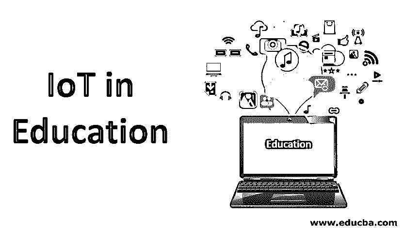
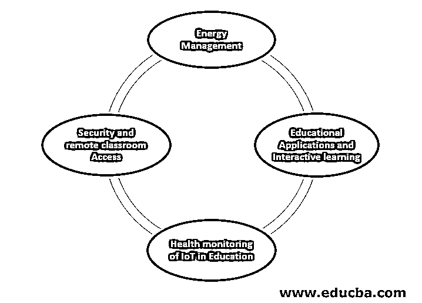

# 教育中的物联网

> 原文：<https://www.educba.com/iot-in-education/>

## 物联网在教育中的应用

物联网对教育机构产生了强烈的冲击。教育机构正在选择物联网生态系统，并利用从增强现实到云计算的各种技术。随着物联网技术的[集成，物理环境变得比以往任何时候都更加智能和互联。当讨论教育中的物联网时，人们可能会想到先进的智能教室、数字板和基于语音的命令系统。](https://www.educba.com/what-is-iot-technology/)

然而，物联网已经取得了更大的进步，可以用来让父母了解有关接送孩子、校园智能安全摄像头、自动跟踪学生出勤等更多信息，这些都可以在物联网生态系统中实现。

<small>Hadoop、数据科学、统计学&其他</small>

### 物联网在教育中的作用

*   随着技术的进步，我们的下一代已经沉迷于互联网和信息点播。主要问题出现了，教育系统中的物联网会对学生产生积极还是消极的影响。目前正在研究许多挑战，如隐私和教育中技术的额外成本。许多教育机构仍然不愿意接受物联网，并在系统中寻找更好的物联网。教育中的物联网可以大致分为学生和员工两个角度。
*   从工作人员的角度来看，物联网有潜力管理学生的课堂出勤率和必要教育设备的可用性。在教育系统内的多个位置(如图书馆、自助餐厅和入口)安装物联网传感器有助于跟踪和监控学生在不同位置的活动。
*   随着物联网融入教室，教师可以通过语音或手势命令远程管理教室，与远程位置的学生建立通信，从学生那里收集关于特定主题的宝贵反馈，并帮助有特殊能力的学生。其他场景包括使用噪声传感器与邻近教室通信，并建议他们降低噪声水平。
*   在考试期间，物联网嵌入式液晶屏可以检测特定教室中的过量噪音，并显示警告消息。借助物联网生态系统，可以轻松管理年度日或运动日注册等活动。
*   物联网可以帮助学生在本地或远程与同学交流，交换项目信息，实时分析和注释学习材料，并远程访问远程实验室等学习工具。
*   物联网是互联网技术的一个子类，在许多方面促进了学习。物联网系统使教育机构更容易从传感器和可穿戴设备收集大量数据，并基于这些数据开展实际行动。通过使用嵌入式传感器、二维码和其他技术，这些系统允许学生随时探索和访问学习材料和其他信息。
*   为了促进教学，教师还可以在课堂上使用可穿戴设备和智能手机。智能教室可以被描述为具有各种类型的软件和硬件模块的智能环境。视频投影仪、传感器和面部识别算法是物联网嵌入式生态系统的几个例子。

### 物联网在教育领域的应用

物联网在转变传统教育体系方面发挥着至关重要的作用。物联网在教育领域有着广泛的应用。让我们来看看物联网在教育领域的几个应用领域。

#### 1.能量消耗监控

通过在灯和水龙头中安装物联网传感器，可以利用物联网进行能源管理。基于物联网的组织声称物联网解决方案可以通过减少二氧化碳排放来帮助创建绿色校园。物联网可以帮助校园监控能源消耗，并在智能电网的帮助下确保能源得到有效利用。借助物联网生态系统，能源和水的使用得到控制和监控，从而营造健康的教学氛围。

#### 2.安全性和远程教室访问

教育系统的一个主要关注点是为学生创造一个安全的氛围，这可以通过选择物联网生态系统来实现。NFC 等嵌入式技术可用于管理学生及其对校园各部分的访问，如实验室和教育机构内的其他地方。在 NFC 的帮助下，可以开发实时教室控制机制，NFC 可以传递教室注册信息并在 LCD 面板上显示教室的状态。此外，借助嵌入每个学生身份证的 RFID 标签，可以记录学生的出勤情况。

#### 3.教育物联网健康监控

在可穿戴设备的帮助下，可以定期监控学生的健康，并可以检测一段时间内的生理信号。在物联网的帮助下，可以在学生中检测到抑郁和自杀意图的迹象，从而为防止任何悲剧提供足够的时间。

该系统进一步考虑学生个人的健康信息，如他们的病史、血压和处方，以检测任何健康衰竭的迹象，并通过发出警报在移动应用程序上通知工作人员和他们的父母。

#### 4.教育应用和互动学习

教育应用程序有助于定制，并允许学生以传授学科知识的方式决定他们的行动路线。从家用电脑到电视，学生可以在休病假时通过多个频道访问教育直播内容。可以利用某些应用来创建 3D 图形教科书，该教科书以视频内容和笔记为特征。记笔记不再是写在纸上，随着物联网的进步，学生可以大声朗读，基于语音的应用程序将语音转换为文本，并将其保存在数字笔记本中。

### 结论

*   在本文中，我们看到了物联网在教育领域的多种应用，并讨论了学生和教师从物联网嵌入式生态系统中获得的各种好处。通过将传感器和移动设备集成到建筑物中，物联网有可能改变教室。
*   物联网为加强学生参与、教学和学习合作创造了独特的机会。在不久的将来，物联网将被纳入大部分教育系统。
*   一些学校可能使用它来培训学生的高科技素养，而其他学校可能使用它来利用信息、节省资金和其他特定需求。如果我们想将物联网融入教育，我们对教育的理解必须转向更大的视角。

### 推荐文章

这是一份教育物联网指南。这里我们讨论物联网在教育中的作用，物联网在教育领域的应用。您也可以浏览我们推荐的其他文章，了解更多信息——

1.  [物联网的优势](https://www.educba.com/benefits-of-iot/)
2.  [物联网软件](https://www.educba.com/iot-software/)
3.  [云计算提供商](https://www.educba.com/cloud-computing-providers/)
4.  [什么是树莓派？](https://www.educba.com/what-is-raspberry-pi/)

