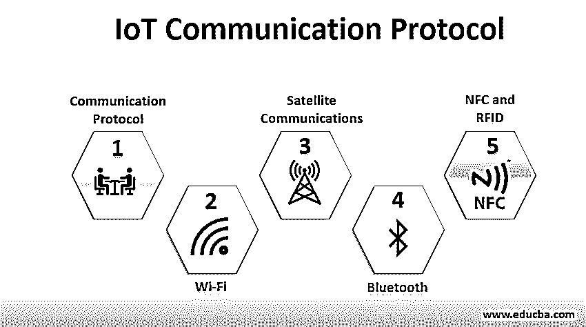

# 物联网通信协议

> 原文：<https://www.educba.com/iot-communication-protocol/>

## 物联网通信协议介绍

物联网信息通信技术(ICT)突破了人与人、人与物、物与物之间的信息传输。智能设备现在能够代表个人进行连接、移动和决策，这项技术也被称为“万物互联”。物联网生态系统由许多可以随时随地相互连接的智能设备组成。然而，存储容量、无线电范围和功率等限制阻碍了物联网的发展，需要通信协议来管理这些限制。

### 顶级物联网通信协议

如今，许多无线技术可用于将物联网设备和互联网互联，包括各种范围的 WPAN 和 WLAN，如 Wi-Fi、红外、蓝牙、Bee、M-bus 等。通信协议可以大致分为 Wi-Fi、蓝牙、卫星、NFC 和 RFID 标准。

<small>Hadoop、数据科学、统计学&其他</small>

这里我们看到了 4 大物联网通信协议:

#### 1.无线局域网（wireless fidelity 的缩写）

*   对于许多开发人员来说，Wi-Fi 连接通常是一个显而易见的选择，特别是考虑到 Wi-Fi 在局域网家庭环境中的普及性。这是一个局域网，在 5Ghz ISM 频率波长范围内使用 IEE 802.11 标准。Wi-Fi 是一种短程技术，提供距离接入点大约 60 英尺的范围。Wi-Fi 是一种无线协议，旨在用无线方式取代以太网。其目标是通过现成的、易于实施、易于使用的短程无线连接提供跨销售者的互操作性。
*   标准 Wi-Fi 通常不是[最佳物联网技术](https://www.educba.com/what-is-iot-technology/)，但一些物联网应用可以利用支持标准 Wi-Fi 的技术，尤其是在室内或校园环境中。明显的例子包括建筑和家庭自动化以及室内能源管理，其中 Wi-Fi 可以用作通信通道，设备可以连接到电源插座。另一方面，Wi-Fi 802.11ah 也称为“HaLow”，是专门为物联网设计的，需要独特的客户端和基础设施。Wi-Fi 技术的供应商不断改进，每天都在努力提供更好的技术。

#### 2.卫星通信

*   卫星通信允许移动电话与最近的大约 10-15 英里的天线进行通信。根据通信速度的不同，这些技术被称为 GSM、GPRS / GSM、3G、4G / LTE、5G 和其他技术。卫星通信也称为物联网中的机器对机器通信，因为它允许移动设备之间的通信。
*   定制设计的卫星通信似乎是解决物联网设备大规模互联这一通信限制的唯一可行解决方案。卫星技术可以帮助物联网行业发展，并轻松应对这一广泛的连接挑战。对于如此高的负载，数据传输的速度可能是一个问题。然而，创新解决方案的出现只是时间问题。
*   卫星提供商已经开始合作提供能够释放物联网全部潜力的服务和设备。一个集成光纤、卫星和无线网络的解决方案已经开始实施。卫星系统的全球性质和同时向多个点广播的能力使其成为地球上最有效的信号传输方式。为了实现全球覆盖，卫星传输标签与地面网络。

#### 3.蓝牙

*   自从 1994 年由爱立信发明以来，蓝牙技术已经走过了漫长的道路。蓝牙是作为标准 RS 电缆的替代品开发的，当时 RS 电缆用于将外部设备连接到 PC。蓝牙在物联网中用于跟踪商业、教育或医疗保健领域的设备。
*   蓝牙应用对于功率要求较低的室内跟踪场景非常有效。然而，蓝牙连接属于短程连接，不支持传输或水下跟踪。此外，对于需要通过 2009 年推出的网络传输视频或音频信息的安全解决方案，也不建议使用蓝牙连接。低能耗蓝牙为物联网利用蓝牙作为通信媒介创造了机会。
*   BLE 是一个专门针对小规模物联网实施的标准，如可穿戴设备和信标，允许设备使用最小的功率发送少量数据。蓝牙在汽车和家庭中的作用和用途将继续增长和扩展。想象一下，在日常通勤或家庭自动化脚本[中，在仪表板上接收自动交通更新或天气报告，使用蓝牙](https://www.educba.com/what-is-bluetooth/)为完美的心情或场合设置照明、恒温器和家庭影院系统并不牵强。

#### 4.NFC 和 RFID

*   NFC 技术最初源于射频技术(RFID ),它使用电磁场来编码和读取信息。每个支持 NFC 的设备都配有一个小芯片，当它靠近另一个 NFC 芯片(10 厘米范围)时就会被激活。因此，NFC 允许电子设备之间简单且安全的交互。NFC 设备可以进一步分为有源和无源设备。主动设备包括能够发送和接收信息的移动设备。
*   相反，无源设备可以传输信息，但不具备读取信息的能力。NFC 技术可以嵌入多种优势，如执行非接触式交易、使用 tap 连接设备、高速下载数字内容以及提供安全系统凭证。只需轻轻一点，两个不同的物联网设备就可以简单地通过 NFC 连接起来。NFC 技术具有内置的安全功能，如[加密，以防止](https://www.educba.com/what-is-encryption/)任何潜在的黑客攻击。此外，短距离 NFC 充当盾牌，保护免受黑客攻击。
*   射频识别(RFID)是一种用于无线跟踪和识别物体的通信方法。这是最简单的通信方法之一，正在大多数物联网生态系统中使用。它不仅用于跟踪世界各地的消费产品，还用于跟踪收费车辆。医院用它来追踪病人，农民用它来追踪他们的动物。RFID 标签是传统条形码的进步，具有读写数据的能力。

### 结论

在本文中，我们看到了各种物联网通信协议，也称为物联网生态系统中的通信媒介。如今有许多通信技术可用于物联网生态系统内的通信。然而，通信媒介的选择完全基于业务需求和要求。

### 推荐文章

这是一个物联网通信协议指南。在这里，我们将详细讨论简介和 4 大物联网通信协议。您也可以浏览我们推荐的其他文章，了解更多信息——

1.  [教育中的物联网](https://www.educba.com/iot-in-education/)
2.  [各种类型的协议测试](https://www.educba.com/protocol-testing/)
3.  [物联网软件](https://www.educba.com/iot-software/)
4.  [不同物联网功能指南](https://www.educba.com/iot-features/)

