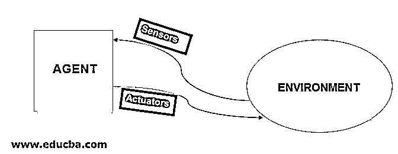
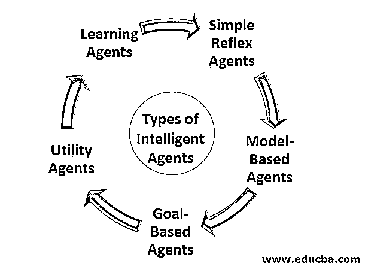

# 智能代理

> 原文：<https://www.educba.com/intelligent-agents/>

## 智能代理简介

智能代理可以是任何实体或对象，如人类、软件、机器。这些代理可以使用其传感器根据来自环境的输入做出决策，并使用执行器对环境进行操作。人工智能代理通过使用像相机、麦克风或其他传感设备这样的传感器从环境中收集输入。然后，代理对输入执行一些实时计算，并使用像屏幕或扬声器这样的执行器来传递输出。这些代理具有实时解决问题、错误或成功率分析以及信息检索等能力。

### 智能代理的三种形式

智能代理可以是三种形式中的任何一种，例如:-

<small>Hadoop、数据科学、统计学&其他</small>

1.  人类代理人
2.  机器人代理
3.  软件代理

这三种形式描述如下:

**人类智能体:**人类智能体使用眼睛、鼻子、舌头和其他感觉器官作为传感器来感知来自环境的信息，并使用四肢和声道作为执行器来执行基于信息的动作

**机器人** **智能体:**机器人智能体使用摄像机和红外雷达作为传感器，记录来自环境的信息。它使用反射电机作为致动器，将输出返回到环境中。

**软件代理:**软件代理使用键盘敲击、音频命令作为输入传感器，使用显示屏作为执行器。

**比如**——基于人工智能的智能助手，比如 Siri，Alexa。它们使用语音传感器来请求用户的请求，并在没有人工干预的情况下在第二来源中搜索相关信息，像其语音或文本模块这样的致动器将信息中继到环境中。

### 智能代理的类型和规则

这些智能体根据其能力范围和智能程度分为五种类型。

#### 1.简单反射剂

它们是代理的基本形式，只在当前状态下起作用。他们的智能很低，因为他们没有能力存储过去的状态。这些类型的代理基于预定义的规则响应事件，这些规则是预先编程的。只有当环境完全可观察时，它们才表现良好。因此，这些代理只在有限的情况下有用，就像智能恒温器一样。简单反射代理拥有一个静态表，它们从这个表中获取所有预定义的规则来执行。

#### 2.基于模型的代理

它是简单反射剂的高级版本。像简单的反射代理一样，它也可以根据预定义的条件对事件做出响应；最重要的是，它可以根据以前的事件存储内部状态(过去的信息)。基于模型的代理在每一步都更新内部状态。这些内部状态帮助代理处理部分可观察的环境。要执行任何动作，它依赖于内部状态和当前感知。然而，在处理部分可观测的环境时，几乎不可能找到确切的状态。

#### 3.基于目标的代理

这些代理采取的行动取决于离他们的目标(期望的情况)的距离。这些行动旨在缩小当前状态和期望状态之间的距离。为了达到它的目标，它使用了搜索和规划算法。基于目标的智能体的一个缺点是，它们并不总是选择最佳路径来达到最终目标。这种不足可以通过使用下述工具代理来克服。

#### 4.公用事业代理

这些代理采取的行动取决于最终目标，因此它们被称为效用代理。当一个问题有多种解决方案，并且必须选择最佳方案时，可以使用实用代理。所选择的方案是基于每个州的效用。然后，他们对每个解决方案进行成本效益分析，并选择一个能够实现最低成本目标的解决方案。

#### 5.学习代理

学习代理具有学习能力，因此他们可以从过去的经验中学习。这些类型的代理可以从零开始，随着时间的推移，可以从他们的环境中获得重要的知识。学习代理有四个主要组成部分，使他们能够从自己的经验中学习。

*   **评论家**:评论家根据设定的绩效基准评估代理的绩效。
*   **学习元素:**它接受来自评论家的输入，并通过从环境中学习来帮助代理提高绩效。
*   **绩效要素:**该组件决定为改善绩效而采取的行动。
*   **问题生成器:**问题生成器接受来自其他组件的输入，并建议可以带来更好体验的行动。

### 规则

要被称为智能代理，代理必须遵循一些规则。

规则 1 :智能体必须有能力使用它的传感器从环境[中感知信息](https://www.educba.com/what-is-sensors/)

规则 2 :从环境中收集的输入或观察结果应被用于决策

规则 3: 从观察中做出的决定应该导致一些切实的行动

规则 4: 采取的行动应该是理性的

### 智能代理的结构

智能代理结构是代理功能、体系结构和代理程序的结合。

**代理=架构+代理程序**

这三个实体描述如下。

**1。架构:**架构是代理执行其动作的机器。它本质上是一个嵌入了执行器和传感器的设备。例如:自动驾驶汽车有各种运动和 GPS 传感器，以及基于输入的执行器，有助于实际驾驶。

**2。代理功能:**代理功能帮助将它从环境中收集的所有信息映射到行动中

**3。代理程序:代理程序执行代理函数**。执行发生在代理架构之上，并产生所需的功能。

### 结论

任何代理的最终目标都是执行原本必须由人类执行的任务。因此，代理就像智能助理一样，可以实现重复任务的自动化，帮助进行数据汇总，从环境中学习，并为正确的行动过程提出建议，这将有助于达到目标状态。智能代理在今天有着巨大的用途，并且它们的用途在将来只会扩大。

### 推荐文章

这是一本智能代理指南。这里我们讨论了智能代理的结构和规则，以及基于它们的能力范围和智能程度的五种类型。您也可以阅读以下文章，了解更多信息——

1.  [什么是人工智能](https://www.educba.com/what-is-artificial-intelligence/)
2.  [职场情商](https://www.educba.com/emotional-intelligence-at-workplace/)
3.  [健康的工作环境](https://www.educba.com/a-healthy-work-environment/)
4.  [什么是机器人？](https://www.educba.com/what-is-robotics/)

