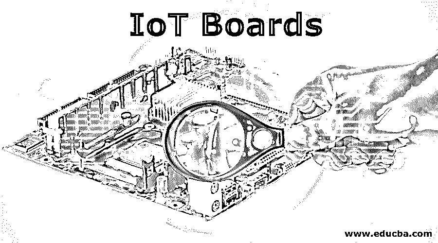
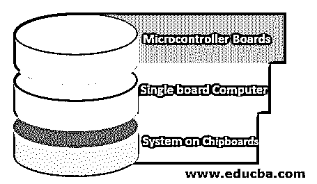

# 物联网板

> 原文：<https://www.educba.com/iot-boards/>

## 物联网板简介

物联网在现实世界中有着无止境的应用范围，已被世界各国的组织和政府广泛考虑。随着大规模工业参与，物联网可用的设计板数量也势不可挡。许多微控制器面板、子板、芯片板器件和专用 ic 都提供板载 Wi-Fi 路由器、红外、其它通信协议和许多用于传感器接口的通用输入/输出引脚。物联网板本质上是用于构建设计者发明模型的硬件结构。目前市场上有各种各样的物联网板。

### 物联网板的分类

在今天的市场上，人们可以找到大量不同规格的电路板。物联网板可以大致分为三类:

<small>Hadoop、数据科学、统计学&其他</small>

*   微控制器板
*   单板计算机
*   纸板上的系统

#### 1.微控制器板

下面提到了一些用于开发和提供软件编程的流行的开源硬件:

##### **a. Arduino Uno Rev**

这是一款基于 ATmega328P 微芯片的开源微控制器板，由 Arduino 科技公司生产。该板具有数字和模拟输入/输出引脚阵列，可以与不同的板接口，用于扩展和其它电路。

Arduino Uno Rev 由 6 个模拟输入、15 个输入/输出连接器、15MHz 石英晶体、复位选项和 ICSP 接头组成。由于该板完全支持微控制器，因此只需用 USB 电缆将其连接到器件，或者用交流 DC 转换器或电池为其供电。

下面给出了优点和缺点:

**优点:**

*   Arduino Uno 非常容易学习和实现。
*   高标准低成本物联网板。
*   Arduino Uno 可使用大量第三方库和传感器。
*   一个庞大的用户社区以及容易获得的资源。

**缺点:**

*   与其他竞争对手相比，处理和任务执行速度较低。
*   Arduino Uno 结构庞大，需要大尺寸 PCB，ATmega 等其他竞争对手在物联网开发方面表现出色。

##### b.ESP8266

ESP8266 是一款低成本物联网板，内置 WIFI 系统，支持物联网应用的快速原型开发。它有多种变体和特定功能，如内存容量和引脚数。Arduino IDE 可用于开发替代物联网 IDE 或物联网应用。

下面给出了优点和缺点:

**优点:**

*   ESP8266 物联网板成本低廉。实时实施物联网解决方案。
*   这个细分市场非常可靠，很容易在市场上买到。

**缺点:**

*   该文件的大部分内容只有普通话版本，这使得世界其他地方的人无法访问。

#### 2.单板计算机

单板计算机主要用于在工业环境中为过程控制的几个设备提供命令和接口。一些广泛使用的计算机有:

##### 形容词（adjective 的缩写）比格犬板

Beagle-Board 和 Digi-Key 是由德州仪器开发的低功耗开源单板计算机。它运行在 Linux 发行版上，由一个工程师小组设计为教学板，在世界各地的大学教授开源硬件和软件技能。这个板子很像树莓派。

下面给出了优点和缺点:

**优点:**

*   比格犬板在使用中非常方便和可靠。
*   与它的竞争对手相比，这种板不贵。
*   该板不需要额外的冷却设备，功耗低。

**缺点:**

*   它具有适合电子编程初学者的基本结构。
*   缺少音频和图形功能。

##### b.覆盆子 Pi3

Raspberry Pi 3 是在英国开发的，旨在促进学校的基础计算机科学教学， [Raspberry Pi 包括](https://www.educba.com/what-is-raspberry-pi/)一系列小型单板计算机，运行在为 Raspbian 创建的 Raspberry Pi 操作系统上。树莓 Pi3 采用四核 64 位 ARM v8 处理器，运行频率为 1.2 GHz。它还包括一个电源单元、4 个 USB 端口和一个可扩展板。

下面给出了优点和缺点:

**优点:**

1.  成本低廉，市场上有大量这类主板。
2.  由通用输入输出引脚组成。

**缺点:**

1.  Raspberry Pi 3 的 CPU 处理速度没有 Mac 或笔记本电脑快，内存也比 Mac 或笔记本电脑少。
2.  容错性低，如果引脚插入不正确，电路板很容易损坏。

#### 3.纸板上的系统

纸板上系统由各种功能单元组成，例如:

##### 形容词（adjective 的缩写）Tessel 2

Tessel 2 运行在 JavaScript 上，是一个开源开发板，旨在使用 Node 生成脚本。它是一个为物联网(IoT)设计的平台，可以玩、修补、设计和创建集成硬件。Tessel 有一组命令行接口设备来设置 Tessel 2 面板并使用它。用户必须下载这些工具，并使用终端命令行来执行脚本。

下面给出了优点和缺点:

**优点:**

1.  Javascript 开发环境使得 Tessel 2 成为一个值得的选择。
2.  低维护和最佳速度。

**缺点:**

*   Tessel 2 相当不错，但它的性价比不如 Raspberry Pi，也没有提供比后者更多的额外价值。

##### b.粒子光子

粒子光子是一个非常小的物联网板，集成了 WIFI 模块。这是一款物联网就绪板，具有一系列扩展套件，可加快设计过程。

**优点:**

粒子光子是一种非常有用的物联网原型工具，有助于远程编码、快速应用迁移和快速项目周转。通过该平台的内置工厂模型，你可以肯定，阻止光子是不可能的，使用微型 USB 电缆从标准手机充电器给设备充电是很容易的。

##### 碳（carbon 的缩写）英特尔爱迪生主板

Intel Edison 是一台非常小的计算机，大约是 35 x 25 x 3.8 毫米的存储卡大小。但是这个小芯片尽管很小，却拥有强大的功能。英特尔 Edison 在运行 Linux 1.6 时没有任何问题，它采用双核、多线程的英特尔凌动 CPU，运行速度为 600mhz，内存为 2 GB。

下面给出了优点和缺点:

**优点:**

1.  面向物联网集成的小巧而强大的主板。
2.  在微软的全力支持下，广泛应用于整个行业。

**缺点:**

1.  与当今的主板相比，潜力有限。
2.  与竞争对手相比价格昂贵。

### 结论–物联网板

在本文中，我们看到了不同的物联网委员会，大多数委员会都有庞大的支持社区和团体来支持任何项目。随着物联网的进步，现在市场上有多种尺寸和规格的电路板。根据项目需求，组织或个人需要选择合适的主板来实施物联网项目。

### 推荐文章

这是物联网板的指南。在这里，我们分三个部分讨论电路板的介绍和分类及其优缺点。您也可以看看以下文章，了解更多信息–

1.  [物联网通信协议](https://www.educba.com/iot-communication-protocol/)
2.  [物联网技术](https://www.educba.com/iot-technology/)
3.  [什么是物联网技术？](https://www.educba.com/what-is-iot-technology/)
4.  [物联网硬件](https://www.educba.com/iot-hardware/)
5.  [Arduino 是什么？|特性](https://www.educba.com/what-is-arduino/)

