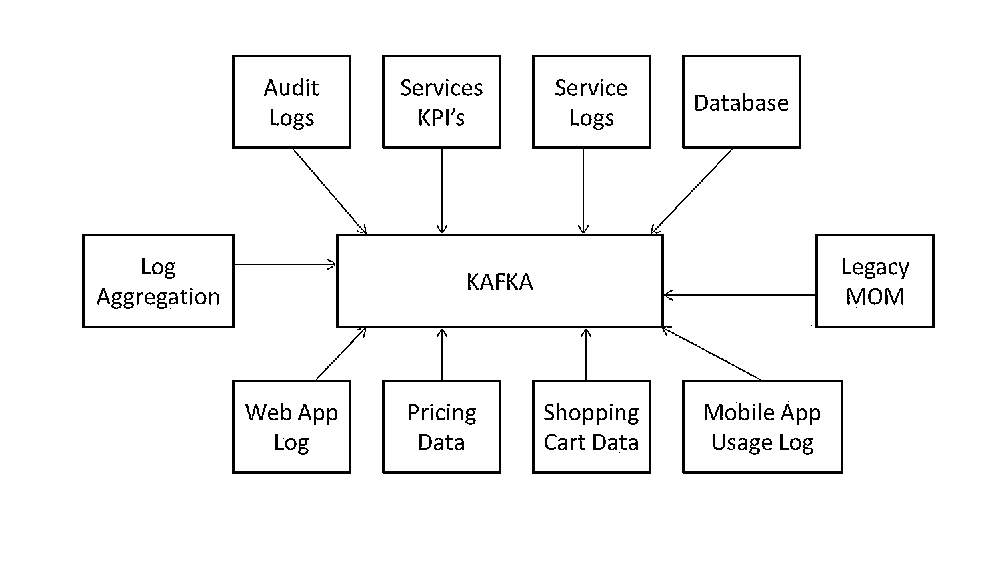
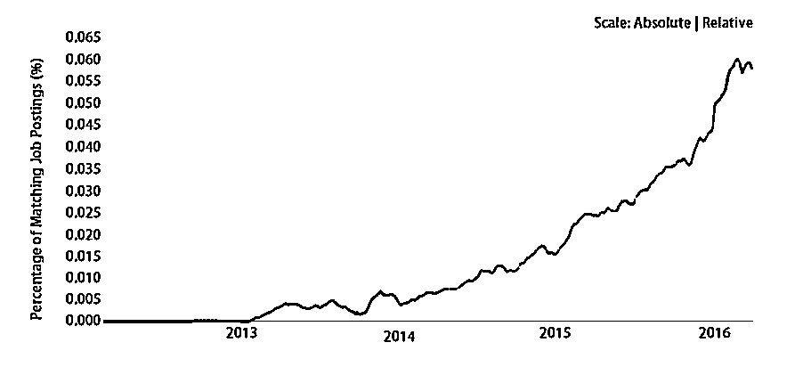

# 卡夫卡是什么？

> 原文：<https://www.educba.com/what-is-kafka/>

## 什么是卡夫卡？

LinkedIn 开发的处理实时数据的开源软件平台叫做 Kafka。它发布和订阅记录流，还用于容错存储。这些应用程序被设计用来处理计时和使用记录。Kafka 中复制了不同服务器的日志分区。它存储、读取和分析流数据，开发者和用户在其中贡献编码更新。它用于消息传递、网站活动跟踪、日志聚合和提交日志。它可以用作数据库，但是它没有数据模型或索引。

<small>Hadoop、数据科学、统计学&其他</small>

### 理解卡夫卡

它的增长呈指数级增长。让我们看看一些事实和数据来更好地强调我们的想法。全球超过三分之一的财富 500 强企业将它作为首选。这种分布由旅游商业公司、电信巨头、银行和其他一些公司分享。LinkedIn、微软和网飞每天用 Kafka 处理四个逗号的消息(几乎等于 10 亿条)。

它用于实时数据流、收集大数据或进行实时分析(或两者兼有)。它与内存中的微服务一起使用以提供耐用性，并可用于向 CEP(复杂事件流系统)和 IoT/IFTTT 风格的自动化系统提供事件。

### 卡夫卡是如何如此轻松地工作的？

简单驱动是定义性能的正确方式。从它的设置和使用，很容易理解卡夫卡是如何如此轻松地工作的。这种行为性能的提高归功于它的稳定性，它提供了可靠的耐用性，以及它灵活的内置发布、订阅或队列维护功能。如果您需要处理 N 个客户群，如果您必须在市场上展示强大的复制能力，以向您的客户提供一致的方法(即 Kafka 主题分区)，这一点至关重要。Kafka 区别于其竞争对手的关键行为是其与数据流系统的兼容性——其流程使这些系统能够聚合、转换和加载其他商店，以方便工作。“如果卡夫卡慢，上述所有事实都不可能”。其卓越的性能使这成为可能。

除了卡夫卡作品的易用性，我们还必须进入“操作系统层面”。

让我们来看看卡夫卡在操作系统层面上是如何工作的:

*   它依靠操作系统内核来更快地移动数据，并基于零拷贝的[原则工作。](https://en.wikipedia.org/wiki/Zero-copy)
*   它允许将数据记录批处理成块，消费者可以从文件系统(也称为 Kafka 主题日志)中看到这些块。
*   批处理数据的功能提供了高效的数据压缩，减少了 I/O 延迟。
*   它能够通过分片进行水平扩展。它可以将标题日志分割成数百到数千个分区。这使它能够轻松处理大量的工作负载。

### 你能拿卡夫卡怎么办？

如果你的公司经常处理大量的数据，你需要 Kafka。有很多公司在使用它。

*   LinkedIn 用它来跟踪数据和运营指标。
*   Twitter 将提供流处理基础设施。

从优步到 Spotify，从高盛到思科，这样的公司不胜枚举。

### 优势

下面是提到的优点:

*   **高吞吐量:**高速生成时可以轻松处理大量数据，这是 Kafka 的一大优势。这个应用程序缺乏巨大的硬件来支持每秒数千条消息的消息吞吐量。
*   **低延迟:**处理大量消息生成的低延迟。
*   **容错:**这个功能得心应手；它有一种固有的能力，即受到集群中内置的节点的限制。
*   耐用:它的操作非常耐用，这也是为什么许多跨国公司更喜欢使用 Kafka 的原因。谈到行动的持久性，从长远来看，这些信息不会丢失。

### 所需技能

作为卡夫卡专业人士没有特别的要求。

但是我们强调了一些流和专业人员:

*   愿意在大数据流领域发展事业并希望加快职业发展的开发人员。
*   就排队和消息传递系统而言，测试专业人员在 Kafka 中有一个很好的范围。
*   架构师——因为任何事情都需要一些框架，而且这个框架可以随时更新。大数据架构师会发现 Kafka 是一项不错的职业投资。
*   如果上述专业人员能够更好地管理资源，则需要一名项目经理。因此，卡夫卡领域的管理专业人士也可以获得更高的职位。

### 为什么要用卡夫卡？

为了根据业务需求跟踪和操作数据，它是全球首选。它提供了通过实时分析实时传输数据的可能性。它速度快、可扩展、耐用，并设计为容错。在 web 上有许多用例，您可以看到为什么 JMS、RabbitMQ 和 AMQP 甚至没有被考虑使用，因为需要操作巨大的容量和响应能力。

它具有高吞吐量、可靠的设置和复制特性，是处理物联网传感器的首选。

兼容性是使用它的另一个原因，并使它在世界范围内被接受。它可以很容易地配置为与下面列出的应用程序一起工作。这种结合对许多公司发展业务和生存至关重要(因为它节省时间和金钱)。

*   水道
*   火花流
*   HBase
*   Spark 用于实时接收、处理和分析数据。
*   它用于提供 Hadoop BigData。

### 范围

它在全球范围内表现出色。我们说的不是统计数据。

Kafka 专业人员的工资统计——工资等级

*   软件工程师——109825 美元
*   数据工程师——109580 美元
*   开发者——81，182 美元
*   高级数据工程师——127，836 美元

### 结论

目前，Kafka 已经成为实时数据分析的事实上的标准，精度最高，以微秒计。我们在数据和细节方面展示了我们的见解，以支持 Kafka 技术。几家大公司每天都在利用数据；为此，他们需要专业人员来驾驭这些庞大的数据集。有了 Kafka，人们可以放心地在大数据分析领域引领自己的职业生涯。

### 推荐文章

这是一本关于什么是卡夫卡的指南？在这里，我们讨论了卡夫卡的工作，范围，职业发展和优势。您也可以浏览我们推荐的其他文章，了解更多信息——

1.  [卡夫卡事件](https://www.educba.com/kafka-event/)
2.  [卡夫卡的听众](https://www.educba.com/kafka-listener/)
3.  [卡夫卡动物园管理员](https://www.educba.com/kafka-zookeeper/)
4.  [卡夫卡分区键](https://www.educba.com/kafka-partition-key/)

