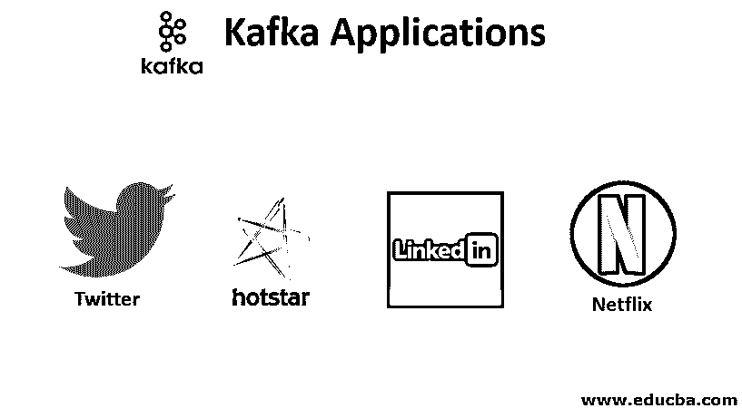
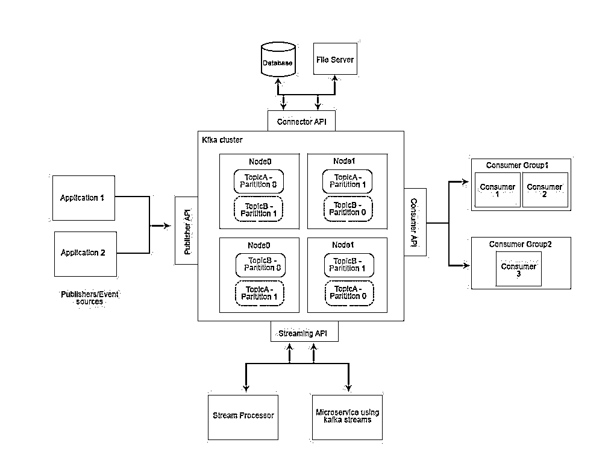
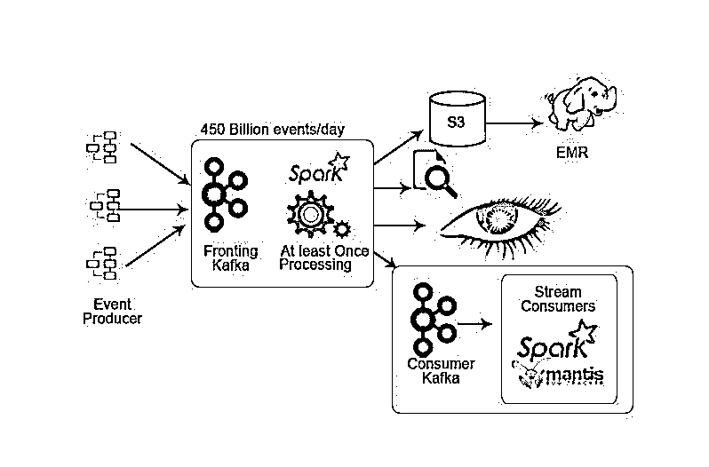
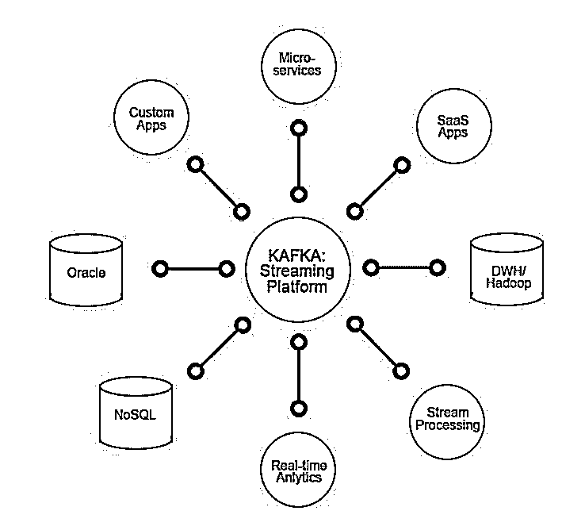
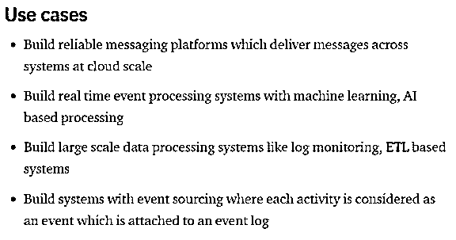
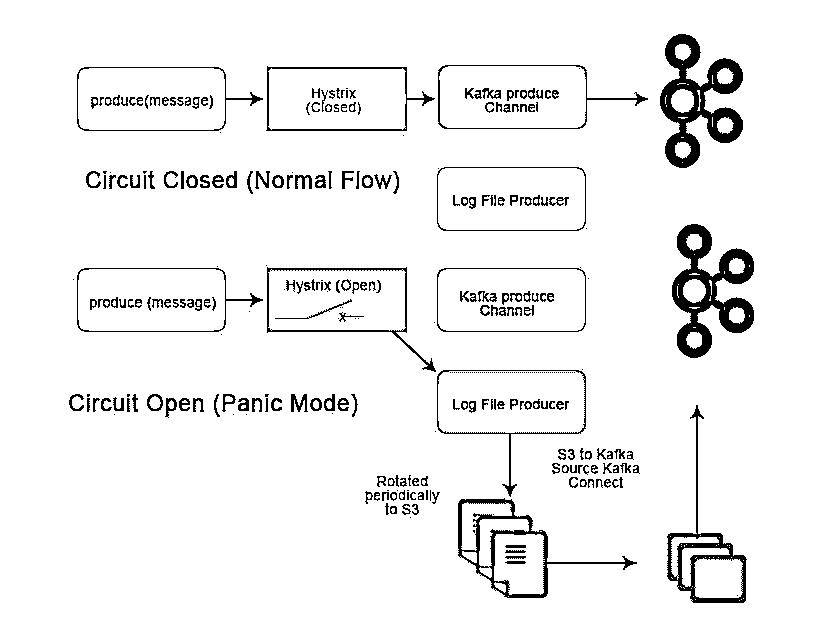

# Kafka 应用程序

> 原文：<https://www.educba.com/kafka-applications/>

## Kafka 应用程序概述

IT 行业的趋势领域之一是大数据。该公司处理大量[客户数据](https://www.educba.com/customer-data/)，并从中获得有用的见解，帮助他们的业务并为客户提供更好的服务。挑战之一是从一端到另一端处理和传输这些大量数据，以便进行分析或处理；这就是 Kafka(一种可靠的消息系统)发挥作用的地方，它有助于实时收集和传输大量数据。Kafka 是为分布式高吞吐量系统设计的，非常适合大规模消息处理应用程序。Kafka 支持许多当今最好的商业和工业应用。卡夫卡专业人才需要有很强的技能和实践知识。

<small>Hadoop、数据科学、统计学&其他</small>

本文将学习 Kafka，它的特性，使用案例，并了解一些值得注意的应用。

### 卡夫卡是什么？

Apache Kafka 是在 LinkedIn 开发的，后来成为了一个[开源的 Apache 项目](https://www.educba.com/what-is-apache/)。Apache Kafka 是一个快速、容错、可扩展的分布式消息传递系统，它使用基于消息的主题实现了两个实体之间的通信，即生产者(消息的生成者)和消费者(消息的接收者)之间的通信，并提供了一个管理所有实时数据馈送的平台。

使 Apache Kafka 优于其他消息传递系统并适用于实时系统的特性是其高可用性、从节点故障中立即自动恢复以及支持低延迟消息传递。Apache Kafka 的特性有助于将其与大规模数据系统集成，并使其成为通信的理想组件。

### 顶级 Kafka 应用

文章的这一部分将看到一些流行的和广泛实现的用例，并看到 Kafka 的一些真实实现。

#### 现实生活的应用

##### 1.Twitter:流处理活动

Twitter 是一个[社交网络](https://www.educba.com/what-is-social-networking/)平台，它使用 Storm-Kafka(一个开源流处理工具)作为其流处理基础设施的一部分。反过来，输入数据(tweets)被用于聚合、转换和丰富，以供进一步消费或后续处理活动。

##### 2.LinkedIn **:** 流处理&指标

LinkedIn 使用 Kafka 进行流数据和运营指标活动。LinkedIn 使用 Kafka 作为其附加功能，如新闻订阅，用于消费消息和对收到的数据进行分析。

##### 3.网飞 **:** 实时监控&流处理

网飞有自己的摄取框架，将输入数据转储到 AWS S3，并使用 Hadoop 来运行视频流、UI 活动和事件的分析，以增强用户体验，并使用 Kafka 通过 API 进行实时数据摄取。

##### 4.Hotstar **:** 流处理

Hotstar 推出了自己的数据管理平台- Bifrost，Kafka 用于数据流、监控和目标跟踪。由于其可伸缩性、可用性和低延迟能力，Kafka 非常适合处理 Hotstar 平台每天或在任何特殊场合生成的数据(任何音乐会或任何体育比赛的直播流等)。)其中数据量显著增加。

很多时候，Apache Kafka 是作为开发流数据架构的一个构建块。这种架构用于收集产品/服务器日志、分析点击流以及从机器生成的数据中获取信息等应用中。

但除了 Kafka，我们还需要使用额外的资源或工具来将获得的数据流转换为有意义的数据，以帮助获得可用于数据驱动决策的见解。例如，我们可能需要从从物联网设备获得的原始数据[或从社交媒体平台实时获得的数据中获得洞察力，并执行一些分析或处理，然后将其展示给企业，以做出更好的决策或帮助他们提高服务性能。](https://www.educba.com/what-is-iot/)

对于这些类型的用例，我们希望将输入数据/原始数据传输到数据湖中，以存储我们的数据并确保数据质量而不影响性能。

另一种不同的情况是，我们可能直接从 Kafka 读取数据，这是在我们需要极低的端到端延迟时，比如向实时应用程序提供数据。

Kafka 向用户展示了某些功能:

*   发布和订阅数据。
*   按照数据生成的顺序高效地存储数据。
*   数据的实时/动态处理。

卡夫卡，大多数时候，是用来:

*   实现动态流式数据管道，在系统中的两个实体之间可靠地获取数据。
*   实施即时流应用程序，转换、操作或处理数据流。

#### 用例

以下是 Kafka 应用程序的一些广泛实现的用例:

**1。消息传递**

Kafka 比 ActiveMQ、RabbitMQ 等其他传统消息传递系统工作得更好。相比之下，Kafka 提供了更好的吞吐量、内置分区工具、复制和容错能力，使其成为大规模处理应用程序的更好的消息传递系统。

**2。网站活动跟踪**

用户活动(页面浏览、搜索或任何操作)可以被跟踪并通过 Kafka 或 Kafka 进行实时监控或分析，以将这些类型的数据存储到 [Hadoop 或数据仓库](https://www.educba.com/data-warehouse-vs-hadoop/)中，供以后处理或操作。活动跟踪会生成大量数据，需要在不丢失数据的情况下将这些数据传输到所需位置。

**3。日志聚合**

日志聚合是从应用程序的不同服务器收集/合并物理日志文件到单个存储库(文件服务器或 HDFS)进行处理的过程。与 Flume 相比，Kafka 提供了良好的性能和更低的端到端延迟。

### 结论

Kafka 在[大数据空间](https://www.educba.com/what-is-big-data/)中被大量用于快速接收和移动大量数据，因为它的性能特征和功能有助于实现可扩展性、可靠性和可持续性。在本文中，我们讨论了 Apache Kafka 的特性、用例以及应用程序，使其成为更好的流数据工具。

### 推荐文章

这是 Kafka 应用指南。在这里，我们讨论什么是 Kafka 以及 Kafka 的主要应用，包括广泛实现的用例以及一些现实生活中的实现。你也可以看看下面的文章来了解更多-

1.  [卡夫卡是什么？](https://www.educba.com/what-is-kafka/)
2.  [如何安装卡夫卡？](https://www.educba.com/install-kafka/)
3.  [卡夫卡面试问题](https://www.educba.com/kafka-interview-questions/)
4.  [阿帕奇卡夫卡 vs 水槽](https://www.educba.com/apache-kafka-vs-flume/)
5.  [你应该知道的 8 大物联网设备](https://www.educba.com/iot-devices/)
6.  [卡夫卡 vs Kinesis |与信息图的差异](https://www.educba.com/kafka-vs-kinesis/)
7.  [不同类型的带有组件的 Kafka 工具](https://www.educba.com/kafka-tools/)
8.  [了解 ActiveMQ 与 Kafka 的主要区别](https://www.educba.com/activemq-vs-kafka/)
9.  [雷迪斯与卡夫卡的区别](https://www.educba.com/redis-vs-kafka/)

