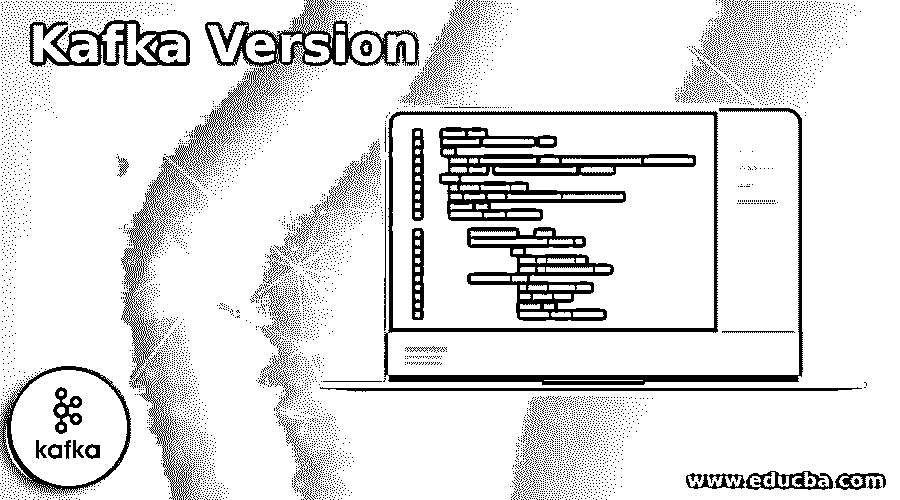

# 卡夫卡版本

> 原文：<https://www.educba.com/kafka-version/>

## 卡夫卡版本简介

卡夫卡版本是卡夫卡的一种特殊形式，其中一些细节不同于早期或后期的形式。基本上，它在某一方面不同于同类事物的其他形式。它表示涉及其特定卡夫卡版本的事件。它是用来指发现卡夫卡的每个阶段和发展或每一个新形式的文件或相关的文献。有一些特定于 Kafka 版本定义的属性，如 CURRENT_KAFKA_VERSION 和 CURRENT_MESSAGE_FORMAT_VERSION。属性 CURRENT_KAFKA_VERSION 指的是您正在升级的版本，而 CURRENT_MESSAGE_FORMAT_VERSION 指的是当前正在使用的消息格式版本。

### 不同的卡夫卡版本及其特征

下面给出的是不同的卡夫卡版本及其具体特征:

<small>Hadoop、数据科学、统计学&其他</small>

#### 1\. 0.5.0

这个版本的 Kafka 旨在提供一个发布-订阅模型，它可以在消费者规模的网站上处理流数据。

#### 2\. 0.6.0

0.06 版本增加了新的生产者 API，即 SyncProducer 和 AsyncProducer。主要目的是将所有的生产者功能包装在一个 API 中。

#### 3\. 0.7.0

生产者上的压缩对于某些或所有主题，在服务器上以压缩格式写入数据，并使消费者知道压缩。该方法目前为您提供最近 30 秒窗口的聚合指标。用一点 CPU 换取减少磁盘和网络活动听起来很棒。

#### 4\. 0.8.0

这个版本在 Kafka 中增加了一个复制，它负责更高的可用性和持久性。它确保任何成功发布的消息都可以被使用，即使任何服务器出现故障。迁移工具使用 0.7 版 Kafka 消费者来消费消息，并将其发送到 0.8 版目标集群，而没有任何停机时间。

#### 5\. 0.8.1 & 0.8.2

一次只有一个代理充当控制器或服务器 57 来关闭它、更新代码并重启。

#### 6\. 0.9.0

在这个版本中，基本上，代理间协议发生了变化，允许在一个集群中运行不同版本的代理。这用于减少升级期间群集的停机时间。在更新之前，任何代理都需要将 inter.broker.protocol.version 设置为所有代理上的现有版本。旧的“协议”与其他代理之间仍有通信。从 0.9.0.0 开始，Java 生成器就是推荐的选项。

#### 7\. 0.10.0

在这个版本中，通过在以前的版本中添加新协议，需要升级 Kafka 集群。它引入了一个名为 Kafka Streams 的新客户端库，用于对 Kafka 主题中存储的数据进行流处理。新的客户端库没有向后兼容性；它仅适用于 0.10.x 和更高版本的代理。Scala 生成器，从 0.10.0 开始就不推荐使用了。从 0.10.0 开始，Java 消费者就是推荐的选项。

#### 8\. 0.10.1

在此版本中，对日志保留进行了修改，这将基于日志段中消息的最大时间戳。对日志的修改导致代理具有大量日志段，并且可能更长。通过更改 num . recovery . threads . per . data . dir 属性的日志加载时间。

#### 9\. 0.10.2

引入了 Streams API 来管理主题，避免在 Zookeeper 中直接修改。此外，与旧代理通信的向后兼容性也得到了改进。例如，0.10.2 版客户端可以与 0.10.0 版或更高版本的代理对话。

#### 10\. 0.11.0

提供读写访问的新用户标题界面。因此新 Headers API 通过 Headers()方法调用公开生产者记录和消费者记录。有许多类已被弃用，如 Cluster class，还引入了 ExtendedSerializer 和 ExtendedDeserializerinterface 来支持头的序列化和反序列化。Scala 消费者，从 0.11.0.0 开始就被弃用了。因为二进制兼容性在 1.0.0 中被意外破坏，所以被恢复。

#### 11\. 1.1.0

Kafka 工件和 Log4j 之间的依赖关系已经被移除。卡夫卡流变得更高级，以便处理异常和与集群的通信。

#### 12\. 2.0.0

对 java 版本的主要支持已从 java 7 更改为 java 8。有一个认证更新，即 https，用于执行主机名验证。Scala 消费者和 Scala 生产者在之前的版本中被弃用，现在已经被完全移除了。作为这个版本的一部分，OAuth 2 实现了以多种方式做相同事情的能力。

#### 13\. 2.1.0

这个 Kafka 版本支持 Java 11。由于 Kafka 没有内置的 UUID 串行器/解串器，uuid 不能开箱即用，它们需要被转换成字符串或字节[]。UUID 的字符串表示是跨平台和编程语言通用的。网络线程已作为此版本的一部分实现，它负责建立与客户端和其他代理的连接，并对它们执行身份验证。这种实现减少了拒绝服务和许多其他安全攻击的原因。

#### 14\. 2.2.0

默认使用者的组 id 设置为 null，而不是空字符串(" ")。此外，启用命令行脚本 bin/Kafka-topics.sh，它通过–bootstrap-server 直接连接到代理。通过将自定义 SSL 用户名修改为一个自定义的主体构建器类，改进了基础结构。通常，对于较小的更改，您需要构建和维护一个定制的构建器类，并将 jar 打包和部署到所有代理。在这种情况下，允许定制 SSL 主体名称的内置 SSL 主体生成器配置/规则将非常有用。

#### 15\. 2.3.0

通过为 Kafka Connect 引入新的重新平衡协议，可用性得到了提高。增加了名为静态成员资格的新功能，用于在升级期间滚动重启服务器。这个版本增加了两个选项，“–JMX-SSL-enable”和“–JMX-auth-prop”，通过利用 JmxTool 来传递允许有效条目的环境映射。AlterConfigs RPC 通过更改主题、代理或其他资源的配置来通知所有资源。新的 RPC 应该以增量方式运行，只修改指定的配置值。

#### 16\. 2.4.0

这是最新的版本。它的功能包括 Zookeeper 版本从 3.4.14 升级到 3.5.6。命令行工具“bin/Kafka-preferred-replica-election . sh”替换为“bin/Kafka-leader-election.sh”。使用构造函数 groupouthorizationexception(String)代替 TopicAuthorizationException(String)来指定异常消息。Kafka 消费者增量再平衡协议被部分实施，以减少扩展/缩减操作的时间，从而有利于繁重的、状态完整的消费者，例如 Kafka 流应用。通过向内部 REST 端点提供身份验证和授权来连接工作者，减少了对连接集群的任务配置的意外修改。

### 推荐文章

这是一本卡夫卡版的指南。在这里我们分别讨论导言和不同的卡夫卡版本及其具体特征。您也可以看看以下文章，了解更多信息–

1.  [卡夫卡动物园管理员](https://www.educba.com/kafka-zookeeper/)
2.  [卡夫卡监控](https://www.educba.com/kafka-monitoring/)
3.  [卡夫卡式建筑](https://www.educba.com/kafka-architecture/)
4.  [卡夫卡工具](https://www.educba.com/kafka-tools/)

