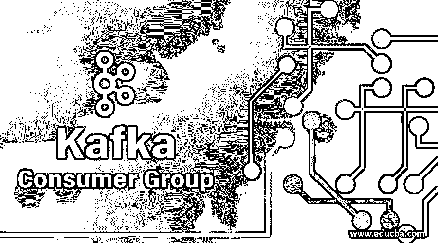
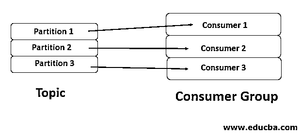
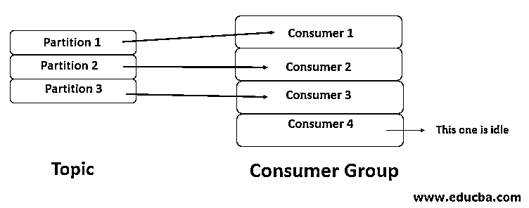
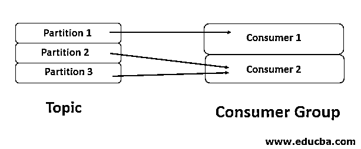
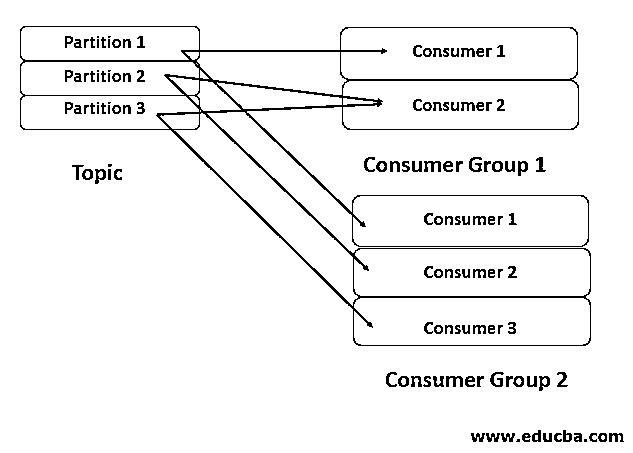

# 卡夫卡消费群体

> 原文：<https://www.educba.com/kafka-consumer-group/>

## 卡夫卡消费群简介

Kafka 消费群基本上是几个 Kafka 消费者，他们可以从一个 Kafka 主题并行读取数据。一个卡夫卡消费群具有以下属性:

*   一个组中的所有消费者都有相同的 group.id。
*   只有一个使用者读取主题中的每个分区。
*   使用者的最大数量等于主题中的分区数量。如果用户比分区多，那么一些用户将保持空闲。
*   消费者可以从多个分区中读取数据。

### 卡夫卡消费群体的重要性

对于零售组织来说，将会有大量的生产者以巨大的速度生成数据。现在，为了读取大量数据，我们需要多个消费者并行运行。在生产者方面相对容易，每个生产者独立于其他生产者生成数据。但是，在消费者方面，如果我们有不止一个消费者阅读同一个主题，那么每条消息很有可能会被阅读不止一次。卡夫卡用消费群体解决了这个问题。在任何情况下，只允许一个使用者从分区中读取数据。

<small>Hadoop、数据科学、统计学&其他</small>

#### 卡夫卡消费群体的划分

假设我们有一个卡夫卡主题，里面有 4 个分区。那么我们可以有以下场景:

**1。消费者数量=分区数量**

在这种情况下，每个消费者将从每个分区读取数据，这是理想的情况。

**2。消费者数量>分区数量**

在这种情况下，一个消费者将保持空闲，导致资源利用率低下。

**3。消费者数量<分区数量**

在这种情况下，其中一个用户将从多个分区读取数据。

**4。消费群体数量> 1**

在这种情况下，主题被不止一个消费者群体订阅，这迎合了两种不同的应用。这两个应用程序可以彼此独立运行。

### 卡夫卡消费群体的优势

消费群增加了以下优势:

*   **可伸缩性:**多个用户并行读取数据无疑会增加数据消耗率，并使系统能够读取大量数据。
*   **容错:**假设我们只有一个消费者(用于读取不那么大的数据量)；如果消费者因为某种原因失败了会发生什么？整个管道都会断裂。
*   **负载均衡:** Kafka 与每个消费者公平地共享分区，从而使数据消费的过程流畅高效。
*   **重新平衡:**如果增加了一个新的消费者或者现有的消费者停止消费，[卡夫卡重新平衡](https://www.educba.com/what-is-kafka/)现有消费者的负荷。

### 卡夫卡如何将两种模式联系起来？

让我们首先讨论这两种消息传递模型。

#### 1.消息队列

在这个模型中，消息流只从一个生产者发送到一个消费者。因此，每条消息只被读取一次，一旦消费者取出一条消息，该消息就会从队列中删除。一个典型的例子可能是发放一份薪水支票，其中每份薪水支票必须只发放一次。此外，这种模型不能确保消息按顺序传递。处理消息的可伸缩性仅限于单个域。

#### 2.发布-订阅消息传递

在这个模型中，生产者发布的消息可以被多个消费者订阅。生产者和消费者在很大程度上是分离的。该模型确保每个消费者将按照生产者的确切顺序接收关于某个主题的消息。一个典型的例子可以是发布不同频道如音乐、电影、体育等的碟形电视。，消费者可以订阅多个频道。由于一个主题有多个订阅者，扩展流的处理是一个挑战。

虽然 Kafka 是基于发布-订阅模型的，但它如此受欢迎是因为它具有消息队列系统的优势。如前所述，如果我们有一个消费者群体，Kafka 确保一个主题中的每条消息只被一个消费者阅读一次(这类似于一个消息队列系统)。额外的好处是代理保留消息(在一段时间内，从而使其容错)。如果我们有一个以上的消费者群体，他们可以阅读来自相同主题的信息，但以不同的方式处理它们。

### 用例含义

假设我们有一个简单的云平台，允许用户进行以下操作:

*   将文件存储到云中。
*   在云中查看他们的文件。
*   从云端下载他们的文件。

一开始，我们的用户基数很小。我们希望获得各种统计数据(每小时一次)，如活跃用户数、上传请求数、下载请求数等。为了满足需求，我们设置了一个 Kafka 集群，它将日志(由我们的应用程序生成)生成到一个主题中，并且有一个应用程序使用该主题(使用一个消费者),然后对其进行处理以生成所需的统计信息，并最终在网页中显示这些信息。

随着人们开始喜欢我们的服务，越来越多的人开始使用它们，从而每小时产生许多日志。我们发现使用该主题的应用程序变得非常慢，因为我们只使用了一个消费者。为了解决这个问题，我们向组中添加了一些消费者，并发现了显著的性能改进。

我们遇到了另一个需求，我们必须将日志写入 HDFS 集群，并且这个过程应该独立于之前的应用程序运行(这是因为，随着数据的进一步增加，我们计划停用第一个应用程序，并在 [HDFS 环境](https://www.educba.com/what-is-hdfs/)中获取所有统计信息)。为了满足这一需求，我们开发了另一个应用程序，该应用程序使用不同的消费者组订阅该主题，并将数据写入 HDFS 集群。

### 推荐文章

这是一本卡夫卡消费群指南。在这里，我们讨论 Kafka 消费者群体的重要性，Kafka 如何连接两个模型，以及它的用例含义。你也可以看看下面的文章来了解更多-

1.  [卡夫卡的应用](https://www.educba.com/kafka-applications/)
2.  [如何安装卡夫卡？](https://www.educba.com/install-kafka/)
3.  [卡夫卡面试问题](https://www.educba.com/kafka-interview-questions/)
4.  [HDFS 建筑](https://www.educba.com/hdfs-architecture/)

