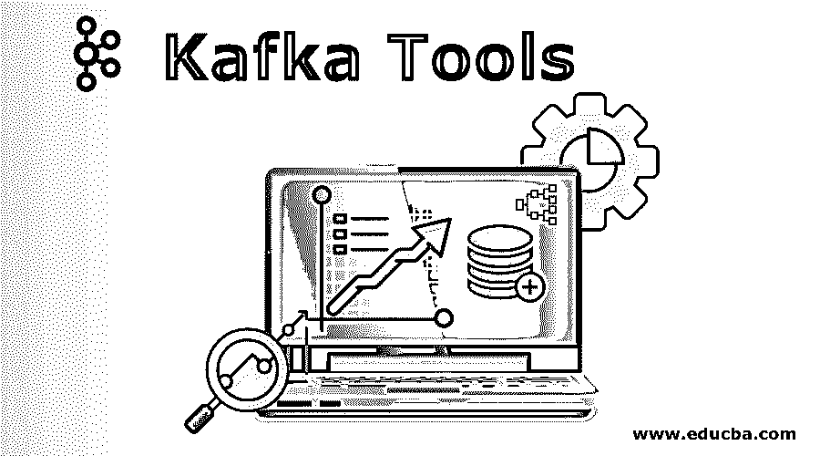
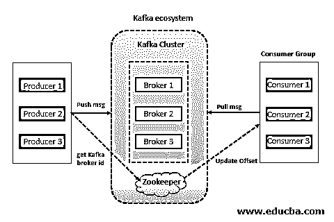

# 卡夫卡工具

> 原文：<https://www.educba.com/kafka-tools/>

## Kafka 工具简介

Kafka Tools 是各种工具的集合，使用这些工具我们可以管理我们的 Kafka 集群。这些工具大多是基于命令行的，但是也有基于 UI 的工具，可以下载和安装。

**我们可以使用 Kafka 工具进行各种操作，例如:**

<small>Hadoop、数据科学、统计学&其他</small>

*   列出可用的 Kafka 集群及其代理、主题和消费者。
*   可以在标准输出中打印各种主题的消息。基于 UI 的工具肯定可以提供更好的可读性。
*   添加和删除经纪人的话题。
*   在分区中添加新消息。
*   请查看我们消费者的所有抵消。
*   为我们的主题创建分区。
*   列出所有消费者组，描述消费者组，删除消费者组信息并重置消费者组偏移量。

如果我们想使用基于 UI 的工具，我们可以使用它，它可以从以下网页下载:

http://www.kafkatool.com/download.html

该应用程序可供个人免费使用，但我们需要购买商业使用许可证。它的好处是可以在 Mac、Windows 和 Linux 系统上使用。

### 卡夫卡工具的三大类型

它们分为系统工具和应用工具。

#### 1.系统工具

可以使用以下语法运行系统工具。

**语法:**

`bin/kafka-run-class.sh package.class - - options`

一些系统工具如下:

*   **Kafka 迁移工具:**该工具用于将 Kafka Broker 从一个版本迁移到另一个版本。
*   **消费者偏移检查器:**该工具可以显示特定主题集和消费者组的消费者组、主题、分区、偏移、日志大小、所有者。
*   **Mirror Maker:** 该工具用于将一个 Kafka 集群镜像到另一个集群。

#### 2.复制工具

这些基本上是为耐用性和可用性提供的高级设计工具。

一些复制工具包括:

*   **创建主题工具:**该工具用于创建具有默认分区数量和复制因子的主题。
*   **列出主题工具:**用于列出给定主题列表的信息。这个工具的伟大之处在于，如果命令行中还没有可用的主题，它将查询 Zookeeper，首先获取主题列表，然后打印关于它们的信息。它列出了各种字段，如主题名称、分区、标题、副本等。
*   **添加分区工具:**该工具用于为主题添加分区，以应对主题中数据量的增长。但是请注意，我们必须在创建主题时指定分区。该工具允许我们为添加的分区添加手动副本。

#### 3.杂项工具

现在让我们讨论一些杂项工具:

**a .卡夫卡-主题工具**

该工具用于创建、列出、更改和描述主题。

**举例:**话题创作:`bin/kafka-topics.sh --zookeeper zk_host:port/chroot --create --topic topic_name --partitions 30 --replication-factor 3 --config x=y`

**b .卡夫卡-控制台-消费工具**

该工具可用于从 Kafka 主题中读取数据，并将其写入标准输出。

**举例:** `bin/kafka-console-consumer --zookeeper zk01.example.com:8080 --topic topic_name>/code>`

**c .卡夫卡-控制台-制作人工具**

该工具可用于从标准输出向 Kafka 主题写入数据。

**举例:** `bin/kafka-console-producer --broker-list kafka03.example.com:9091 --topic topic_name`

**d .卡夫卡-消费群体工具**

此工具可用于列出所有使用者组、描述使用者组、删除使用者组信息或重置使用者组偏移量。该工具主要用于描述消费者群体和调试任何消费者补偿问题。

**示例:**查看不安全集群上的偏移量:`bin/kafka-consumer-groups --new-consumer --bootstrap-server broker01.example.com:9092 --describe --group group_name`

### 卡夫卡建筑

卡夫卡建筑如下图。

#### Kafka 工具的各种组件

主要组件如下所述:

**1。经纪人**

Kafka 集群中的每个节点都是存储数据的代理。通常，有多个代理来适当地平衡负载。代理以主题的形式存储消息，生产者可以访问(用于编写)，消费者可以访问(用于阅读)。创建主题是为了将一个应用程序的数据与另一个应用程序的数据隔离开来。由于代理是无状态的，它们需要 Zookeeper 的帮助来维护它们的集群状态。一个代理可以处理数 TB 的消息，而不会对性能产生任何影响。动物园管理员做卡夫卡经纪人领导人选举。

**2。制片人**

它是将消息推入代理的单元。可以有多个生产者以非常高的速度并且彼此独立地生成数据。生产者不会收到来自代理的确认，而是以代理可以处理的速率发送数据。他们可以搜索代理，代理一启动，他们就开始发送消息。生产者负责选择将哪个消息分配给主题中的哪个分区。这可以通过循环方式来平衡负载，也可以根据某种语义划分功能来完成(比如基于消息中的某个键)。

**3。动物园管理员**

它是管理和协调经纪人的单位。在经纪人加入或失败的情况下，动物园管理员通知生产者或消费者。只要动物园管理员还活着，每个代理都会定期向它发送心跳请求。zookeeper 还维护关于主题和消费者补偿的信息。

**4。消费者**

它是从主题中读取消息的单元。消费者可以订阅和阅读多个主题。一个消费者可以与其他消费者并行工作(在这种情况下，每个分区将只由一个消费者读取)，形成一个消费者组。它不能与生产者同步工作。消费者必须通过使用分区偏移量来维护它已经读取了多少消息。如果一个消费者接受了一个特定的分区偏移量，这意味着他已经使用了该分区以前的消息。

### 结论

本文学习了如何使用各种 Kafka 工具来有效地管理 Kafka 集群。我们还了解了卡夫卡生态系统的各个组成部分，以及它们是如何相互作用的。

### 推荐文章

这是一本卡夫卡工具指南。这里我们讨论 Kafka 工具的类型，各种组件以及架构。您也可以阅读以下文章，了解更多信息——

1.  [顶级 Kafka 应用](https://www.educba.com/kafka-applications/)
2.  [卡夫卡与火花的区别](https://www.educba.com/kafka-vs-spark/)
3.  [卡夫卡建筑的组成部分](https://www.educba.com/kafka-architecture/)
4.  [卡夫卡控制台消费者](https://www.educba.com/kafka-console-consumer/)

