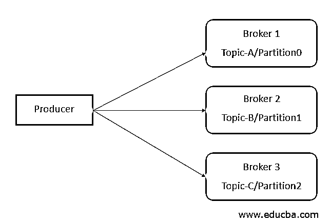

# Kafka 控制台生产商

> 原文：<https://www.educba.com/kafka-console-producer/>

## Kafka 控制台制作商简介

Kafka 控制台生成器是一个程序，它带有 Kafka 软件包，这些软件包是 Kafka 中的数据源。它用于从标准输入或命令行读取数据，并将其写入 Kafka 主题(消息的占位符)。每当我们在控制台中输入任何文本时，Kafka-console-producer 都会将数据保存到集群中。主题由生产者写入这些数据的分区组成。换句话说，“它从命令行输入(STDIN)创建消息”。

在卡夫卡那里，有两种类型的生产者。

<small>Hadoop、数据科学、统计学&其他</small>

1.  同步-它直接在后台发送消息。
2.  只要考虑到具有较高吞吐量的消息数量，sync-It 就发送消息。

生成器会自动找到要写入数据的代理和分区。它通过连接到 Kafka，然后连接到将向各自的代理和分区生成消息的生成器，从而消除了依赖性。当出现经纪人故障，并且由于某种原因，经纪人要倒了，生产者会自动恢复；这个生产者在分区和代理之间提供了一个助推器。只是程序设计得很好。简单地说，我们不必实现这些特性。

### Kafka 控制台制作程序是如何工作的？

它是如何工作的:

我们有一个生产者，他正在向主题 a 的代理 1 的分区 0 发送数据。生产者知道向哪个代理写入数据。基本上，如果生产者发送没有密钥的数据，那么它将基于循环算法选择一个代理。生产者在实际的代理之间进行负载均衡。生产者过去通过选择接收数据确认来写入数据。

#### 确认或确认节点的类型

1.  ack = 0；在这种情况下，我们没有关于经纪人的实际知识。如果生产者将数据发送给代理，而代理已经停机，那么数据就有可能丢失，使用起来也会有危险。
2.  ack = 1；这是来自经纪人的默认确认，其中生产者将等待作为经纪人的领导者。在这种情况下，代理存在并准备好接受来自生产者的数据
3.  ack = all 在这种情况下，我们有一个领导者和副本的组合。如果任何代理出现故障，副本中会出现相同的数据集，并且可能不会有数据丢失。

### Kafka 控制台生成器的功能

*   它是线程安全的:-在每个生产者有一个缓冲空间池保存记录，这还没有被传输到服务器。用于将这些记录作为请求发送到群集的 I/O 线程。
*   Kafka-控制台生产者是持久的:-ack 负责提供标准，在该标准下，请求 ace 被认为是完整的。借助于 ack=" all "，阻止记录的完全提交，该设置被认为是持久设置。
*   它提供了可伸缩性:-生成器为每个分区维护未发送记录的缓冲区。这些缓冲区是根据批处理大小发送的，批处理大小也同时处理大量消息。
*   Kafka-控制台生产者容错**:–**当一个节点出现故障时，生产者有一个重要的功能，即向一个节点提供阻力并自动恢复。

Kafka 控制台生成器是幂等的，它将交付语义从至少一次加强到恰好一次交付。它还使用了一种事务模式，允许应用程序向多个分区发送消息，包括一个主题。

### 实现 Kafka 控制台生成器的示例

下面是提到的例子:

#### 示例#1

**代码:**

`C:\kafka_2.12-2.4.1\bin\windows>kafka-console-producer --broker-list 127.0.0.1:9092 --topic first_Program
>my first Kafka
>itsawesome
>happy learning`

如果您没有收到任何错误，这意味着它正在成功地产生上述消息。

#### 实施例 2

传递带有有值参数的 ack

**代码:**

`C:\kafka_2.12-2.4.1\bin\windows>kafka-console-producer --broker-list 127.0.0.1:9092 --topic first_Program --producer-property acks=all
>this is acked property message
>learning new property called acked`

### Kafka 控制台制造商提供不同的选项

1.  –batch-size<integer: size="">:-我们正在定义发送消息数量的单个批次</integer:>
2.  –broker-list<string: broker-list="">:-这是 Kafka-console- producer 的必需选项，形式为 HOST: PORT 的代理列表字符串</string:>
3.  –compression-codec[String:compression-codec]:-此选项用于压缩“none”或“gzip”。如果没有指定值，则默认为“gzip”
4.  –帮助:–它将显示使用信息。
5.  –metadata-expiry-ms<long: metadata="" expiration="" interval="">:-以毫秒为单位的时间段，在此时间段后，即使我们没有看到任何领导层变更，我们也会强制刷新元数据。(默认值:300000)。</long:>
6.  –producer-property<string: producer_prop="">:-该参数用于将用户定义的属性设置为生产者的 key=value 对。</string:>
7.  –producer . config<string: config="" file="">:-这是包含所有与生成器相关的配置的属性文件。</string:>
8.  –属性 <string: prop="">:-该属性提供了将用户定义的属性传递给消息阅读器的自由。这些属性允许自定义配置并以 key=value 的形式定义。</string:>
9.  –request-required-ack<string: request="" required="" acks="">:-生产者请求所需的 ack(默认值:1)</string:>
10.  –request-time out-ms<integer: request="" timeout="" ms="">:-生产者值的 ack 超时必须为非负非零值(默认值:1500)。</integer:>
11.  –Sync:–如果发送 set 消息，对代理的请求是同步的，一次一个。
12.  –超时 <integer: timeouts="">:-如果设置，并且生成器以异步模式运行，这将给出消息排队等待足够批量的最长时间。该值以毫秒为单位</integer:>
13.  –主题 <string: topic="">:-该选项是必需的。基本上，向其生成消息的主题 id。</string:>
14.  –版本:-显示卡夫卡版本。

### Maven 卡夫卡依赖

Maven Kafka 对以下程序的依赖性:

**代码:**

`<? xml version="1.0" encoding="UTF-8"?>
<project
xmlns:xsi="http://www.w3.org/2001/XMLSchema-instance"
xsi:schemaLocation="http://maven.apache.org/POM/4.0.0 http://maven.apache.org/xsd/maven-4.0.0.xsd">
<modelVersion>4.0.0</modelVersion>
<groupId>com.kafka.example</groupId>
<artifactId>kafka-beginner</artifactId>
<version>1.0</version>
<dependencies>
<!-- https://mvnrepository.com/artifact/org.apache.kafka/kafka -->
<dependency>
<groupId>org.apache.kafka</groupId>
<artifactId>kafka_2.13</artifactId>
<version>2.4.1</version>
</dependency>
<!-- https://mvnrepository.com/artifact/org.slf4j/slf4j-simple -->
<dependency>
<groupId>org.slf4j</groupId>
<artifactId>slf4j-simple</artifactId>
<version>1.7.30</version>
</dependency>
</dependencies>
</project>`

#### 用 JAVA 编写生产者代码

**代码:**

`importorg.apache.kafka.clients.producer.KafkaProducer;
importorg.apache.kafka.clients.producer.ProducerConfig;
importorg.apache.kafka.clients.producer.ProducerRecord;
importorg.apache.kafka.common.serialization.StringSerializer;
importjava.io.BufferedReader;
importjava.io.IOException;
importjava.io.InputStreamReader;
importjava.util.Properties;
public class MessageToProduce {
public static void main(String[] args) {
String bootstrapServers = "127.0.0.1:9092";
String msg = null;
// create Producer properties
Properties properties = new Properties();
properties.setProperty(ProducerConfig.BOOTSTRAP_SERVERS_CONFIG, bootstrapServers);
properties.setProperty(ProducerConfig.KEY_SERIALIZER_CLASS_CONFIG, StringSerializer.class.getName());
properties.setProperty(ProducerConfig.VALUE_SERIALIZER_CLASS_CONFIG, StringSerializer.class.getName());
// create the producerprogramatically
KafkaProducer<String, String> producer = new KafkaProducer<String, String>(properties);
System.out.print("Enter message to send to kafka broker : ");
BufferedReader reader = new BufferedReader(new InputStreamReader(System.in));
try {
msg = reader.readLine();
} catch (IOException e) {
e.printStackTrace();
}
ProducerRecord<String, String> record =
newProducerRecord<String, String>("first_Program",msg);
producer.send(record);
producer.flush();
producer.close();
}
}`

**输出:**

### 推荐文章

这是一个指南卡夫卡控制台生产者。在这里，我们讨论介绍 Kafka 控制台生产者，它是如何工作的，例子，不同的选项，以及依赖关系。您也可以浏览我们的其他相关文章，了解更多信息——

1.  [卡夫卡控制台消费者](https://www.educba.com/kafka-console-consumer/)
2.  [卡夫卡的替代品](https://www.educba.com/kafka-alternatives/)
3.  [卡夫卡式建筑](https://www.educba.com/kafka-architecture/)
4.  [卡夫卡镜子制造者](https://www.educba.com/kafka-mirrormaker/)

