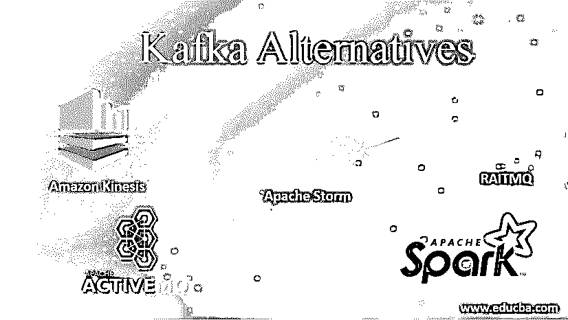

# 卡夫卡式的选择

> 原文：<https://www.educba.com/kafka-alternatives/>

## 卡夫卡替代方案介绍

在这篇文章中，我们将讨论卡夫卡的替代品。Apache Kafka 是一个分布式流媒体平台，最初由 LinkedIn 开发，然后捐赠给 Apache 基金会，该基金会还拥有 Apache Hadoop 和 Apache Solr 等。Kafka 基本上是一个用 [Scala 和【Java 编写的开源流处理平台，用于实时处理数据馈送，提供一个统一的低延迟高吞吐量平台。流媒体平台基本上有三个主要角色，即。实时发布和订阅记录流，存储它们并实时处理它们。](https://www.educba.com/scala-vs-java/)

Kafka 有一个生产者、Kafka 集群(流处理器和连接器)和消费者的基本结构。分布式日志技术可能看起来类似于传统的代理消息传递通道；然而，它们在架构上有很大的不同，并且有不同的复杂用例场景来区分不同的应用程序。然而，由于一些固有的缺点，如消息调整的问题，缺乏速度和缺乏一些消息范式等，了解一些 Apache Kafka 的替代方案变得越来越重要，如 Rait MQ，AWS 的 Kinesis， [Microsoft Azure 的](https://www.educba.com/what-is-azure/) Event Hubs 等。在本文中，我们将简要讨论其中的一些，以及它们相对于 Apache Kafka 的特性和优势。

<small>Hadoop、数据科学、统计学&其他</small>

### 卡夫卡的另类

以下是卡夫卡排名靠前的替代品列表。

#### 1.亚马逊 Kinesis

*   AWS Kinesis 或 Kinesis Streams 被认为是基于卡夫卡。Kinesis 以其超快的速度、可靠性、易操作性和跨平台复制能力而闻名。跨平台复制是物理和逻辑数据中心之间的数据同步。还有很多特定语言的客户端，比如 Java、Scala、Ruy、JavaScript (Node)等。
*   卡夫卡的一个主要缺陷是需要人为干预来安装和维护溪流。然而，Kinesis 将流跨分片(类似于 Kafka 中的分区)进行分解，每个分片对每秒的事务数量和数据量都有严格的限制。如果超过这个限制，您需要增加碎片的数量。这就是 Kinesis 区别于 AWS 的地方，AWS 允许用户通过只为他们使用的东西付费来增加或扩展他们的操作，因此，许多维护对用户是隐藏的。
*   然而，卡夫卡更灵活，可以习惯于用户需要什么；，用户需要管理自己的集群，并需要 DevOps 资源来保持其运行。另一方面，Kinesis 是由亚马逊网络服务作为一项服务出售的，不需要 DevOps 团队来运行它。
*   Kinesis 对股票价格报价器、社交网络数据(尽管 LinkedIn 完全在 Kafka 上运行流数据)、地理空间数据(如连接用户与司机和物联网传感器)等功能更有用。
*   在这两者之间进行选择同样取决于用例以及数据量；然而，Kinesis 是一个很好的开始，因为它的速度和成本优势，如前所述。使用 AWS Kinesis 的一些公司包括亚马逊、Intuit、埃森哲、网飞、Lyft 和 500px。

#### 2.RAITMQ

它是一个传统的消息代理，也是首批具有合理特性的开源消息代理之一。它最初是为实现 AMQP 协议而开发的，该协议因其强大的路由功能而被广泛使用。随着 AMQP 协议的出现，开源消息代理的跨语言灵活性成为可能。它使用智能代理/Dum 消费者方法一致地向消费者传递消息。它是成熟的，如果配置正确的话性能会很好，并且有一个像 Java、.NET、node.js、Ruy、PHP 等等，还有无数可用的插件。虽然 Kafka 有一些优点，比如它在应用程序中包含了代理，因此可以毫不费力地处理流，

*   当应用程序需要在各种协议上工作时，比如 AMQP、STOMP、MQTT，就会用到它。
*   假设您需要对每个消息进行更详细的控制。这意味着数据量较少，用户需要对其进行更多的控制。但是，Kafka 最近增加了对更多控制的支持。
*   应用程序在点对点、请求/回复消息方面需要更大的灵活性。
*   将多个服务/应用与重要的路由逻辑相集成。
*   如果你需要更多的安全应用程序，因为它提供了插件和 API 的支持。此外，它有更好的社区支持，通过各种社区插件，几乎所有可能的情况。
*   使用 RabbitMQ 的公司有 Reddit、9gag、Robinhood、Zapier、Myntra 和 MIT。

#### 3.ActiveMQ

尽管 Kafka 和 ActiveMQ 最初是为完全不同的操作而设计的，但随着时间的推移，它们有许多相互重叠的特性。因此，它们可以互换使用，并且经常用于相同的目的和相互比较。

ActiveMQ 是一个通用的消息代理，就像 RaitMQ 一样，它支持多种消息协议，比如 AMQP、STOMP 和 MQTT。它稍微与众不同的地方是对企业集成模式的更好支持。因此，一般来说，它用于应用程序或服务之间的集成。

一些关键的区别是:

*   允许用不同语言和不同操作系统构建的应用程序相互集成
*   Kafka producer 不等待代理的确认，如果代理处理消息的速度与生产者发送消息的速度一样快，那么它可以提高整体吞吐量。ActiveMQ 必须保存和维护每个状态下每个消息的传递报告。因此，它具有强大的恢复支持，如果队列失败，消息可以在以后恢复。
*   卡夫卡也和卡夫卡一样有更好的存储效率；每条消息有 9 个字节的开销，而 ActiveMQ 有 144 个字节的开销。这使得 ActiveMQ 使用的空间比 Kafka 多了 70%。
*   ActiveMQ 还将消息推送给消费者，而不是消费者必须通过执行 SQL 查询来轮询新消息，这减少了处理新消息所涉及的延迟。
*   它也有一个伟大的 rousts 调度程序，这意味着你可以安排消息在特定的时间交付。
*   使用 ActiveMQ 的公司有 Intuit，Awin，Zingat。

#### 4.阿帕奇火花

*   Spark 是一个开源的分布式通用统一分析引擎，用于大规模分布式数据处理和 ML。除了核心数据处理，它还有用于 SQL、ML 图计算和流处理的库。因此，它比 Kafka 提供的要多得多，Kafka 只在其核心提供流处理。
*   Spark 实时处理生成的数据流，使其成为速度最快的产品之一，从而在金融市场等领域有越来越多的使用案例。此外，随着数据流的增长，它正以指数速度增长，它们的 ML 功能变得更加可行和准确。
*   它还易于使用，不需要预设的 DevOps 团队，因为它有简单的 API 来操作大型数据集。它包括 100 多个用于转换数据的操作符和用于操作半结构化数据的数据框架 API。
*   它还有一个交互式分析引擎，使用户能够获得引人入胜的项目数据。
*   然而，许多人仍然[更喜欢 Kafka](https://www.educba.com/what-is-kafka/) 或更好的 Kafka Streams，因为它的方法相对简单，因此 Spark 更适合从事 ML 和分析的数据科学家和开发人员，而不是简单的消息代理平台。

#### 5.阿帕奇风暴

*   storm 更符合 Spark，因为它主要是在数据方面。这是一个开源的分布式实时数据流计算系统，类似于 Hadoop 对一批数据的处理。它还集成了排队和数据库技术。
*   它还非常快速、可靠和容错，在一个中等规模的集群上，每个节点每秒处理超过一百万条记录。
*   由于其相似的性质，具有多种用例的 Storm 像 Spark 一样被广泛应用于金融、电信、零售、We 和制造部门。

### 结论

虽然有无数其他的卡夫卡替代品像阿卡，暴风，弗林克等。由于功能和一些冗余功能的叠加，以及 AWS 和 Google 等公司的加入，关注功能和使用案例而不是依赖单一解决方案提供商变得越来越重要。

### 推荐文章

这是一本关于卡夫卡替代方案的指南。这里我们详细讨论一下 Kafka 的介绍和替代方案，包括 Amazon Kinesis，RAITMQ，ActiveMQ，Apache Spark。您也可以阅读以下文章，了解更多信息——

1.  【Spark Streaming 是如何工作的？
2.  [Kafka MirrorMaker |五大好处](https://www.educba.com/kafka-mirrormaker/)
3.  [Kafka 控制台消费者指南](https://www.educba.com/kafka-console-consumer/)
4.  [卡夫卡节点| 6 个最佳步骤](https://www.educba.com/kafka-node/)
5.  [卡夫卡复制|如何工作？](https://www.educba.com/kafka-replication/)

