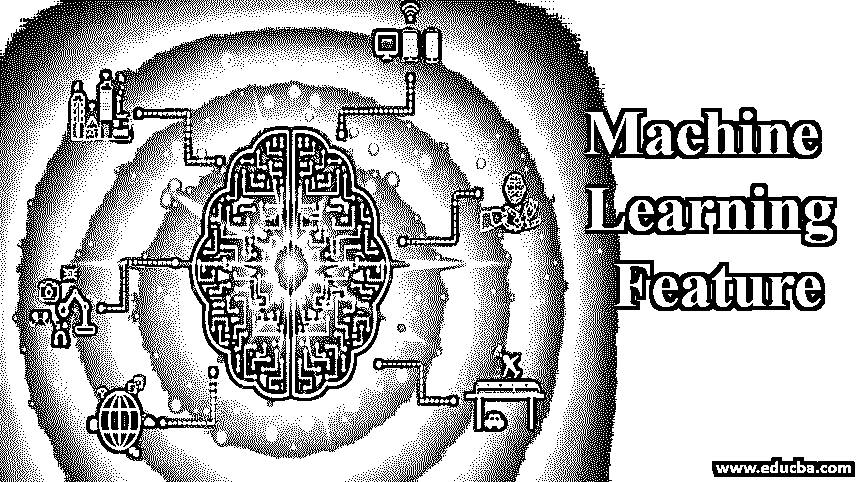

# 机器学习功能

> 原文：<https://www.educba.com/machine-learning-feature/>

## 机器学习功能介绍

机器学习特征被定义为作为学习模型的输入的结构化数据集中的列形式的独立变量。需要分析的是对象的可测量属性。因此，我们拥有的特征越多，我们就能更好地找到模式，但同样重要的是要注意，在过多的特征中，我们可能会面临过度拟合等问题。

### 机器学习策略的类型

您将探索机器学习领域中各种学习类型的介绍，这些学习类型将被分类为:

<small>Hadoop、数据科学、统计学&其他</small>

#### 1.监督机器学习

[有监督的机器学习算法](https://www.educba.com/supervised-machine-learning-algorithms/)将把过去学到的知识应用到新的知识虐待标记的例子中，以预测长期事件。它将输出与正确的假设输出进行联合比较，并找出错误，从而切换模型。它分析教练知识并产生推断的操作，该操作可用于映射新的例子。

为了解决监督学习，我们希望执行后续步骤

*   确定辅导示例的种类。
*   收集教练集。
*   确定所学操作的输入特征图示。
*   确定所学操作的结构和相应的训练算法程序。
*   完成规划。
*   评估培训操作的准确性。

监督学习中需要考虑的主要问题如下:

*   偏差-方差权衡。
*   职能素质和教练知识素质。
*   输入房屋的维度。
*   输出值内的噪声。

#### 2.无监督机器学习

[无监督机器学习](https://www.educba.com/unsupervised-machine-learning/)一旦数据习惯训练既没有被分类也没有被标记，就使用算法程序。这种技术不理解正确的输出，但是，它探索知识，并可以从知识集中进行推断，以解释来自未标记数据的隐藏结构。它统称为组织，允许对给定输入的可能性进行建模。无监督学习的一个主要应用是统计学中的密度估计领域。

无监督机器学习中使用的算法如下所述:

*   群聚；聚集
*   异常检测
*   神经网络

聚类再次被分为不同的类型，例如:

*   基于连通性的聚类
*   基于质心的聚类
*   基于分布的聚类
*   基于密度的聚类

#### 3.半监督机器学习

半监督机器学习算法程序介于监督和非监督学习之间，因为它们使用每个标记和未标记的知识进行指导。一般来说，极少量的标注知识和过量的标注知识都会显著提高学习的准确性。学习程序的标记知识的获取通常需要有天赋的人类代理或物理实验。

它使用许多假设来执行算法程序，其中它一次只使用一个假设。下面提到了它们:

*   连续性假设
*   集群假设
*   流形假设

下面提到了不同类型的半监督学习策略:

*   生成模型
*   低密度分离
*   基于图表的策略
*   启发式方法

#### 4.强化机器学习

强化机器学习算法可能是一种学习技术，它通过制造动作与其氛围进行交互，并发现错误或奖励。代理人需要直接的奖励反馈来发现行动是最好的，这通常被称为强化信号。这种气氛通常用安德烈·马尔科夫呼叫方法来表示，这是由于这种环境中的几种强化学习算法利用了动态规划技术。

动态规划策略和强化学习算法之间的主要区别在于，后者在精确的策略变得不可行的情况下，不假设 Andre Markov 调用方法的特定数学模型的数据。

强化机器学习使用的绑定方法如下:

*   最佳标准
*   强力
*   价值表现
*   蒙特卡洛方法
*   时间区分方式
*   直接策略搜索

Andre Markov 使用的方法是关于微分方程的组合，通过将分数连续并应用于方程

#### 5.自学

它是没有外部奖励和外部老师建议的学习。CAA 自学习算法规则，以一种非常交叉的方式，每一个关于动作的选择和关于结果的选择。这是一个只有一个输入和一个输出的系统。既没有单独的强化输入，也没有来自设置的护理建议输入的关联。

#### 6.特征学习

特征学习可以是允许系统从信息中机械地发现特征检测或分类所需的表示的一组技术。特征学习是由这样一个事实驱动的，即像分类这样的机器学习任务通常需要一个在数学上和计算上对方法方便的输入。特征学习也被称为表征学习。特征学习可以是有监督的，也可以是无监督的。

监督特征学习包括以下方法，例如:

*   监督字典学习
*   神经网络

无监督特征学习包括后续方式，例如:

*   k 均值聚类
*   [主成分分析](https://www.educba.com/principal-component-analysis/)
*   局部线性嵌入
*   独立成分分析
*   无监督字典学习

特征学习的设计是为了支持分布式插图的信念，在这一过程中，输入是前一级的插图，并产生新的输出。最底层的输入是信息，因此最终层的输出是最终的低维特征。

#### 7.稀疏字典学习

这是一种插图学习方法，旨在找到计算机文件的分布式插图，其形式为基本部分的线性组合，仍然是这些基本部分本身。这些部分被称为组成字典的原子。字典中的原子不必是正交的，它们将在一个完整的生成集上相关联。稀疏字典学习最重要的应用是在压缩传感或信号恢复领域。

下面提到了用于稀疏字典的算法:

*   最佳方向法
*   k-奇异值分解
*   随机梯度下降
*   拉格兰德对偶方法
*   参数训练方法
*   在线词典学习

### 机器学习的优势

机器学习有几个优点，其中一些列举如下:

*   它很容易识别趋势和模式
*   该程序不需要人工干预，因为它是自动化的
*   他们不断改进自己的不准确性
*   它们可以处理多维和多种数据
*   它具有帮助和提供良好体验的能力。

### 推荐文章

这是机器学习功能的指南。在这里，我们讨论的介绍和特点，以及优势和不同的机器学习策略。您也可以阅读以下文章，了解更多信息——

1.  [机器学习数据集](https://www.educba.com/machine-learning-datasets/)
2.  [什么是机器学习系统？](https://www.educba.com/machine-learning-system/)
3.  [机器学习中的集成方法](https://www.educba.com/ensemble-methods-in-machine-learning/)
4.  [机器学习的统计数据](https://www.educba.com/statistics-for-machine-learning/)

