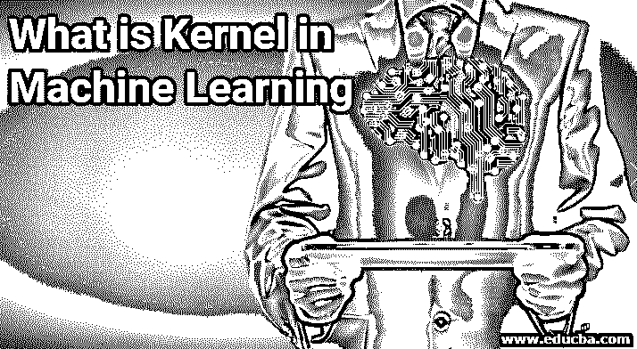
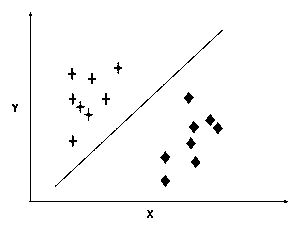
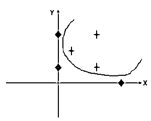
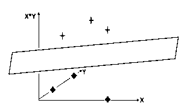

# 机器学习的核心是什么

> 原文：<https://www.educba.com/what-is-kernel-in-machine-learning/>

## 机器学习中的内核是什么？

机器学习是一个广阔的领域，我们希望机器在没有明确编程的情况下进行学习。在 ML 中，我们处理回归、分类和模式识别问题。在分类问题中，任务是根据已知的输入标签对不同的类进行分类(监督学习)，我们有不同的方法。一个是 SVM(支持向量机):核方法(核技巧)在 SVM 使用。机器学习中的核用于解决数据集中存在的非线性。用户指定的核函数(相似性函数)向数据集添加了另一维度，通过这样做，现在可以使用线性超平面对数据集进行分类。

### 为什么我们需要内核方法？

为了解决这个问题，我们将采用一个简单的分类问题来对数据集中的两个不同类别的数据进行分类。在数据集中，我们根据两个特征 X 和 y 分为星形和菱形两个类别。只需使用一条直线就可以轻松区分这两个数据集。见下图:(来源:自拟)

<small>Hadoop、数据科学、统计学&其他</small>

**图 A:可线性分离的数据集，用线性函数(线)分离**

让我们举另一个例子，这里我们也有两个类别星和钻石，但现在他们不是线性可分的。在这种情况下，我们将使用一个核函数，它给出的输出使数据集可以线性分离。

对于我们的分析，我们将只取 6 个数据点。

**图 B 无法使用线性函数分离的数据集。**

所有星点的坐标:(1，2)；(2, 1) ;(2, 3)

所有菱形点的坐标:(0，1)；(0, 3) ;(4, 0)

这里我们可以看到，不可能用一个线性函数来区分每个类别。为了解决这个问题，我们将引入一个内核函数()。

对于我们的例子，我们将使用的内核函数是:X*Y

这个核函数为现有的数据点增加了另一个维度。简单地说，现在一个点的坐标是(X，Y，X*Y)。

现在星点的坐标是:(1，2，2)；(2, 1, 2) ;(2, 3, 6)

所有菱形点的坐标为:(0，1，0)；(0, 3, 0) ;(4, 0, 0)

我们观察到所有菱形点的三维坐标都是零。通过引入这个核函数，我们可以使用一个线性超平面来区分两个类别。

**图 C:分离非线性扩散数据集的线性超平面**

这就是我们需要知道什么是内核机器学习的原因。我们的数据集是二维的，位于二维平面上(就像一张纸)。现在通过使用一个核，我们可以把这个 2D 平面放到其他更高维的空间。

### 机器学习中的内核是什么？

机器学习中的内核是一个研究领域，它使计算机能够在没有显式编程的情况下进行学习。基本上，我们在核方法或技巧的帮助下将输入数据集放入一个更高维的空间，然后在这个更高维的空间中使用任何可用的分类算法。这就是我们如何得到一个线性分离这两个类别的超平面。我们可以在图 C 中看到，这个超平面现在可以很容易地区分这两类。

换句话说，机器学习中的核是两点之间相似性的度量，它也取决于任务。例如，如果一个人的任务是识别不同的类别。机器学习中的内核将尝试为具有相同对象的数据分配低值，而为另一组对象分配高值。这里要注意的是内核提供了一种比逐点比较相似性更快的方法来寻找相似性。

比方说，如果我们使用内核进行文本处理，那么它会将高值分配给相似类型的字符串，将低值分配给不相似的字符串。

核函数从原始维度获取数据，并通过使用高维向量的点积来提供标量输出。因此，核方法的输出是一个标量，通过这种方式，高维度被降低，并且我们可以容易地避免高维度计算来分类类别。这就是内核戏法的神奇之处。

让我们看一个简单的例子:

I = (i1，i2，i3)；

J = (j1，j2，j3)。

解决非线性的简单函数:a 指 I，j

f = (a1a1，a1a2，a1a3，a2a1，a2a2，a2a3，a3a1，a3a2，a3a3)

核方法是 K(i，j ) = (i.j)^2

我们将使用一些任意的数据。

i = (1，2，3)；

j = (4，5，6)。

然后:
f(i) = (1，2，3，2，4，6，3，6，9)

f(j) = (16，20，24，20，25，30，24，30，36)

f(一)。f(j)= 16+40+72+40+100+180+72+180+324 = 1024

计算量很大，因为 f 试图从 3 维空间映射到 9 维空间。

如果我们使用内核技巧，那么:

K(i. j) = (4 + 10 + 18 ) ^2 = 32^2 = 1024

相同的输出，和非常少的计算。

对于每一个具有更高维度和非线性的分类问题，我们不能使用核，而不付出任何额外的努力。如果我们对复杂的和更高的维度使用核，它增加了模型的灵活性。因此，想法是使用简单的内核，可以减少计算时间和复杂性。因为灵活性越大，就越有可能在训练集上过度适应。过度拟合会破坏模型。

很难选择哪一个内核应该用于特定的问题。一般来说，建议尝试小-小训练集中所有可能的内核，并使用最好的一个。

### 利益

我们将讨论在 ML 中使用内核技巧的一些好处。

*   内核降低了计算的复杂度，使计算速度更快。
*   我们可以使用内核来处理无限维。
*   内核有助于轻松区分相似的对象。
*   内核通过引入线性来帮助处理非线性数据。
*   内核给出一个标量输出。

### 结论

核技巧用于转换数据集中存在的非线性，以减少计算任务并引入线性。内核提供了一个相似性函数，通过提供标量输出进一步帮助对数据进行分类。本文简要介绍了为什么内核如此重要，以及如何在机器学习中使用内核技巧。

### 推荐文章

这是一个指导什么是机器学习的核心。这里我们也讨论为什么我们需要内核方法和好处。您也可以看看以下文章，了解更多信息–

1.  什么是监督学习？
2.  [机器学习算法](https://www.educba.com/machine-learning-algorithms/)
3.  [SVM 算法](https://www.educba.com/svm-algorithm/)
4.  [单片内核](https://www.educba.com/monolithic-kernel/)

