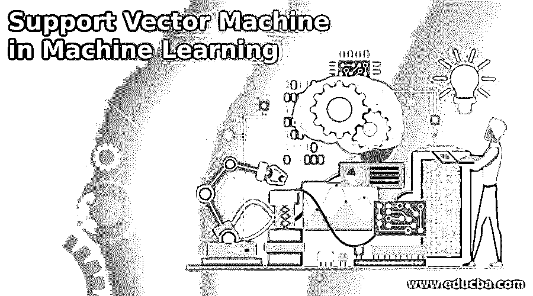
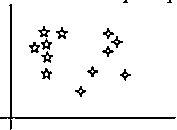
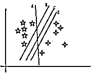
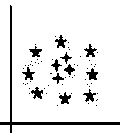
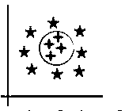
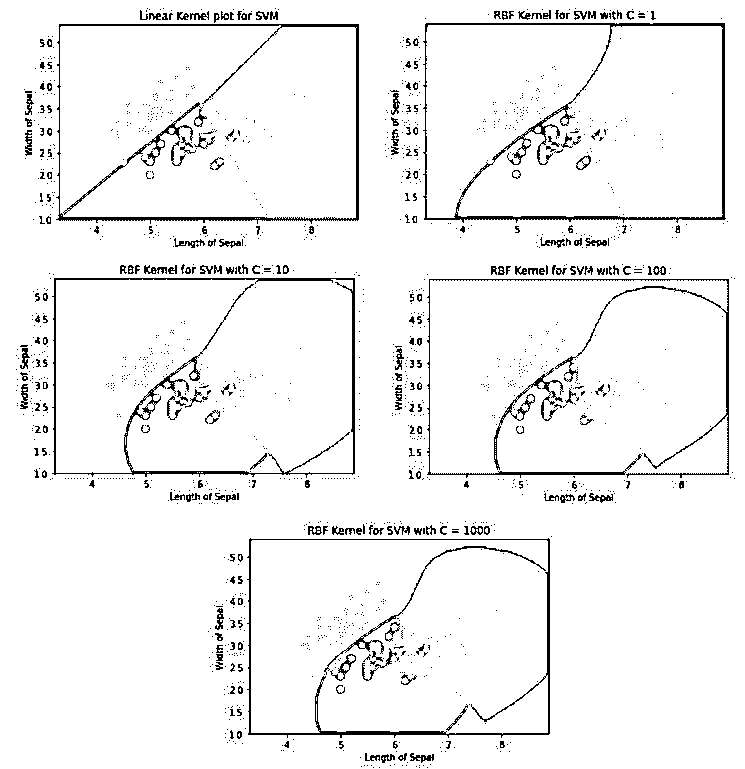

# 机器学习中的支持向量机

> 原文：<https://www.educba.com/support-vector-machine-in-machine-learning/>

## 机器学习中的支持向量机简介

机器学习中的支持向量机被定义为属于监督学习类的数据科学算法，该算法分析数据集的趋势和特征，并解决与分类和回归相关的问题。支持向量机基于 VC 理论(Vapnik-Chervonenkis 理论)的学习框架，并且每个训练数据点被标记为 2 个类别之一，然后迭代地构建将空间中的数据点分成 2 组的区域，使得该区域中的数据点在具有最大宽度或间隙的边界上被很好地分开。

将不同的数据点设置成两个类别中的相应一个类别是非概率二进制分类器。现在，当一个新的示例进入该空间时，从特征中预测相应的组，并将其分配给相同的组。

<small>Hadoop、数据科学、统计学&其他</small>

### 支持向量机在机器学习中是如何工作的？

支持向量机能够概括区分提供给算法的训练数据的特征。这是通过检查以最大余量区分两个类别的边界来实现的。分隔这两类的边界称为超平面。即使名字有一个平面，如果有两个特征，这个超平面可以是一条线，在 3d 中它将是一个平面，等等。在样本空间中，可能有无数的超平面，但是支持向量机的目标是通过迭代过程找到该超平面，该迭代过程确定具有来自所有相应训练点的最大余量的超平面，并且这将有助于任何新点根据特征落入准确的类别。

现在是时候让我们了解支持向量机的工作原理了。有两种类型的数据，因此 SVM 对数据类型的处理方式也有所不同。对于第一类数据，它需要是线性可分的。假设数据以下面的方式分布在样本空间中。为了简单起见，让我们假设数据是二维的，我们将在随后的段落中逐渐把它转换成三维的。

作为超平面，样本空间将产生下面的线。让我们把它们命名为 A，B，C，d。

在上图中，我们看到所有的超平面都在对数据集中的不同组进行准确的分类。但问题是他们中谁做得更干净。让我们一个一个来看。线 A 完成了工作，但是 2 个点非常接近该线，甚至一个单独的移动都可能使模型陷入正确和错误的混乱中。现在看 B 线，我们看到 5 颗指针星非常靠近那条线，因此即使有微小的变化，仍然有被错误分类的风险。对于 D 线，四角星更近，因此最有可能被错误分类。这样，我们只剩下 C 行，它被证明是最好的。最接近可分割线的数据点被称为支持向量，并且支持向量与可分割线的距离确定了最佳超平面。

我们在这里做了什么？

我们遵循一些最佳分离的基本规则，它们是:

*   **最大分离度:**我们选择了能够将所有数据点分离到相应类别的线，这就是我们如何将其缩小到 A、B、C、d。
*   **最佳分离:**从线 A、B、C、D 中，我们选择具有最大余量的线来分类数据点。这是相对于相应支持向量(最接近的数据点)具有最大宽度的线。

并不是每次我们都可能遇到线性可分的数据，这就是为什么我们会遇到另一种类型的数据，那就是非线性可分的数据。为此，我们也需要确定边界，但是你认为会有任何直线能够区分下面的数据集吗？

更重要的是寻找直线以外的东西，可能是圆。

下面的界限是什么？

我们现在观察到他们完全分开了吗？当然，它们比一条线能做到的要好得多。这就是所谓的内核技巧。在内核技巧中，数据被投影到更高维度，然后构建一个平面，以便数据点可以被分离。这些核中的一些是 RBF、Sigmoid、Poly 等。使用各自的内核，我们将能够调整数据集，以获得最佳超平面，再次使用上面看到的 2 条规则来分离训练数据点。

### 机器学习中支持向量机的例子

下面是提到的例子:

SVM 使用著名的虹膜数据集。

**语法:**

`import numpy as np
import matplotlib.pyplot as plt
from sklearn import svm, datasets
dfIris = datasets.load_iris()
features = dfIris.data[:, :2] target = dfIris.target
C_grid = [1,10,100,1000] svc = svm.SVC(kernel='linear', C=1, gamma='auto').fit(features, target)
x_low, x_high = features[:, 0].min() - 1, features[:, 0].max() + 1
y_low, y_high = features[:, 1].min() - 1, features[:, 1].max() + 1
height = (x_high / x_low)/100
xAxisGrid, yAxisGrid = np.meshgrid(np.arange(x_low, x_high, height),
np.arange(y_low, y_high, height))
plt.subplot(1, 1, 1)
predSVM = svc.predict(np.c_[xAxisGrid.ravel(), yAxisGrid.ravel()])
predSVM = predSVM.reshape(xAxisGrid.shape)
plt.contourf(xAxisGrid, yAxisGrid, predSVM, cmap=plt.cm.Paired, alpha=0.8)
plt.scatter(features[:, 0], features[:, 1], c=target, cmap=plt.cm.Paired)
plt.xlabel('Length of Sepal')
plt.ylabel('Width of Sepal')
plt.xlim(xAxisGrid.min(), xAxisGrid.max())
plt.title('Linear Kernel plot for SVM')
plt.show()
for c in C_grid:
svc = svm.SVC(kernel='rbf', C=c,gamma='auto').fit(features, target)
x_low, x_high = features[:, 0].min() - 1, features[:, 0].max() + 1
y_low, y_high = features[:, 1].min() - 1, features[:, 1].max() + 1
height = (x_high / x_low)/100
xAxisGrid, yAxisGrid = np.meshgrid(np.arange(x_low, x_high, height),
np.arange(y_low, y_high, height))
plt.subplot(1, 1, 1)
predSVM = svc.predict(np.c_[xAxisGrid.ravel(), yAxisGrid.ravel()])
predSVM = predSVM.reshape(xAxisGrid.shape)
plt.contourf(xAxisGrid, yAxisGrid, predSVM, cmap=plt.cm.Paired, alpha=0.8)
plt.scatter(features[:, 0], features[:, 1], c=target, cmap=plt.cm.Paired)
plt.xlabel('Length of Sepal')
plt.ylabel('Width of Sepal')
plt.xlim(xAxisGrid.min(), xAxisGrid.max())
plt.title('RBF Kernel for SVM with C = ' + str(c))
plt.show()`

**输出:**

在上面的图中，我们看到随着内核从线性移动到 rbf，我们能够正确分类的数据点的数量增加，并且我们从 1->10->100->1000 移动，我们能够更好地分类它，但只是增加了复杂性。

### 支持向量机在机器学习中的优缺点

下面给出了提到的优点和缺点:

#### 优势:

*   由于只有支持向量对于确定超平面是重要的，因此该算法具有很高的稳定性。
*   离群点不影响超平面的判定。
*   数据集不需要有预定义的假设。
*   同样，由于只涉及支持向量，该算法也是内存高效的。

#### 缺点:

*   当数据集很大时，训练时间会更长。
*   如果目标类甚至在更高的维度上重叠，SVM 开始表现不佳。
*   这是一个黑盒，不提供概率估计，这使得在培训期间更难解释下一步该做什么。

### 结论

这样，我们就结束了 SVM 的工作方式以及背后的直觉。我们鼓励您尝试用 python 来体验 SVM 模块的不同参数，以获得更深入的了解。

### 推荐文章

这是一个机器学习中支持向量机的指南。在这里我们讨论介绍，工作，例子，优点和缺点。您也可以看看以下文章，了解更多信息–

1.  [神经网络机器学习](https://www.educba.com/neural-network-machine-learning/)
2.  [机器学习备忘单](https://www.educba.com/machine-learning-cheat-sheet/)
3.  [什么是机器周期？](https://www.educba.com/what-is-machine-cycle/)
4.  [机器学习功能](https://www.educba.com/machine-learning-feature/)

