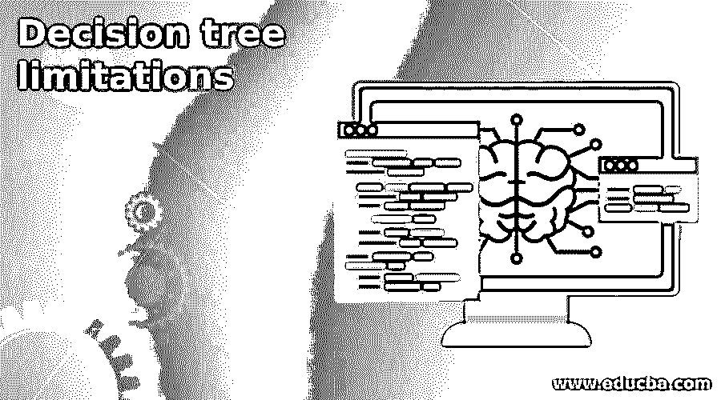

# 决策树的局限性

> 原文：<https://www.educba.com/decision-tree-limitations/>

## 决策树限制简介

决策树模型是复杂的分析模型，易于理解、可视化、执行和评分，只需最少的数据预处理。这些是受监督的学习系统，其中输入根据特定的因素被不断地分成不同的组。它们也有我们将要讨论的局限性；当树中的决策和结果很少时，决策树通常很容易理解。典型的例子包括无法测量属性值、此类测量的高成本和复杂性，以及无法同时获得所有属性。

### 决策树的局限性

以下是下面提到的限制

<small>Hadoop、数据科学、统计学&其他</small>

#### 1.不利于回归

逻辑回归是一种统计分析方法，它使用独立的特征来尝试预测精确的概率结果。在高维数据集上，这可能会导致模型在训练集上过度拟合，夸大训练集预测的准确性，从而阻止模型准确预测测试集的结果。

这种情况在模型使用少量训练数据和大量特征进行训练时最为常见。应该在高维数据集上考虑正则化策略，以最小化过拟合(但这会使模型变得复杂)。如果正则化变量太高，该模型可能对训练数据欠拟合。

逻辑回归很难捕捉复杂的相关性。这种方法很容易被更强大和复杂的算法如神经网络所超越。

因为逻辑回归(见上图)有一个线性决策面，它不能处理非线性问题。在现实世界中，线性可分数据并不常见。因此，必须转换非线性特征，这可以通过增加特征的数量来实现，以便可以在更高维度中线性分离数据。

#### 2.过度拟合问题

决策树学习者可以创建过于复杂的树，这不能很好地概括输入。这被称为过度拟合。避免此类问题的一些重要技巧是

*   修剪
*   建立叶节点所需的最小样本量
*   设置树的最大深度

如果我们继续开发该树，输入数据表的每一行都可能被视为最终规则。在训练数据上，该模型的表现令人钦佩，但在测试数据上它将无法验证。当树达到特定的复杂程度时，就会发生过度拟合。过度拟合很可能发生在一棵非常大的树上。

该决定努力避免过度拟合。树木几乎总是在到达深度之前就停止生长；因此，每个叶节点仅包括来自一个类或一个观测点的观测值。有几种方法可以确定何时停止树的生长。

1.  如果叶节点在生长过程中的任何时候都是纯节点，则不会从该节点生长出额外的下游树。其他叶节点可用于继续生长树。
2.  当树杂质的减少相对较小时。当杂质降低很少量时，比如 0.001 或更少，该用户输入参数导致树终止。
3.  当叶节点上只剩下一些观察值时。这确保了当节点的进一步分裂的可靠性由于有限的样本大小而受到质疑时，树被终止。根据中心极限定理，一个大样本由大约 30 个相互独立的观测值组成。这可以作为一般的指导，但是因为我们通常使用可能相关的多维观察，这个用户输入参数应该高于 30，比如 50 或 100 或更多。

#### 3.昂贵的

创建决策树的成本很高，因为每个节点都需要字段排序。在其他算法中，同时使用几个字段的混合，导致甚至更高的开销。由于必须产生和比较大量的候选子树，修剪方法也是昂贵的。

#### 4.样本间的独立性

每个定型示例必须完全独立于数据集中的其他样本。如果它们以某种方式相关，模型将尝试给予那些特定的训练实例更多的权重。因此，不应将匹配数据或重复测量用作训练数据。

#### 5.易变的

因为数据的微小变化会导致构建一个完全不同的树，所以决策树是不稳定的。在集成中使用决策树有助于解决这个困难。

#### 6.贪婪的方法

要形成二叉树，必须正确划分输入空间。用于此的贪婪算法是递归二进制分裂。这是一个需要排列各种数值的数值过程。将根据第一个最佳剥离来剥离数据，并且仅使用该路径来剥离数据。然而，分裂的各种途径可能更有启发性；因此，这种分割可能不是最好的。

#### 7.预测不是平滑或连续的

如下图所示，决策树预测既不是平滑的也不是连续的，而是分段常数逼近。

### 结论–决策树的局限性

我们在上面提到了决策树的局限性，人们发现决策树的问题大于好处，特别是在大型复杂的树中，阻止了它们作为决策工具的广泛使用。为了绕过决策树的约束，我们需要使用随机森林，它不依赖于单棵树。它种下一片树林，然后根据投票数做出决定。bagging 方法是集成学习方法之一，用于随机森林。因为最大值点是非线性的，所以机器学习不能总是依赖线性模型。应该提到的是，诸如随机森林和决策树之类的树模型擅长处理非线性。

换句话说，决策树试图从训练数据中学习一切可能的东西，甚至是噪音和离群值。虽然这对于训练数据是理想的，但是它对未来的数据(非噪声数据)有负面影响。

> ### Recommended articles

这是一个关于决策树局限性的指南。这里我们讨论上面决策树的局限性，并且发现决策树的问题大于好处。您也可以看看以下文章，了解更多信息–

1.  [什么是决策树？](https://www.educba.com/what-is-decision-tree/)
2.  [创建决策树](https://www.educba.com/create-decision-tree/)
3.  [R 中的决策树](https://www.educba.com/decision-tree-in-r/)
4.  [决策树算法](https://www.educba.com/decision-tree-algorithm/)

