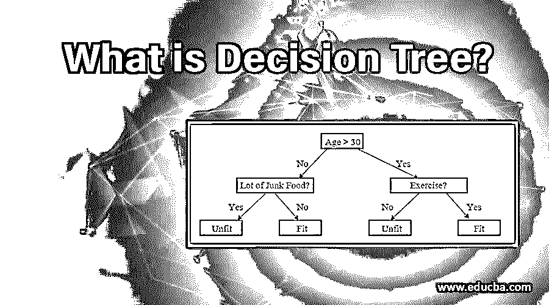
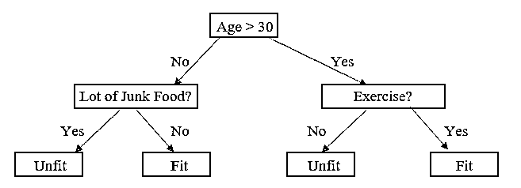

# 什么是决策树？

> 原文：<https://www.educba.com/what-is-decision-tree/>

## 决策树介绍

决策树是一种分层的树结构算法，用于从各种输入中导出有意义的输出。从这种层次结构中获取的输出被认为是对基本业务决策产生分析结果的有价值的贡献。因此，这种算法被称为决策树。当被评估的数据量很大，并且不可能手动检查大部分数据时，商业专家从决策树中寻求帮助。

### 什么是决策树？

现在让我们深入了解决策树属于哪一类，以及术语决策树的确切含义。正如我们之前讨论的，决策树属于监督学习的范畴。监督学习是机器学习的[部分，其中模型根据数据进行训练，输出特征位于数据集中。通俗地说，我们的意思是我们已经知道输出是什么，在此基础上，我们查看输入特征，并尝试训练一个模型来获得输出变量或特征。](https://www.educba.com/what-is-machine-learning/)

<small>Hadoop、数据科学、统计学&其他</small>

现在来看什么是决策树。决策树是一种生成树状结构或流程图状结构的算法，其中每一层或我们称之为节点的部分基本上都是对某个功能的测试。这个测试基本上是基于本文后面描述的标准对一个特性进行操作。此外，需要记住的一点是，在起始节点，整个数据集属于一个类别，随后在每一层中，都会发生数据拆分。

| **年龄** | **很多垃圾食品** | **练习** | **健康/不健康** |
| **45** | 不 | 不 | 不健康的 |
| **40** | 不 | 是 | 合适的 |
| **25** | 是 | 不 | 不健康的 |
| **29** | 不 | 是 | 合适的 |
| **23** | 是 | 是 | 不健康的 |

在下图中，我们将看看如何读取数据提到的表的决策树。

在上图中，我们阅读决策树，假设这个人的年龄超过 30 岁，然后检查这个人是否在锻炼。如果是，那么这个人是合适的，否则，这个人是不合适的。如果这个人不到 30 岁，那么检查一下这个人是否吃了很多垃圾食品。如果这个人是，那么这个人是不合适的，否则这个人是合适的。

### 对决策树的理解

现在，当我们查看每一层时，我们会检查一个特定的特征。这就是我们在上一节中谈到的，我们在每一层测试一个特定的特性。现在让我们直观地看看如何决定我们需要测试哪个特性，以便得到一个最佳的分割。

如果你看一下数据，任何一个超过 30 岁的人都有“大量垃圾食品”的问题。这意味着对于一个超过 30 岁的人来说，这一特殊特征并不能区分健康与不健康。但是，如果我们看看“运动”的特点，是或否的区别分离了健康/不健康的标签。这意味着，如果我们检查“锻炼”的特征，我们将得到最佳的分割。

现在对于一个不到 30 岁的人来说，情况可能有点不同。在这种情况下，如果“大量垃圾食品”是肯定的，它总是“不适合”，而数据可能不足以表明“锻炼”是否起作用。因此，“大量垃圾食品”实际上起了作用，对于“锻炼”，我们没有数据证实最佳分割，因此选择“大量垃圾食品”来分割我们的数据。

现在来谈谈我们如何用算法来决定的数学原因。我们有所谓的“信息增益”(IG)和“基尼指数”来了解我们广泛使用的特征。对于信息增益，我们使用我们拥有的不同特征来计算不同分裂的熵。熵只不过是随机性，而信息增益是分裂前和分裂后熵的差异，同样，我们希望分裂后具有最小的随机性，因此分裂后有更多的信息增益。对于“基尼指数”，它只不过是一个随机选择的特定变量被错误分类的概率。通俗地说，如果我们想要区分它们，IG 试图减少随机性，这意味着每次分裂中的类比例在概率上是相等的，而在 Gini 中，它将试图在分裂后的分裂节点中与纯类一起分裂。

### 我们在哪里使用决策树？

现在每个阅读这篇文章的人都在想我们应该在哪里使用决策树？

*   **战略规划:**知道一个企业应该专注于哪些领域。
*   **产品规划:**了解产品的哪些特性会影响产品的销售。
*   由于其固有的特性重要性，我们在金融用例中使用它来了解什么特性影响预测。
*   了解特定客户的贷款能否成功收回。
*   决策树能够处理分类和回归问题。

### 决策树的优势

现在我们已经了解了什么是决策树，让我们看看它的优势:

*   由于内置的树形结构决策树，很容易理解数据拆分背后的直觉。
*   它被广泛用作数据探索的一部分。
*   它很少人为干预。
*   分类和数字特征可以在输入特征中进行处理。

### 结论

因此，总之，决策树有一个其他算法无法触及的全新维度，那就是特征的非线性。因为没有线性假设，所以它也适合非线性数据集。决策树作为一种类似流程图的结构，使其成为数据科学领域中广泛使用的算法。

### 推荐文章

这是一个什么是决策树的指南？这里我们讨论决策树的介绍、理解、使用和好处。您也可以阅读以下文章，了解更多信息——

1.  [数据挖掘中的决策树算法](https://www.educba.com/decision-tree-in-data-mining/)
2.  [机器学习中的决策树](https://www.educba.com/decision-tree-in-machine-learning/)
3.  [12 大数据挖掘类型](https://www.educba.com/type-of-data-mining/)
4.  [决策技巧](https://www.educba.com/decision-making-techniques/)

