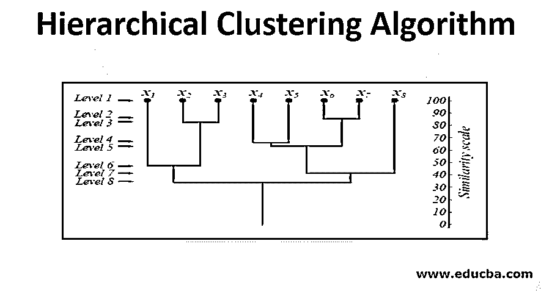
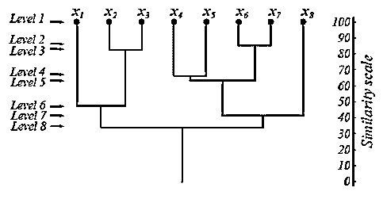
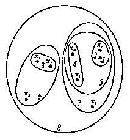

# 分层聚类算法

> 原文：<https://www.educba.com/hierarchical-clustering-algorithm/>

## 层次聚类算法简介

分层聚类算法是一种无监督的机器学习技术。它旨在根据数据的特征找到自然的分组。分层聚类算法旨在通过构建层次结构来查找嵌套的数据组。它类似于植物界或动物界的生物分类学。分级聚类通常使用称为树状图的分级树来表示。

### 层次聚类算法的类型

分层聚类算法有两种类型:

<small>Hadoop、数据科学、统计学&其他</small>

*   分裂的
*   结块的

#### 1.分裂的

这是一种自上而下的方法，它最初将整个数据视为一个组，然后迭代地将数据分成子组。如果层次聚类算法的数目是已知的，那么一旦达到聚类的数目，划分过程就停止。否则，当数据不能再被分割时，该过程停止，这意味着从当前迭代获得的子组与从先前迭代获得的子组相同(也可以认为当每个数据点是聚类时，分割停止)。

#### 2.结块的

这是一种自下而上的方法，依赖于集群的合并。最初，数据被分成 m 个单独的聚类(其中 m 的值是样本/数据点的数量)。迭代地将两个聚类合并为一个，从而减少每次迭代中的聚类数量。当所有的聚类已经被合并成一个或达到期望的聚类数目时，合并聚类的过程停止。

在级别 1，有 m 个聚类在级别 m 减少到 1 个聚类。那些被合并以在较低级别形成聚类的数据点也在较高级别保持在相同的聚类中。例如，假设有 8 个点 x1..x8，所以最初，在级别 1 有 8 个集群。假设点 x1 和 x2 在第 2 级合并成一个簇，那么直到第 8 级，它们都在同一个簇中。

上图显示了 8 个数据点的聚集聚类方法的树状图表示，以及对应于每个级别的相似性等级。聚类的级别让我们知道聚类中的数据点有多相似。如图 1 所示，数据点越早合并成一个聚类，它们就越相似。因此，第 2 级聚类中的数据点(例如 x2 和 x3)比第 6 级聚类中的数据点(例如 x1 和 x2)更相似。

上图显示了上述 8 个数据点的凝聚聚类方法的集合或文氏图表示。树状图和集合表示都可以用于聚类。然而，树状图通常是更好的资产表示，它不能定量地表示集群的相似性。

### 层次聚类算法的步骤

让我们遵循下面给出的分层聚类算法的以下步骤:

#### 1.算法

凝聚层次聚类算法。

1.  开始初始化 c，c1 = n，Di = {xi}，i = 1，…，n '
2.  do C1 = C1–1
3.  找到最近的集群，比如 Di 和 Dj
4.  合并 Di 和 Dj
5.  直到 c = c1
6.  返回 c 群集
7.  结束

该算法最初从 n 个聚类开始，其中每个数据点是一个聚类。随着每一次迭代，当两个最近的聚类合并时，聚类的数量减少 1。这个过程继续进行，直到聚类的数量减少到预定值 c

##### 如何决定哪些集群是靠近的？

这是使用如下几个距离度量来定义的:

*   集群之间的最小距离 dmin(Di，Dj)。对单身有用。
*   聚类之间的最大距离 dmax(Di，Dj)。完全有用。
*   聚类之间的平均距离 davg(Di，Dj)。

##### 什么是单联动和完全联动？

*   当 dmin(di，dj)用于寻找两个聚类之间的距离，并且如果最近的聚类之间的距离超过阈值，则该算法终止，则该算法被称为单链接算法。
*   当 dmax(Di，Dj)用于寻找两个聚类之间的距离，并且如果最近的聚类之间的距离超过阈值，则该算法终止，那么该算法被称为完全链接算法。
*   让我们把每个数据点看作一个图的节点。如果两个数据点属于同一个聚类，则它们之间存在边。当两个最近的聚类合并时，会添加一条边。它被称为单一链接，因为从一个节点到另一个节点存在唯一的路径。
*   完全链接算法通过最小化两个最远点之间的距离来合并两个聚类。
*   单一链接算法生成生成树。然而，这种算法容易受到噪声的影响。完整的链接算法生成完整的图形。

##### 算法的时间复杂度是多少？

假设我们在 d 维空间中有 n 个模式，我们用 dmin(Di，Dj)组成 c 个簇。我们需要计算 n(n-1)个点间距离——每一个都是 O(d 2 )计算——并将结果放入点间距离表中。空间复杂度为 O(n 2 )。寻找最小距离对(用于第一次合并)要求我们遍历完整的列表，保留最小距离的索引。

因此，对于第一个凝聚步骤，复杂度为 O(n(n1)(d2+1))= O(n2d2)。对于另一个任意凝聚步骤(即从 c1 到 c11)，我们只需遍历列表中的 n(n1)–C1“未使用”距离，并找到 x 和 x’位于不同簇中的最小距离。这也是 O(n(n 1)C1)。因此，总时间复杂度为 O(cn 2 d 2 )，在典型条件下为 n > > c。

#### 2.形象化

一旦数据被划分到聚类中，将聚类可视化是一个很好的做法，这样可以了解分组的情况。但是可视化这些高维数据是很困难的。因此，我们使用主成分分析(PCA)进行可视化。在 PCA 之后，我们获得低维空间(通常是 2D 或 3D)中的数据点，我们可以绘制这些数据点以查看分组。

**Note:** High dimension means a large number of features and not a number of data points.

#### 3.估价

评估聚类的方法之一是聚类之间的点的距离(聚类间距离)应该比聚类内的点的距离(聚类内距离)大得多。

### 结论

层次聚类算法用于发现数据中的嵌套模式。层次聚类有两种类型——分裂型和凝聚型树状图和集合/文氏图可用于表示。单个链接通过最小化两个聚类之间的最小距离来合并它们。它通过最小化两个集群之间的最大距离来合并两个集群，从而形成一个完整的图。层次聚类算法的总时间复杂度为 O(cn 2 d 2 ，其中 c 为预定义的聚类数，n 为模式数，d 为 n 个模式的 d 维空间。

### 推荐文章

这是一个分层聚类算法的指南。这里我们讨论层次聚类算法的类型和步骤。你也可以看看下面的文章来了解更多-

1.  [系统聚类分析](https://www.educba.com/hierarchical-clustering-analysis/)
2.  [R '](https://www.educba.com/hierarchical-clustering-in-r/)中的层次聚类
3.  [聚类算法](https://www.educba.com/clustering-algorithm/)
4.  [什么是数据挖掘中的聚类？](https://www.educba.com/what-is-clustering-in-data-mining/)

