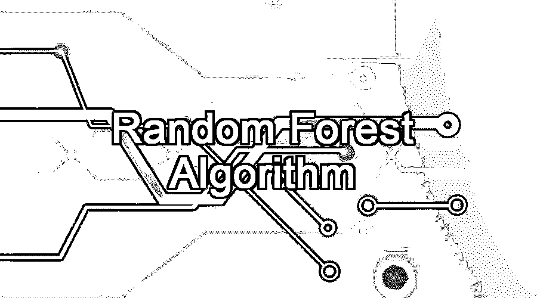

# 随机森林算法

> 原文：<https://www.educba.com/random-forest-algorithm/>

## 随机森林算法简介

算法是进行复杂计算以解决问题的一系列步骤。创造算法是为了解决机器学习问题。随机森林算法就是这样一种用于机器学习的算法。它用于根据之前反馈的数据训练数据，并预测未来可能的结果。它是一种非常流行和强大的机器学习算法。

### 了解随机森林算法

随机森林算法基于监督学习。它可用于回归和分类问题。顾名思义，随机森林可以看作是随机抽样的多个决策树算法的集合。该算法是为了根除决策树算法的缺点而提出的。

<small>Hadoop、数据科学、统计学&其他</small>

Random forest 是 Breiman 的" [bagging](https://en.wikipedia.org/wiki/Bootstrap_aggregating) "思想和随机选择功能的结合。其思想是通过取多个决策树输出的平均值或模式来使预测精确。考虑的决策树数量越多，输出就越精确。

### 工作

为了理解随机森林的工作原理，首先，我们需要理解决策树的工作原理，因为随机森林是基于决策树的。

### 决策图表

这是一个简单但流行的算法，遵循自顶向下的方法。决策树中的每个节点代表一个属性，叶子代表结果。将节点链接到叶子的分支是预测的决策或规则。最后，根节点是最能描述训练数据集的属性。因此，整个过程被绘制成树状结构。

**决策树的局限性:**

*   它倾向于过度适应训练数据集。因此，当用于测试或不同的数据集时，结果可能会有所不同。因此，它会导致糟糕的决策。此外，树可能是不稳定的，因为数据的微小变化可能导致完全不同的树。

随机森林使用装袋方法来获得期望的结果。其概念是对数据集应用决策树算法，但每次使用不同的训练数据样本。这些决策树的输出将是不同的，并且可能基于馈送给算法的训练数据而有所偏差。因此，最终的输出可以作为单个决策树输出的平均值或模式。因此可以减少差异。取样可以通过替换来完成。决策树的输出是有等级的，等级最高的将是随机森林的最终输出。因此，所获得的输出将更少偏差且更稳定。

### 随机森林算法的重要性

下面给出的是随机森林算法的重要性:

*   随机森林算法可用于机器学习的回归和分类模型。
*   它还可以处理数据集中缺失的值。
*   与决策树不同，它不会过度拟合模型，也可用于分类变量。随机森林增加了模型的随机性。
*   与决策树不同，它不是搜索单个最重要的特征来构建决策树，而是使用树的随机特征子集来搜索最佳特征。
*   然后基于子集决策树的最高排序输出来生成输出。

#### 现实生活中的例子

假设一个叫丽莎的女孩想开始写一本书，所以她去找她的一个朋友大卫，征求他的建议。他建议丽莎看一本根据她读过的作家写的书。同样，她去找其他几个朋友寻求建议，根据体裁、作者和出版商，他们推荐了一些书。她列了一张清单。然后她买了一本她大多数朋友推荐的书。

假设她的朋友是决策树和流派、作者、出版商等。作为数据的特征。因此，丽莎去不同的朋友是不同决策树的代表。所以算法的输出就是得到票数最多的那本书。

### 随机森林算法应用

下面给出了一些应用:

*   随机森林算法在银行、电子商务、医学、股票市场等许多领域都有应用。
*   在银行业，它用于确定忠诚客户和欺诈客户。它用于检测哪个客户能够偿还贷款。因为在银行业务中，只向那些能够及时还款的客户发放贷款是非常重要的。此外，随机森林用于预测客户是否欺诈。银行的发展依赖于这种类型的预测。
*   在医学领域，随机森林用于根据患者过去的病历诊断疾病。
*   在股票市场中，随机森林用于识别市场和股票行为。
*   在电子商务领域，这种算法用于根据过去的行为预测客户的偏好。

### 优势

下面是提到的优点:

*   如上所述，它可以用于回归和分类类型的问题。它很容易使用。数据集的过拟合在随机森林算法中不是问题。
*   它可用于识别可用功能中最重要的功能。使用超参数，往往会产生好的预测，而且非常简单易懂。
*   随机森林具有较高的准确性、灵活性和较小的方差。

### 不足之处

以下是提到的缺点:

*   随着树的数量增加，该算法在处理实时场景时变得缓慢和无效。
*   与决策树相比，随机森林更耗时。
*   它还需要更多的计算资源。

**例子:**公司使用机器学习算法来更好地了解他们的客户并发展他们的业务。可以使用随机森林算法来了解客户的偏好。它还可以用来预测一个人购买某种产品的可能性。假设，给定重量、身高、颜色、平均值、油耗等特征。公司可以预测它是否会成为市场上的成功产品。它可以用来确定高销售额的因素。

### 结论

随机森林算法使用简单，是一种有效的算法。它的预测准确率很高，这也是它非常受欢迎的原因。

### 推荐文章

这是随机森林算法的指南。这里我们讨论随机森林算法的工作、理解、重要性、优点和缺点。您也可以浏览我们推荐的其他文章，了解更多信息——

1.  [朴素贝叶斯算法](https://www.educba.com/naive-bayes-algorithm/)
2.  [什么是贪婪算法？](https://www.educba.com/what-is-a-greedy-algorithm/)
3.  [什么是数据湖？](https://www.educba.com/what-is-a-data-lake/)
4.  [最常用的集成学习技术](https://www.educba.com/bagging-and-boosting/)

