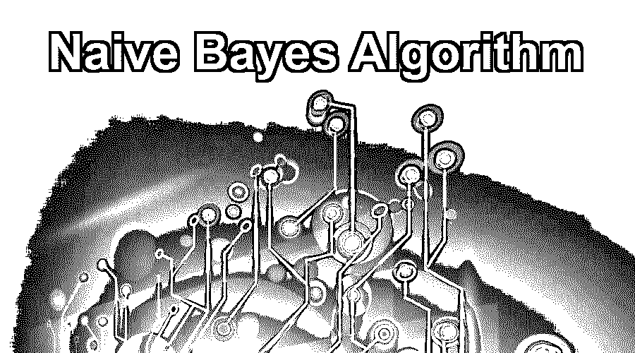

# 朴素贝叶斯算法

> 原文：<https://www.educba.com/naive-bayes-algorithm/>

## 什么是朴素贝叶斯算法？

朴素贝叶斯算法是一种流行的分类机器学习算法，它有助于根据条件概率值计算对数据进行分类。它实现了用于计算的贝叶斯定理，并使用表示为特征值或预测向量的类级别来进行分类。朴素贝叶斯算法是一种分类问题的快速算法。该算法非常适合于实时预测、多类预测、推荐系统、文本分类和情感分析用例。朴素贝叶斯算法可以使用高斯分布、多项式分布和伯努利分布来构建。对于大型数据集，该算法可扩展且易于实现。

使用类别 P(c)的先验概率、预测值 P(x)的先验概率和预测值给定类别的概率(也称为似然性 P(x|c ),有助于计算后验概率 P(c|x)。

<small>Hadoop、数据科学、统计学&其他</small>

计算后验概率的公式或方程是:

P(c|x) = (P(x|c) * P(c)) / P(x)

### 朴素贝叶斯算法是如何工作的？

让我们通过一个例子来理解朴素贝叶斯算法的工作原理。我们假设天气和目标变量“购物”的训练数据集。现在我们会根据天气情况对一个女生是否会去逛街进行分类。

给定的数据集是:

| **天气** | **去购物** |
| 快活的 | 不 |
| 下雨的 | 是 |
| 遮蔽 | 是 |
| 快活的 | 是 |
| 遮蔽 | 是 |
| 下雨的 | 不 |
| 快活的 | 是 |
| 快活的 | 是 |
| 下雨的 | 不 |
| 下雨的 | 是 |
| 遮蔽 | 是 |
| 下雨的 | 不 |
| 遮蔽 | 是 |
| 快活的 | 不 |

将执行以下步骤:

**第一步:**用数据集做频率表。

| **天气** | **是** | **否** |
| 快活的 | Three | Two |
| 遮蔽 | Four | Zero |
| 下雨的 | Two | Three |
| **总计** | **9** | **5** |

**第二步:**通过计算每种天气情况和去购物的概率，做一个可能性表。

| **天气** | **是** | **否** | **概率** |
| 快活的 | Three | Two | 5/14 = 0.36 |
| 遮蔽 | Four | Zero | 4/14 = 0.29 |
| 下雨的 | Two | Three | 5/14 = 0.36 |
| **总计** | **9** | **5** |  |
| 可能性 | 9/14 = 0.64 | 5/14 = 0.36 |  |

**第三步:**现在，我们需要使用朴素贝叶斯方程计算每一类的后验概率。

**问题实例:**如果天气阴沉，一个女生会去逛街。这种说法正确吗？

**解决方案:**

*   P(是|阴)= (P(阴|是)* P(是))/ P(阴)
*   p(阴|是)= 4/9 = 0.44
*   p(是)= 9/14 = 0.64
*   p(阴)= 4/14 = 0.39

现在把所有的计算值放进上面的公式

*   p(是|阴)= (0.44 * 0.64) / 0.39
*   p(是|阴)= 0.722

具有最高概率的类将是预测的结果。使用相同的方法，可以预测不同类别的概率。

### 朴素贝叶斯算法是用来做什么的？

*   **实时预测:**朴素贝叶斯算法速度快，并且随时准备学习，因此最适合实时预测。
*   **多类预测:**可以使用朴素贝叶斯算法预测任何目标变量的多类概率。
*   **推荐系统:**朴素贝叶斯分类器借助协同过滤构建推荐系统。该系统使用[数据挖掘和机器学习](https://www.educba.com/data-mining-vs-machine-learning/)技术来过滤以前没有见过的信息，然后预测用户是否会喜欢给定的资源。
*   **文本分类/情感分析/垃圾邮件过滤:**由于其对多类问题的更好表现及其独立性规则，朴素贝叶斯算法在文本分类中表现更好或具有更高的成功率；因此，它被用于情感分析和垃圾邮件过滤。

### 朴素贝叶斯算法的优缺点

下面给出了提到的优点和缺点:

#### 优势:

*   容易实现。
*   快速的
*   如果独立性假设成立，那么它比其他算法更有效。
*   它需要较少的训练数据。
*   它是高度可扩展的。
*   它可以进行概率预测。
*   可以处理连续和离散数据。
*   对无关的特征不敏感。
*   它可以很容易地处理缺失值。
*   新数据到达时易于更新。
*   最适合文本分类问题。

#### 缺点:

*   关于功能相互独立的假设在实际应用中并不成立。
*   数据稀缺。
*   失去准确性的机会。
*   零频率，即如果在训练数据集中没有看到任何分类变量的类别，则模型将该类别的概率分配为零，然后无法进行预测。

### 如何使用朴素贝叶斯算法建立基本模型

有三种类型的朴素贝叶斯模型，即高斯、多项式和伯努利模型。让我们简单地讨论一下它们。

**1。高斯:**高斯朴素贝叶斯算法假设每个特征对应的连续值按高斯分布，也叫正态分布。

假设给定类别的预测值的似然性或先验概率是高斯型的；因此，条件概率可以计算为:

**2。多项式:**使用多项式分布生成由特征向量表示的某些事件的出现频率。该模型广泛用于文档分类。

**3。伯努利:**在这个模型中，输入由特征描述，这些特征是独立的二元变量或布尔。这也广泛用于文档分类，如多项式朴素贝叶斯。

您可以根据需要使用上述任何模型来处理和分类数据集。

通过理解下面给出的例子，您可以使用 Python 构建高斯模型[:](https://www.educba.com/what-is-python/)

**代码:**

`from sklearn.naive_bayes import GaussianNB
import numpy as np
a = np.array([-2,7], [1,2], [1,5], [2,3], [1,-1], [-2,0], [-4,0], [-2,2], [3,7], [1,1], [-4,1], [-3,7]])
b = np.array([3, 3, 3, 3, 4, 3, 4, 3, 3, 3, 4, 4, 4])
md = GaussianNB()
md.fit (a, b)
pd = md.predict ([[1, 2], [3, 4]])
print (pd)`

**输出:**

([3, 4])

### 结论

在本文中，我们详细了解了朴素贝叶斯算法的概念。它主要用于文本分类。它易于实现，执行速度快。它的主要缺点是它要求特性必须是独立的，这在实际应用中是不真实的。

### 推荐文章

这是一个朴素贝叶斯算法的指南。在这里，我们讨论了基本概念，它是如何工作的，以及优点和缺点。您也可以浏览我们推荐的其他文章，了解更多信息——

1.  [升压算法](https://www.educba.com/Boosting-Algorithm/)
2.  [编程中的算法](https://www.educba.com/algorithm-in-programming/)
3.  [算法介绍](https://www.educba.com/introduction-to-algorithm/)
4.  [机器学习模型](https://www.educba.com/machine-learning-models/)

