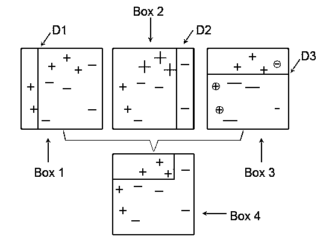

# 升压算法

> 原文：<https://www.educba.com/boosting-algorithm/>

## 什么是 Boosting 算法？

增强算法是一种特殊的算法，用于增强数据模型的现有结果并帮助修复错误。他们使用弱学习者和强学习者对话的概念，通过加权平均值和较高的投票值进行预测。这些算法使用决策戳、间隔最大化分类进行处理。有三种类型的算法可用，如 AdaBoost 或自适应增强算法、梯度和 XG 增强算法。这些是机器学习算法，遵循预测和微调结果的训练过程。

**举例:**

<small>Hadoop、数据科学、统计学&其他</small>

让我们借助下面的例子来理解这个概念。让我们以电子邮件为例。你如何识别你的邮件，不管它是不是垃圾邮件？您可以通过以下条件来识别它:

*   如果一封电子邮件包含大量这样的源，这意味着它是垃圾邮件。
*   如果一封电子邮件只包含一个文件图像，那么它就是垃圾邮件。
*   如果一封电子邮件包含“你拥有一张$xxxxx 的彩票”的信息，这意味着它是垃圾邮件。
*   如果一封电子邮件包含一些已知的来源，那么它不是垃圾邮件。
*   如果包含 educba.com 等官方域名。，这意味着它不是垃圾邮件。

上述规则对于识别垃圾邮件与否并不强大；因此，这些规则被称为弱学习者。

要将弱学习者转换为强学习者，请使用以下方法组合弱学习者的预测。

1.  使用平均值或加权平均值。
2.  考虑预测有更高的投票。

考虑上述 5 条规则；垃圾邮件有 3 票，非垃圾邮件有 2 票。由于有高票垃圾邮件，我们认为它是垃圾邮件。

### 助推算法是如何工作的？

Boosting 算法将每个弱学习者结合起来，创建一个强预测规则。为了识别弱规则，有一个基础学习算法(机器学习)。每当应用基本算法时，它都使用迭代过程创建新的预测规则。经过一些迭代后，它将所有弱规则组合起来创建一个单一的预测规则。

要选择正确的发行版，请遵循以下步骤:

**第一步:**基础学习算法结合每个分布，对每个分布应用相等的权重。

**步骤 2:** 如果在第一基本学习算法期间发生任何预测，那么我们高度关注该预测误差。

**步骤 3:** 重复步骤 2，直到达到基本学习算法的极限或高精度。

第四步:最后，它将所有弱学习器组合在一起，创建一个强预测乐途。

### 升压算法的类型

Boosting 算法使用不同的引擎，如决策戳、最大化间隔分类算法等。有以下三种类型的升压算法:

1.  AdaBoost(自适应增强)算法
2.  梯度推进算法
3.  [XG 增强算法](https://www.educba.com/xgboost-algorithm/)

#### AdaBoost(自适应增强)算法

要了解 AdaBoost，请参考下图:

**框 1:** 在框 1 中，对于每个数据集，我们分配相等的权重，并且为了分类加号(+)和减号(-)，我们应用判定树桩 D1，其在框 1 的左侧创建垂直线。该行错误地将三个加号(+)预测为减号(-)；因此，我们对这些加号应用更高的权重，并应用另一个决策树桩。

**框 2:** 在框 2 中，三个错误预测的加号(+)的大小与另一个相比变大。第二个决策在块的右侧难倒 D2，将这个错误预测的加号(+)预测为正确。但是由于带有负号(-)的不相等权重导致了错误分类错误，所以我们将较高的权重分配给负号(-)并应用另一个决策树桩。

**第三格:**在第三格中，因为分类错误，三个减号(-)的权重很高。这里，应用判定树桩 D3 来预测这种错误分类并纠正它。这一次分类加号(+)和减号(-)水平线被创建。

方框 4: 在方框 4 中，决策树桩 D1、D2 和 D3 被组合以创建新的强预测。

自适应增压的工作原理与上面提到的类似。它将基于体重年龄的弱学习者群体结合起来，产生一个强学习者。在第一次迭代中，它对每个数据集赋予相同的权重，并开始预测该数据集。如果出现不正确的预测，它会给予该观察较高的权重。自适应增强在下一个迭代阶段重复该过程，并继续直到达到精度。然后结合这些来创建一个强预测。

### 梯度推进算法

[梯度提升算法](https://www.educba.com/gradient-boosting-algorithm/)是一种机器学习技术，定义损失函数并降低它。它用于使用预测模型解决分类问题。它包括以下步骤:

#### 1.损失函数

损失函数的使用取决于问题的类型。梯度提升的优点在于，对于每个损失函数，不需要新的提升算法。

#### 2.弱学习者

在梯度推进中，决策树被用作弱学习器。回归树用于给出真实值，这些值可以组合在一起以创建正确的预测。像在 AdaBoost 算法中一样，使用具有单个分裂的小树，即决策树桩。较大的树用于较大的层，即 4-8 层。

#### 3.加性模型

在这个模型中，一次添加一棵树。现有的树木保持不变。在添加树的过程中，使用梯度下降来最小化损失函数。

### XG 升压

XG Boost 是极端梯度增强的简称。XG Boost 是梯度增强算法的升级实现，它是为高计算速度、可伸缩性和更好的性能而开发的。

XG Boost 具有各种功能，如下所示:

1.  **并行处理:** XG Boost 为训练时使用 CPU 内核的树构造提供并行处理。
2.  **交叉验证:** XG Boost 使用户能够在每次迭代时对升压过程进行交叉验证，从而轻松获得一次运行中升压迭代的准确最佳次数。
3.  **缓存优化:**提供算法的缓存优化，以获得更高的执行速度。
4.  **分布式计算**:对于训练大型模型，XG Boost 允许分布式计算。

### 推荐文章

在本文中，我们已经看到了什么是 Boosting 算法，机器学习中的各种 Boosting 算法及其工作原理。您也可以浏览我们推荐的其他文章，了解更多信息——

1.  [什么是机器学习？](https://www.educba.com/what-is-machine-learning/)
2.  [学习算法](https://www.educba.com/learning-algorithms/)
3.  [什么是区块链技术？](https://www.educba.com/what-is-blockchain-technology/)
4.  [什么是算法？](https://www.educba.com/what-is-an-algorithm/)

