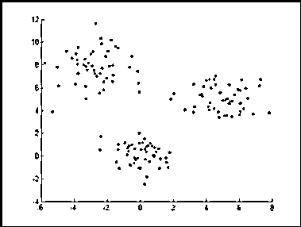
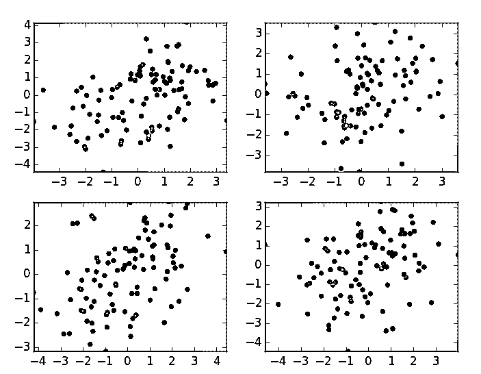
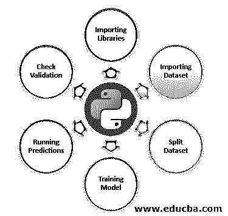

# KNN 算法

> 原文：<https://www.educba.com/knn-algorithm/>

## KNN 算法简介

k 近邻算法，也就是著名的 KNN 算法，是机器学习的基本算法。理解这种算法是开始学习机器学习的一个非常好的地方，因为这种算法背后的逻辑被纳入了许多其他的[机器学习模型](https://www.educba.com/machine-learning-models/)。k 近邻算法属于监督学习中的分类部分。

什么是监督学习？

<small>Hadoop、数据科学、统计学&其他</small>

监督学习算法是一种在提供未标记数据的情况下，依靠标记输入进行学习和基于函数进行预测的算法。正如我们已经理解的[什么是监督学习](https://www.educba.com/what-is-supervised-learning/)让我们看到什么是分类，分类算法给出一个离散值作为输出，而不是连续值。

### KNN 算法是如何工作的？

k 最近邻是一种基本算法，它存储所有可用数据，并基于相似性度量来预测未标记数据的分类。在线性几何中，当两个参数被绘制在 2D 笛卡尔系统上时，我们通过计算点之间的距离来识别相似性度量。这同样适用于这里，KNN 算法的工作原理是假设相似的事物存在于很近的地方，简单地说我们可以把相同的事物放在彼此靠近的地方。

**举例:**

如果我们有一个数据集，当绘制时看起来像这样，要分类这些数据点，K 最近邻算法将首先确定点之间的距离，看看它们是否相似。

在根据欧几里得的几何学中，距离函数可以由下面的方程计算。

如果 K=1，则该案例被简单地分配到其最近邻的一类中[我们在数学中的几乎任何情况下都使用“1”，我们可以在训练机器学习中的模型时改变 K 的值，我们将在文章中进一步讨论这一点] X 和 Y 是坐标轴上的值。

如果我们注意到这里，我们得到的所有距离度量将是连续变量，但我们在进行分类时需要离散值，因此，我们必须使用汉明距离来实现这一点。

当数据集中存在数值和分类值的混合时，该等式还为我们带来了 0 到 1 之间的数值标准化。

| **X** | **Y** | **距离** |
| 患有癌症 | 患有癌症 | X = Y → D = 0 |
| 没有癌症 | 没有癌症 | x！= Y → D = 1 |

以这种方式，算法工作，现在，让我们深入到，我们如何选择 KNN 的 K 值。

### KNN 算法中 K 值的选取

在看到选择 K 值时要考虑的因素之前，我们必须了解 K 值如何影响算法。

这些是具有不同 K 值的相同数据集的图，左上角的图的 K 值为 1，右下角的图的 K 值最高。如果我们仔细检查，我们可以理解，随着 K 值的增加，分类算法的边界变得平滑。也就是说，K 的值与边界的平滑度成正比。因此，我们可以理解，如果 K 值设置为 1，则训练模型将使数据过拟合，如果 K 值设置为较大的数字，则训练模型将使数据过拟合。为了选择 K 的最佳值，我们需要检查多个 K 值的验证误差，并选择一个误差最小的值。

### 用 Python 实现 KNN 算法的步骤

到目前为止，我们已经看到了 K 近邻算法的理论部分，现在让我们通过学习如何用 python 实现它来实际地看看它。

#### 步骤 1:导入库

在下面，我们将看到导入库，我们需要运行 KNN。

**代码:**

`import numpy as np
import matplotlib.pyplot as plt
import pandas as pd`

#### 步骤 2:导入数据集

在这里，我们将看到数据集被导入。

**代码:**

`file = "/path/to/the/dataset"
#Push dataset into Pandas dataframe
dataset = pd.read_csv(file)`

#### 步骤 3:分割数据集

下一步是将我们的数据集分成测试和训练两部分。

**代码:**

`from sklearn.model_selection import train_test_split
X_train, X_test, y_train, y_test = train_test_split(X, y, test_size=0.30)`

**Note:** Data set I am using to demonstrate has been pre-processed with defining the X and Y values. If this is not done first it has to be done, because while the classification model is getting trained we have to pass labelled data for that to calculate distances.

#### 第四步:培训模式

在这一步中，我们将看到一个模型训练。

**代码:**

`from sklearn.neighbors import KNeighborsClassifier
classifier = KNeighborsClassifier(n_neighbors=3)
classifier.fit(X_train, y_train)`

**Note:** Here we are using K neighbours classifier imported from the module sklearn.neighbours library.

#### 步骤 5:运行预测

对测试分割数据运行预测。

**代码:**

`y_pred = classifier.predict(X_test)`

#### 步骤 6:检查验证

下一步是评估算法并检查验证误差，使用不同的 K 值再次运行，并考虑获得最小验证误差的 K 值。这就是我们如何实际实现 K 最近邻分类器，有多种方法来实现这种算法，这只是其中之一，在这篇文章中，我已经非常简要地描述了这些步骤，因为我们的主要议程是了解算法如何工作。

### 结论

如前所述，K 最近邻算法是用于分类的最简单和最容易的算法之一。根据它的工作原理，它也属于“懒惰学习算法”。通常，每个人在训练模型时通过的 K 值是奇数，但这不是强制性的。

然而，使用 KNN 也有一些缺点，其中一些是:

*   这与分类数据不太相符，因为我们无法找到两个分类特征之间的距离。
*   它也不能很好地处理高维数据，因为算法很难计算每个维度上的距离。

如果我们看到目前[机器学习中的大多数用例都被基本级别的分类算法包围](https://www.educba.com/what-is-machine-learning/)，这就是 KNN 如何在机器学习世界中发挥主要作用的。

### 推荐文章

这是 KNN 算法指南。在这里，我们讨论了 K 最近邻算法的介绍和工作原理，以及用 python 实现 kNN 算法的步骤。你也可以看看下面的文章来了解更多-

1.  [SVM 算法是如何工作的？](https://www.educba.com/svm-algorithm/)
2.  [K 均值聚类算法](https://www.educba.com/k-means-clustering-algorithm/)
3.  [强化学习的类型](https://www.educba.com/what-is-reinforcement-learning/)
4.  [c++算法完全指南](https://www.educba.com/c-plus-plus-algorithm/)

