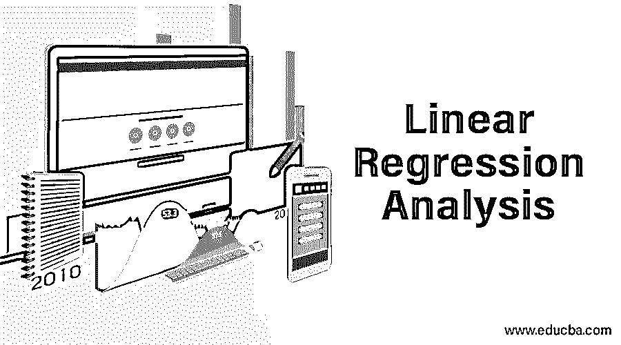
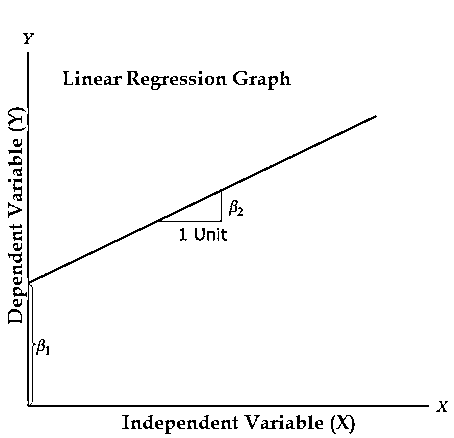
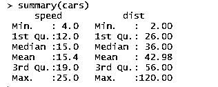
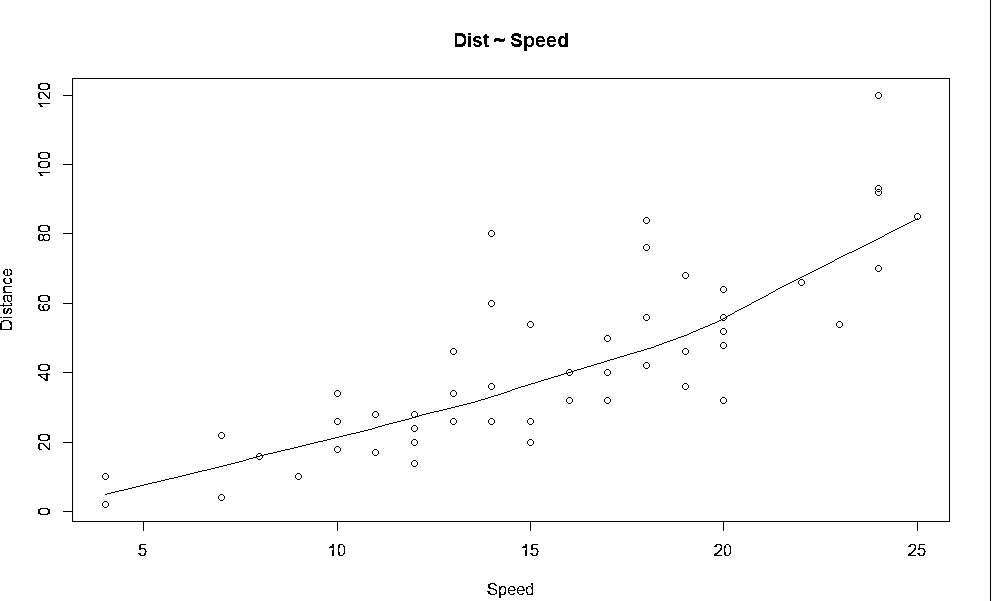
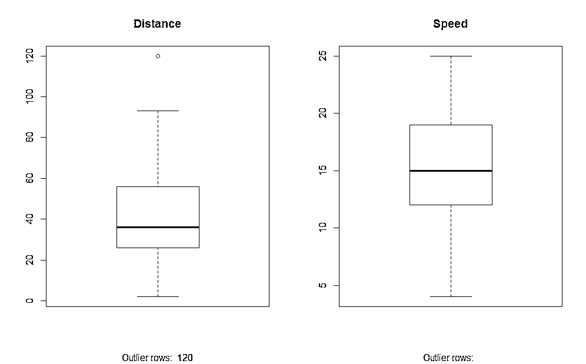
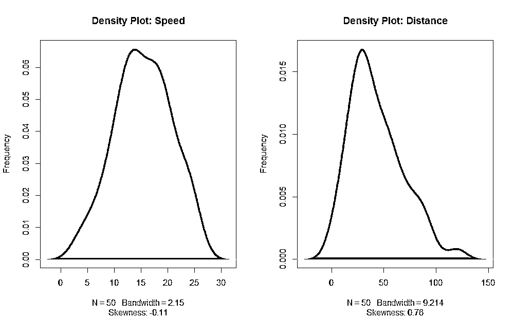
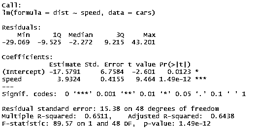

# 线性回归分析

> 原文：<https://www.educba.com/linear-regression-analysis/>

## 线性回归分析简介

线性回归分析是最广泛使用的统计分析技术之一，因为它涉及单变量和多变量技术之间的加性和线性关系的研究。使用单个变量的分析称为简单线性分析，而多个变量的分析称为多重线性分析。基本上，在线性回归分析中，我们试图找出自变量和因变量之间的关系，这就是为什么它具有多种优势，如简单而有力地做出更好的商业决策等。

### 3 种回归分析

这三个回归分析在现实世界中有最大的使用案例；另外，回归分析的类型超过 15 种。

<small>Hadoop、数据科学、统计学&其他</small>

下面给出了 3 种回归分析:

1.  线性回归分析
2.  多次线性回归分析
3.  逻辑回归

在本文中，我们将着重于简单的线性回归分析。这种分析有助于我们确定独立因素和非独立因素之间的关系。更简单地说，回归模型帮助我们发现独立因素的变化如何影响非独立因素。

这种模式在多方面帮助我们，例如:

*   这是一个简单而强大的统计模型。
*   它将帮助我们进行预测和预报。
*   这将有助于我们做出更好的商业决策。
*   这将有助于我们分析结果和纠正错误。

**线性回归方程并将其拆分成相关部分:**

Y = β1 + β2X + ϵ

*   β1 在数学术语中称为截距，β2 在数学术语中称为斜率。它们也被称为回归系数。ϵ是误差项，它是回归模型无法解释的 y 的一部分。
*   y 是因变量(可互换使用的其他因变量术语有响应变量、回归变量、测量变量、观察变量、响应变量、解释变量、结果变量、实验变量和/或输出变量)。
*   x 是独立变量(回归变量、受控变量、操纵变量、解释变量、暴露变量和/或输入变量)。

**问题:**为了理解什么是线性回归分析，我们以“Cars”数据集为例，该数据集默认位于 R 目录中。在这个数据集中，有 50 个观察值(基本上是行)和 2 个变量(列)。列名为“距离”和“速度”。在这里，我们必须看到速度变量的变化对距离变量的影响。为了查看数据的结构，我们可以运行一个代码 Str(数据集)。这段代码帮助我们理解数据集的结构。这些功能帮助我们做出更好的决策，因为我们对数据集结构有了更好的了解。这些代码帮助我们识别数据集的类型。

**代码:**

类似地，为了检查数据集的统计检查点，我们可以使用代码摘要(cars)。这些代码提供了数据集的平均值、中值和范围，研究人员可以在处理问题时使用这些数据。

**输出:**

在这里，我们可以看到数据集中每个变量的统计输出。

### 数据集的图形表示

此处将涉及的图形表示类型及其原因:

*   **散点图:**借助图形，可以看到我们的线性回归模型往哪个方向走，是否有强有力的证据证明我们的模型。
*   **箱线图:**帮助我们发现离群值。
*   **密度图:**帮助我们了解自变量的分布；在我们的例子中，独立变量是“速度”。

### 图形表示的优势

下面给出了提到的优点:

*   很好理解。
*   这有助于我们快速做出决定。
*   对比分析。
*   更少的努力和时间。

**1。散点图:**它将有助于直观显示自变量和因变量之间的任何关系。

**代码:**

**输出:**

从图表中我们可以看到因变量(距离)和自变量(速度)之间的线性增长关系。

**2。箱形图:**箱形图帮助我们识别数据集中的异常值。

使用箱线图的优点是:

*   变量位置和分布的图形显示。
*   它帮助我们理解数据的偏斜度和对称性。

**代码:**

**输出:**

**3。密度图(检查分布的正态性)**

**代码:**

**Output:**

### 相关分析

这种分析有助于我们找到变量之间的关系。

相关性分析主要有六种类型。

1.  正相关(0.01 到 0.99)
2.  负相关(-0.99 到-0.01)
3.  不相关
4.  完全相关
5.  强相关性(接近 0.99 的值)
6.  弱相关性(接近 0 的值)

散点图有助于我们识别数据集之间有哪些类型的相关性，查找相关性的代码是

**输出:**

在这里，速度和距离之间有很强的正相关性，这意味着它们直接相关。

### 线性回归模型

这是分析的核心部分；早些时候，我们只是尝试和测试我们拥有的数据集是否足够逻辑来运行这样的分析。我们计划使用的函数是 lm()。该函数包含两个元素，即公式和数据。在指定哪个变量是因变量或自变量之前，我们必须非常确定，因为我们的整个公式都依赖于此。

**公式如下:**

Linear Regression <- lm(Dependent Variable ~ Independent Variable, data=Date.Frame)

**代码:**

**输出:**

从文章的上述部分我们可以回忆起，线性回归的等式是:

Y = β1 + β2X + ϵ

现在我们将把从上面代码中得到的信息放进这个等式中。

dist = −17.579 + 3.932∗speed

仅仅找到线性回归的方程是不够的；我们还必须检查其统计意义。为此，我们必须在线性回归模型上传递一个代码“Summary”。

**代码:**

**输出:**

有多种方法可以检查模型的统计显著性，这里我们使用的是 P 值法。当 P 值小于预定的统计显著性水平(理想情况下为 0.05)时，我们可以认为模型是统计拟合的。在我们的汇总表(linear_regression)中，我们可以看到 P 值低于 0.05 水平，因此我们可以得出结论，我们的模型在统计上是显著的。一旦我们确定了我们的模型，我们就可以使用我们的数据集来预测事情。

### 推荐文章

这是一个线性回归分析指南。这里我们讨论三种类型的线性回归分析，具有优势的数据集的图形表示和线性回归模型。您也可以浏览我们的其他相关文章，了解更多信息-

1.  [R 中的线性回归](https://www.educba.com/linear-regression-in-r/)
2.  [什么是回归分析？](https://www.educba.com/what-is-regression-analysis/)
3.  [R 中简单线性回归指南](https://www.educba.com/simple-linear-regression-in-r/)
4.  [什么是线性回归？](https://www.educba.com/what-is-linear-regression/)

