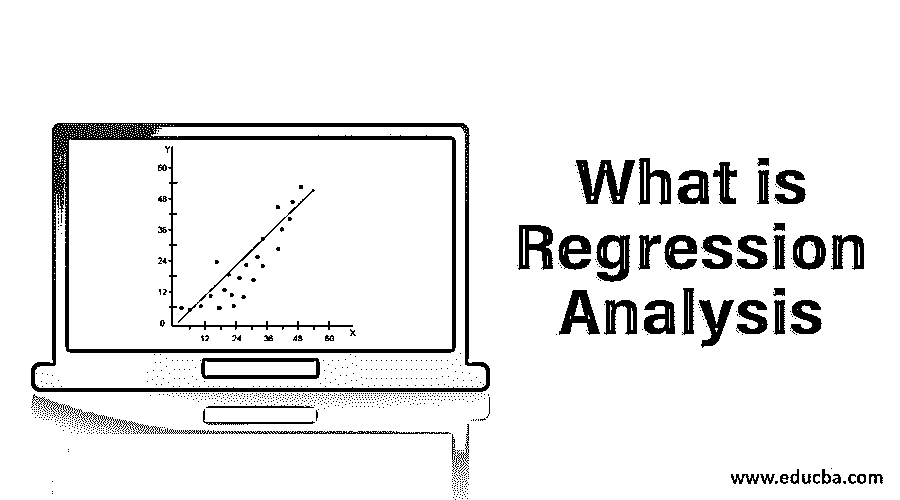

# 什么是回归分析？

> 原文：<https://www.educba.com/what-is-regression-analysis/>

## 回归分析导论

### 回归分析是如何工作的？

考虑到不同的因素和结果，可以使用多种类型的回归技术。

*   线性回归
*   逻辑回归
*   套索/岭回归
*   [多项式回归](https://www.educba.com/polynomial-regression/)

下面列出了一些在不同部门使用的重要统计回归测试:

<small>Hadoop、数据科学、统计学&其他</small>

#### 1.线性回归

当结果变量线性依赖于独立变量时使用。当我们没有庞大的数据集时，通常会用到它。它对异常值也很敏感，所以如果数据集包含异常值，那么最好在应用线性回归之前处理它们。有单变量和多变量回归技术。简单线性回归是当结果变量线性依赖于单个独立变量时的分析。简单的线性回归遵循下面给出的直线方程:

**T2`Y=mx+c`**

在哪里，

*   Y=目标变量、因变量或标准变量
*   x=独立变量或预测变量
*   m=斜率或回归系数
*   c=常数

多变量线性回归定义了结果变量和多个独立变量之间的关系。它遵循以下直线方程，其中因变量是所有自变量的线性组合:

`**Y= m1x1+m2x2+m3x3+…mnan+c**`

在哪里，

*   Y=目标变量、因变量或标准变量
*   x1，x2，x3…xn=独立变量或预测变量
*   m1，m2，m3…mn=各个变量的斜率或回归系数
*   c=常数

线性回归遵循最小二乘法的原理。这种方法规定，通过最小化误差平方和来选择最佳拟合线。选择最佳拟合的线，其中观察数据和线之间的平方误差之和最小。

在对数据集应用线性回归之前，需要考虑一些假设。

*   自变量和因变量之间应该是线性关系。
*   自变量之间应该没有或有一点多重共线性。多重共线性被定义为独立变量之间高度相关的现象。我们可以通过删除一个相关变量或将两个变量视为一个变量来处理多重共线性。
*   同方差:它被定义为在回归分析中误差项应随机分布在直线上的状态。如果存在某种确定的模式，则该数据不应该有任何跨越该线的模式被称为异方差的。
*   所有的变量都应该是正态分布的，这一点我们通过绘制 Q-Q 图可以看到。如果数据不是正态分布，我们可以用任何非线性变换方法来处理。

因此，在应用线性回归时，为了获得良好的准确性和正确的结果，总是建议对假设进行测试。

#### 2.逻辑回归

当目标或结果变量本质上是分类的或二元的时，使用这种回归技术。线性回归和逻辑回归的主要区别在于目标变量，线性回归应该是连续的，而逻辑回归应该是分类的。结果变量应该只有两个类，不能超过两个。一些例子是电子邮件中的垃圾邮件过滤器(垃圾邮件或非垃圾邮件)、欺诈检测(欺诈/非欺诈)等。它根据概率原理工作。通过设置阈值，可以将其分为两类。

**举个例子:**如果有 A、B 两个类别，我们设置阈值为 0.5 那么 0.5 以上的概率会被认为是一个类别，0.5 以下是另一个类别。逻辑回归遵循 S 形曲线。在建立逻辑回归模型之前，我们必须将数据集分为训练和测试。由于目标变量是分类的或二进制的，我们必须确保在训练集中有一个适当的类别平衡。

如果存在阶级不平衡，那么可以使用下面提到的各种方法来解决这个问题:

*   **上采样:**在这种技术中，对具有较少行的类进行上采样，以匹配多数类的行数。
*   **向下采样:**在这种技术中，具有更多行的类被向下采样，以匹配少数类的行数。

在将逻辑回归模型应用于数据集之前，有一些要点需要理解:

*   目标变量本质上应该是二进制的。如果目标变量中有 2 个以上的类别，则称为**多项式逻辑回归**。
*   独立变量之间应该没有或只有很少的多重共线性。
*   这需要很大的样本量。
*   自变量和几率对数之间应该有线性关系。

### 回归的好处

回归分析有很多好处。我们可以使用回归分析并显示可能结果的有效点，而不是考虑我们的直觉和预测结果。

其中一些列举如下:

*   预测任何部门短期或长期的销售和收入。
*   预测任何行业的客户流失率，并找出降低客户流失率的适当措施。
*   了解和预测仓库的库存水平。
*   了解在市场上推出新产品是否会成功。
*   预测任何客户是否会拖欠贷款。
*   预测顾客是否会购买产品。
*   欺诈或垃圾邮件检测

### 结论

在应用模型后，有各种评估指标需要考虑。尽管在应用模型之前需要测试一些假设，但我们总是可以使用各种数学方法修改变量，并提高模型性能。

### 推荐文章

这是回归分析指南。这里我们讨论回归分析的介绍，回归分析是如何工作的以及回归的好处。您也可以浏览我们推荐的其他文章，了解更多信息——

1.  [线性回归分析](https://www.educba.com/linear-regression-analysis/)
2.  [回归测试工具](https://www.educba.com/regression-testing-tools/)
3.  [回归 vs 分类](https://www.educba.com/regression-vs-classification/)
4.  什么是回归？

