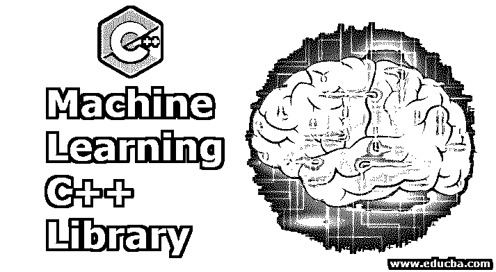

# 机器学习 C++库

> 原文：<https://www.educba.com/machine-learning-c-plus-plus-library/>

**

** 

## 机器学习 C++库简介

以下文章提供了机器学习 C++库的概要。当谈到数据分析和机器学习时，C++作为大多数程序员的第一语言并不是优选的，因为它相对于 python 和 R 来说很难理解，程序员可能会选择使用它，因为它的速度和在嵌入式系统上运行的能力，在这种情况下，值得注意的是 C++附带了许多库，如 mlpack、tensorflow、dlib、pytorch、opencv、eigen、DyNet 等。这有助于程序员实现机器学习算法。

### 机器学习的概念 C++

要开始熟悉机器学习，您必须了解以下概念:

<small>Hadoop、数据科学、统计学&其他</small>

*   编程语言
*   线性代数
*   统计数字
*   可能性
*   结石

#### 1.编程语言

要在软件产品或机器中实现机器学习算法，您必须熟悉 Python、R 等编程语言。了解这些语言非常重要，因为它们用于实现完整的机器学习过程。这两种语言都很容易学习和实现，因为它们内置了库模块，使得整个过程比任何其他语言都更容易和更快。

#### 2.线性代数

我们在学校都学过线性代数，因为它是数学中所有运算的中心。在现实生活中广泛使用，是一个很好的例子。它被用于科学和技术，使我们能够有效地执行各种自然操作，通过一组线性方程，我们可以计算输出，也可以预测未来。矩阵、向量和线性变换是用线性代数来处理的。它用于对数据集执行和转换不同的操作。

#### 3.统计数字

统计学不仅是机器学习中最重要的部分，也是现实生活中最重要的部分。它是一个数学分支，关注于将任何原始数据转换成一些有用的信息作为输出。使用统计工具，数据集中的一小部分样本就可以在输出中提供大量信息。统计学主要涉及数据的解释、组织、收集、展示、分析和表达。

#### **4。** **概率**

这在机器学习中被广泛使用[，因为你可以保证当你给你的软件一些输入或考虑任何现象时接下来会发生什么，但你总是可以预测在某个水平会发生什么，或者我们可以说什么最有可能发生，那是一种概率，意味着某事即将发生。它有助于预测正在发生的任何事件的最受欢迎的结果。概率的结果总是介于 0 和 1 之间，其中 0 代表不可能的事件，1 代表确定性。](https://www.educba.com/what-is-machine-learning/)

#### 5.结石

微积分是任何机器学习过程中最不可或缺的一部分，因为它听起来意味着计算。它与数学计算的不断变化有关。它有两部分，一部分是积分，另一部分是微分学。微积分被广泛用于开发机器学习模型。随着大型数据集的可用性，可以通过对数据集执行连续计算来设计机器。

### 推荐文章

这是一个机器学习 C++库的指南。在这里，我们还讨论了机器学习 C++库的概述以及顶级的 5 ML 概念。您也可以看看以下文章，了解更多信息–

1.  [数据科学机器学习](https://www.educba.com/data-science-machine-learning/)
2.  [机器学习模型](https://www.educba.com/machine-learning-models/)
3.  [机器学习库](https://www.educba.com/machine-learning-libraries/)
4.  [什么是机器学习？](https://www.educba.com/what-is-machine-learning/)

