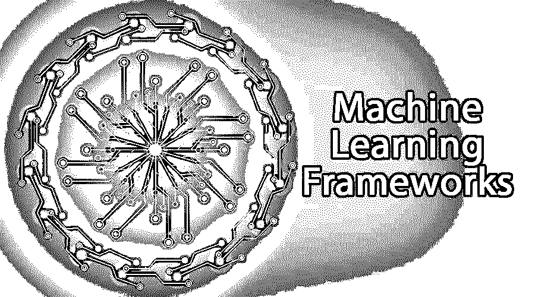

# 机器学习框架

> 原文：<https://www.educba.com/machine-learning-frameworks/>

## 机器学习框架简介

机器学习框架已经被定义为一种工具、库或接口，它使开发人员能够轻松地创建机器学习模型。此外，机器学习框架提供了开发者在部署这些应用时使用的标准方式，因为用户可以通过他们的应用代码来选择性地改变框架的通用功能，从而遵循代码开发的标准方式。

### 十大不同的机器学习框架

以下是 10 大不同的机器学习框架:

<small>Hadoop、数据科学、统计学&其他</small>

#### 1\. Scikit-Learn

这是一个基于 SciPy(科学 python)的免费机器学习库。Python 程序员广泛使用它。大卫·库尔纳波发展了它。您可以对数据进行特征工程(增加特征数量)、缩放、预处理、将数据分成训练和测试子集。它还包括许多机器学习算法，如线性回归、逻辑回归、K 均值算法、支持向量机。它非常受欢迎，因为它可以轻松地与 NumPy 和 SciPy 一起工作。

#### 2.张量流

它也是一个开源库，一般[用于深度学习](https://www.educba.com/what-is-deep-learning/)或使用神经网络的机器学习算法。谷歌创造了它。张量流是一个用于数据流编程的库；它使用各种优化技术来计算数学表达式，以获得所需的结果。

sci-kit learn 的显著特点是:

*   它非常适合包含多维数组的数学表达式。
*   它在机器之间高度可伸缩。
*   它适用于各种数据集。
*   这些特性使它成为部署生产模型的一个非常有用的框架。

#### 3.亚马逊机器学习

顾名思义，是亚马逊提供的。这是一个开发者可以用来创建模型的服务。它可以用作可视化工具，可以被机器学习工程师用来创建模型，而无需知道每个模型的细节。它可以运行或创建各种模型，如二元分类、多类分类集成算法、回归模型。

#### 4.Azure ML 工作室

这个框架来自微软。因此，它的工作原理是，它允许注册 Azure 用户创建和训练模型，在完成这些之后，你可以将它们作为 API 供其他服务使用。用户每个帐户可获得高达 10GB 的存储空间。它支持多种多样的机器学习算法。一个非常好的功能是，即使你没有帐户，你也可以通过匿名登录帐户来尝试这项服务，并且你可以使用 ML studio 长达 8 小时。

#### 5.火花

它是 Apache Spark 的机器学习产品。它包含或支持所有类型的机器学习算法和实用程序，如回归分类(二元和多类)、聚类、集成等等。

#### 6.火炬

它是一个科学的机器学习框架，支持各种机器学习实用程序和算法。这个框架的显著特点是把 GPU 放在第一位。它在机器学习、计算机视觉、图像处理、深度学习等领域拥有社区驱动的软件包。它的主要目的是在创建机器学习模型的同时提供高可伸缩性、灵活性和速度。这绝对是在建立机器学习模型时要寻找的框架。

#### 7.提亚诺

它是使用 python 构建的。它允许我们定义、创建和优化数学计算。像 Torch 一样，它也可以使用 GPU，这有助于优化和可扩展性。

#### 8.韦莱斯

是用 C++写的，是深度学习框架。虽然它是用 C++ 编写的[，但它确实使用 python 来执行自动化。它主要用于神经网络，如 CNN(卷积神经网络)](https://www.educba.com/what-is-c-plus-plus/)[递归神经网络](https://www.educba.com/recurrent-neural-networks-rnn/)。

#### 9.H20

这个名字听起来很有趣，但这个框架允许我们应用数学和预测分析来解决今天的问题。

此外，它还结合了一些很酷的功能，如:

*   最佳开源技术。
*   易于使用的 WebUI。
*   对所有公共数据库的数据不可知支持。
*   除了使用 H2o，我们还可以使用现有的语言，并使用 Hadoop 无缝扩展它。

#### 10.咖啡

这是一个深度学习框架，是利用速度和模块化思想创建的。它主要用于神经网络问题，由伯克利视觉和学习中心创建。

### 结论

当今的每个领域都会产生数据，并且需要使用特定的算法对数据进行分析和建模，以便它可以用于产生更好的未来结果。所以，简而言之，这就是机器学习的作用。这是 21 世纪的一项基本技能，大多数框架对开发人员社区都是开源的。它是技术和 It 领域中不断增长的领域之一。

### 推荐文章

这是机器学习框架的指南。这里我们讨论了入门和 10 大不同的机器学习框架。您也可以阅读以下文章，了解更多信息——

1.  [机器学习技术](https://www.educba.com/machine-learning-techniques/)
2.  [机器学习简介](https://www.educba.com/introduction-to-machine-learning/)
3.  [神经网络机器学习](https://www.educba.com/neural-network-machine-learning/)
4.  [机器学习功能选择](https://www.educba.com/machine-learning-feature-selection/)

