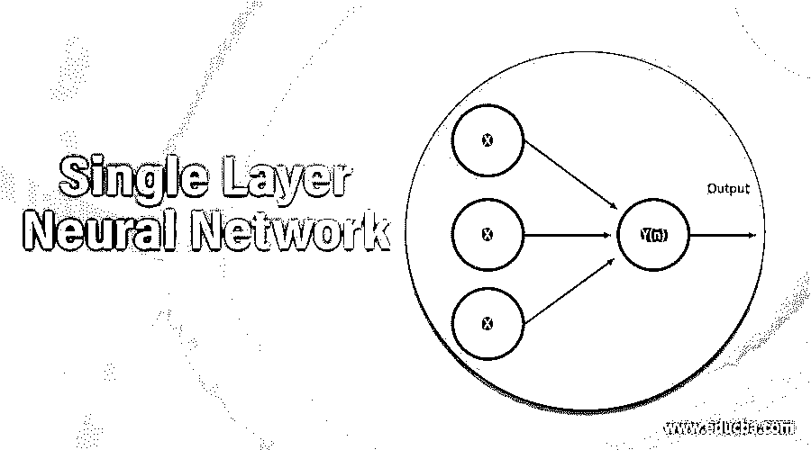
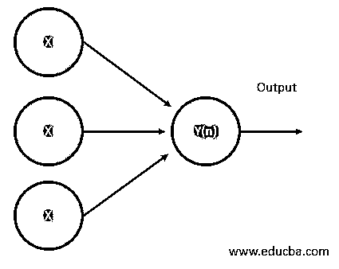

# 单层神经网络

> 原文：<https://www.educba.com/single-layer-neural-network/>

## 单层神经网络简介

单层神经网络可能是这样一种网络，其中只有一层输入节点将输入发送到下一层接收节点。

<small>Hadoop、数据科学、统计学&其他</small>

单层神经网络将计算出不间断的输出，而不是一个操作步骤。一个标准的替代方案是假设的供应发挥作用。

在这种情况下，单层网络与应用数学建模中广泛使用的供应回归模型一模一样。供应操作还被称为 s 形操作。这是一个不间断的副产品，允许它用于反向传播。此外，这种操作最受欢迎，因为它的副产品是经过明确计算的。

如果单层神经网络激活在 Mod1 中运行，则该网络将精确地用一个体细胞求解 XOR 下行。

由单层神经网络组成的神经网络称为感知器。一层感知器的计算是在输入向量的总和的计算上执行的，每个输入向量的值增加了权重向量的相应部分。输出中显示的值是激活操作的输入。

我们可以用供应回归的例子来说明单层感知器。

供应回归的基本步骤是:

对于教练集的每个部分，在教练开始时用随机值初始化权重区域单元，利用期望输出和实际输出之间的差异来计算误差。计算出的误差用于调整权重。

继续该方法，直到在整个训练集上产生的误差不超过要求的阈值，直到达到最大迭代范围。

感知器网络的训练算法规则以及重复确定负载向量 w 的简单主题。该主题称为感知器收敛过程，通常总结如下。

初始附属权重面积单位被设置为很小的随机非零值。然后应用一个全新的输入模式，输出计算如下

其中，如果 x ≥ 0，f(x)=+1；如果 x ≤ 0，f(x) = -1

这是困难的极限非线性，n 是迭代指数。

连接重量面积单位已更新，符合:

其中是小于 1 的正增益系数。

如果输入为类别 1，则 d(n)=+1；如果输入为类别 2，则 d(n)=–1。

如果输出调用是正确的，感知器收敛过程不会调整权重。

然而，如果输出调用与二进制期望响应 d(n)不一致，则一旦误差为正时，通过将加载的输入向量加到权重向量上，或者一旦误差为负时，通过从权重向量中减去加载的输入向量来实现自适应。

一旦指导模式区域单元被适当地分离，感知器收敛过程就被终止。

前面提到单层感知器的面积单位线性分类器。也就是说，他们只会学习线性分割模式。可线性分割的模式可由线性边界分隔的区域单元数据集或函数。

XOR 或“异或”操作可以是对 2 个二进制输入的直接操作，并且通常在比特扭曲操作中发现。

这些函数似乎不是线性可分的，因此需要的是感知器的扩展。简单的扩展是以许多层单元为特征，因此在输入和输出之间有单元非线性计算。

在很长一段时间里，该领域的一些人绝对认为，增加许多层的单元将无法解决线性可分割的缺点。

感知器算法也被称为单层感知器，以区别于多层感知器。

监督机器学习算法中最重要的基本任务之一是衰减值运算。
我们可以通过进入从整个教练集计算的梯度的备选方向来最小化值运算，这也是这种方法被称为批量梯度下降的原因。

梯度下降是众多享受特征缩放的算法中的一种。我们将使用一种称为标准化的特征缩放方法，它提供了我们关于典型分布的属性的信息。
特征标准化使信息内每个特征的值都具有零均值和单位方差。这种方法被广泛用于几种机器学习算法的标准化。
这一般是通过硬性习惯评分来完成的。

计算的一般方法是计算出每个特征的分布均值和方差。接下来，我们倾向于计算每个特征的平均值。然后我们倾向于将每个特性的值除以它的方差。

### 结论

*   在此，我们已经讨论了单个神经网络。
*   它是如何表现的
*   神经网络的工作原理神经网络的局限性
*   梯度下降

主要使用单个神经网络，并且大多数感知器也使用单层感知器而不是多层感知器。

### 推荐文章

这是单层神经网络指南。在这里我们讨论神经网络如何与神经网络的局限性一起工作，以及它是如何表示的。您也可以看看以下文章，了解更多信息–

1.  [单层感知器](https://www.educba.com/single-layer-perceptron/)
2.  [网络发现工具](https://www.educba.com/network-discovery-tools/)
3.  [网络分析工具](https://www.educba.com/network-analysis-tools/)
4.  [神经网络的分类](https://www.educba.com/classification-of-neural-network/)

