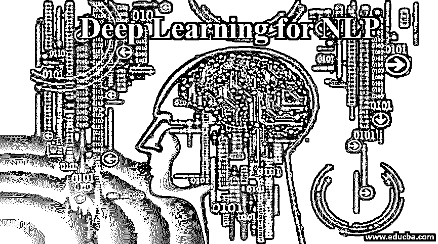

# 面向自然语言处理的深度学习

> 原文：<https://www.educba.com/deep-learning-for-nlp/>

## 自然语言处理深度学习简介

NLP 的深度学习是人工智能的一部分，用于帮助计算机理解、操作和解释人类语言。NLP 处理计算算法的构建，这意味着使用接近算法方法的机器学习来分析和表示人类语言。我们需要各种各样的方法，因为文本到语音数据总是在不同的区域变化，实时应用也是如此(如语音翻译、语音识别、问题回答、文档摘要等)。).

<small>Hadoop、数据科学、统计学&其他</small>

深度学习是神经网络的概念。深度学习方法正在帮助解决使用[机器学习算法](https://www.educba.com/machine-learning-algorithms/)无法解决的自然语言处理(NLP)问题。在深度学习到来之前，文本的表示是建立在一个基本概念上的，我们称之为一个热词编码，如下图所示:

| 话 | 这 | 狗 | 是 | 疯狂的 | 在…里 | 街道 |
| 这 | One | Zero | Zero | Zero | Zero | Zero |
| 狗 | Zero | One | Zero | Zero | Zero | Zero |
| 街道 | Zero | Zero | Zero | Zero | Zero | One |
| 是 | Zero | Zero | One | Zero | Zero | Zero |
| 疯狂的 | Zero | Zero | Zero | One | Zero | Zero |
| 在…里 | Zero | Zero | Zero | Zero | One | Zero |

但是在深度学习到来之后，我们可以使用像 word2vec 这样的方法以及其他一些现在可以用来表示文本的方法，比如 fastText、Glover 等。

### NLP 是如何工作的？

以下是对 NLP 工作原理的解释:

自然语言处理包括许多不同种类的翻译人类语言的方法，从机器学习方法到算法方法。我们需要各种各样的方法，因为文本-语音数据在不同的区域总是不同的，实时应用程序也是如此。

### 自然语言处理的应用

由于神经网络有助于各种非线性过程的建模，因此它们正被用于解决许多现有的问题，如评估、特征提取、机器翻译、异常检测、图像分类、计算机视觉和许多其他技术。同样，深度学习在自然语言处理领域也有很多应用。

通过深度学习变得更容易解决的 NLP 的主要应用是:

*   文本分类和归类
*   命名实体识别(NER)
*   词性标注
*   机器翻译
*   语音识别
*   问题回答
*   文档摘要

#### 1.文本分类和归类

文本分类是当今许多应用中非常重要的一部分，如网页搜索、垃圾邮件过滤、语言识别等。目前，大多数公司还致力于产品分类，他们从不同的网站废弃数据，最后对不同网站的地图数据进行分类，并自动提供产品分类。

#### 2.命名实体识别(NER)

命名实体识别(NER)信息提取和分类两个实体的第一步，这两个实体是预定义的类别，如人员、位置等。NER 在现实世界中的许多主要应用，例如我们可以找到任何包含人名的推文。研究论文《命名实体识别的神经架构》提出了两种 NER 方法，第一种方法是从有监督的语料库中学习基于字符的单词，第二种方法是从无标注的语料库中学习的无监督的单词表示。

#### 3.词性标注

词性标注在大多数正在运行的应用程序中有着巨大的需求，其中的问题是理解文本和文本到语音的转换、信息提取等等。对于其实现，深度学习中的方法(或特征)是可用的，如双向长短期记忆、递归神经网络等。

#### 4.机器翻译

机器翻译是将文本从任何源语言转换成任何其他语言的方法。在这种情况下，输入已经由特定语言的许多符号序列组成，并且计算机程序必须使用所需输出语言中可用的符号将该文本转换成输出所需的语言。

#### 5.语音识别

语音识别是将人类的语音转换成文本的方法。产生人类可读的文本需要一个语言模型。

主要的现实语言模型如下:

*   为电影创作剧本。
*   驾驶时向收音机发出指令。

#### 6.问题回答

当给定一个主题，比如一个文本文档，并且期望该主题的问题的答案时，使用该应用程序。这是 NLP 使用深度学习的最高级功能之一，人们使用机器从给定的文档中找到特定问题的答案作为输入。这个应用程序还将增强网站上的自动聊天。

#### 7.文档摘要

文档摘要是当今高需求的应用之一。在这种情况下，机器本身将创建一个从大文件到小内容的摘要。

这在许多情况下会有帮助，例如:

*   创建文档标题。
*   新闻文章。
*   创建文件的摘要。

### 利益

NLP 有很多好处。NLP 是人工智能的核心部分。自然语言处理有助于机器像机器人一样用自己的语言交流。NLP 不仅有助于交流，也有助于解决其他现实世界的问题，如将任何书面文本转换成计算机数据的形式。NLP 还有助于使网站搜索结果更加准确。例如，如果我们在亚马逊等任何电子商务网站上搜索任何产品，如笔记本电脑电池，但结果也包括移动电池。因此，NLP 将有助于在网站搜索过程中减少这些错误。

### 结论–自然语言处理的深度学习

到目前为止，我们已经看到了 NLP 的应用及其基于神经的模型的好处，如 [CNN 和 RNNs](https://www.educba.com/cnn-vs-rnn/) 。我们也可以根据自己的要求应用[强化学习](https://www.educba.com/what-is-reinforcement-learning/)来获得更多的结果。对不同 NLP 技术的研究仍在继续，以获得更多与机器的交互。

### 推荐文章

这是 NLP 的深度学习指南。这里我们讨论一下什么是自然语言处理？NLP 是如何工作的？随着 NLP 的应用，深度学习变得更容易解决。您也可以浏览我们的其他相关文章，了解更多信息——

1.  [深度学习技术](https://www.educba.com/deep-learning-technique/)
2.  [深度学习算法](https://www.educba.com/deep-learning-algorithms/)
3.  [什么是深度学习](https://www.educba.com/what-is-deep-learning/)
4.  [人工智能技术](https://www.educba.com/artificial-intelligence-techniques/)

