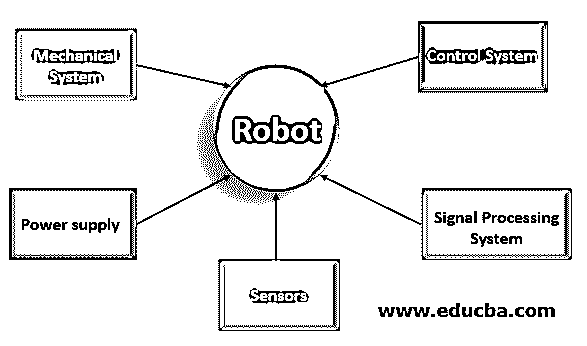
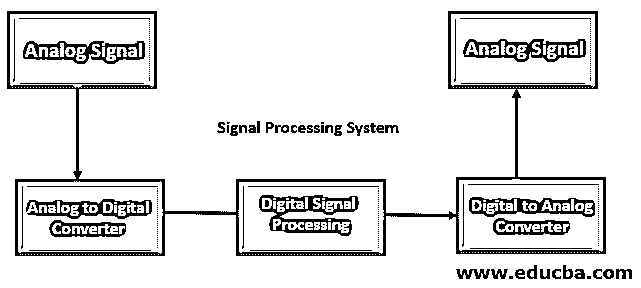
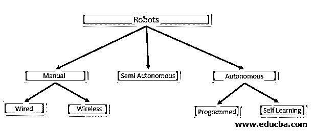

# 什么是机器人技术？

> 原文：<https://www.educba.com/what-is-robotics/>

## 机器人学导论

在信息学和工程领域，开发了机器人，这是一种可以移动并对传感数据做出反应的设备。机器人学是一个智能分支。机器人现在广泛应用于工业中，如焊接和铆接，以进行高度精确的工作。这些也被用来清理有毒废物或在对人类有危险的特殊情况下给炸弹消毒。虽然机器人技术在过去的十年里取得了巨大的进步，但是机器人在日常生活中仍然不是很有用，因为它们太重复了，无法完成普通的家庭作业。

### 积木

下面给出了机器人系统的构建模块:

<small>Hadoop、数据科学、统计学&其他</small>

*   **机械系统:**这是机器人最基本的部分，由底盘、轮子、放置点组成。我们还需要在机器人中安装一个能将电能转化为机械能的装置；它们被称为致动器。最受欢迎的执行器是 DC 电机。
*   **电源:**电池 DC 电源一般用于机器人。
*   **传感器:**机器人一般由各种传感器组成。这些传感器帮助机器人接受输入并相应地执行动作。
*   **信号处理:**信号处理系统由各种部件组成。

它们如下:

*   **控制系统:**机器人控制系统可能有很多品种。

以下是基于控制系统的机器人分类的简要介绍:

### 机器人学的历史

机器人的历史将我们带回到公元前 3000 年，当时埃及的水钟使用人形雕像来敲响每小时的钟声。然后我们追溯到公元前 400 年，塔伦图姆的阿尔库塔斯用蒸汽制造了一只会飞的木鸽。现代机器人时代开始于 1950 年，来自肯塔基州的发明家乔治·c·迪沃发明了一种叫做“Unimate”的装置。这是一个可重新编程的机械手。然而，那时候是很难推销的。

### 机器人的分类

这些通常有两种不同的标准。一个是 JIRA(日本工业机器人协会)，另一个是 RIA(美国机器人工业协会)。我们将在这里看到 JIRA 标准，因为它已经涵盖了 RIA 的所有参数。

分类如下:

*   **1 类:** **手动搬运装置:**这种机器人虽然有一定的自由度，但还是由操作员来操作。
*   **二类:** **固定顺序机器人:**这类机器人可以在一个周期内执行固定顺序的任务。然而，该序列是固定的，不可编程。
*   第三类: **可变序列机器人:**这种类型的机器人与固定序列机器人几乎相同，除了这些机器人是可重新编程的。
*   **Class 4:** **回放机器人:**这种类型的机器人可以循环自动回放一个序列。
*   **第五类:** **数控机器人:**这种机器人也是通过一系列指令来工作的。然而，指令集是数字的。
*   **第六类:** **智能机器人:**能够使用传感器感知周围环境并自动采取一系列必要行动的机器人通常被归类为智能机器人。

### 最佳人形机器人

正如我们已经说过的，早期的人形机器人是那种看起来或多或少像人类的机器人。

让我们来看看一些有史以来最好的人形机器人:

#### 1.阿西莫

ASIMO 代表创新移动的高级步骤。它是由本田在 2000 年创造的。阿西莫能够走路、跳舞、踢球等。它还可以使用头部的双摄像头探测周围的物体。这个机器人可以检测语音命令，并识别像握手这样的手势。ASIMO 能够使用传感器进行自动导航。它也有激光传感器来检测前方的离地间隙。

#### 2.全国验光师协会

NAO 是软银机器人公司在 2007 年创造的。这是一个人形机器人，可以走路，跳舞，并识别人类的手势。它有两个眼睛摄像头，可以用来检测离地间隙和人类的手势。它可以回复人类的问候，并相应地定制动作。这里有一些规格的最新版本的 NAO 规格爱好者:

| 高度 | 5.5 公斤 |
| 中央处理器 | 英特尔凌动四核处理器 |
| 随机存取存储 | 4 GB |
| 兼容操作系统 | C++、Java、Python 等。 |
| 模拟环境 | 网络机器人 |

#### 3.地图集

ATLAS 由波士顿动力公司开发。这是一个人形机器人，能够做出壮观的姿势。制造这种机器人的一般目的是作为搜索和救援行动的一部分，以及其他防御任务。这是 2013 年发布的。这种机器人已经过测试，可以在车祸现场破门、营救受害者和驾驶车辆等。

#### 4.罗密欧

软银机器人的另一个创造，是在 2009 年创造的。创造这种机器人的目的基本上是为了帮助老年人和残疾人。该组织有时认为它是 NAO 机器人的下一步。

#### 5.海洋一号

这是另一个用来探索海洋的人形机器人。这个机器人可以潜入水下，探索深海。它可以由人类飞行员远程控制，当它遇到海底物体时，它会给出触觉反馈。这个机器人是由阿卜杜拉国王科技大学(KAUST)和斯坦福大学机器人专家的合资公司开发的。

### 最佳非人形机器人

让我们来看看一些非人形机器人，它们以自己的方式成为传奇:

#### 1.地点

SPOT 之前被称为 SPOT MINI。它是非人形机器人，能够行走、奔跑、爬楼梯和拿起物体。这是波士顿动力公司在 2016 年创造的。这款机器人于 2019 年末首次上市销售。以下是一些规格:

| 高度 | 84 厘米 |
| 重量 | 25 公斤 |
| 速度 | 3.6 英里/小时 |
| 传感器 | 腿部的摄像头、IMU 和压力传感器以及位置传感器。 |

#### 2.达·芬奇

这是一个由直觉外科设计的非人形机器人，用于执行外科手术，如心脏瓣膜修复和其他普通外科手术。这个机器人可以由医生使用适当的摄像头来控制。这在 2000 年被 FDA 批准。

#### 3\. SOFI

SOFI 是由麻省理工学院的机器人专家开发的机器鱼。这个机器人可以在深水中游泳，并可以利用船上的传感器收集有价值的信息。这个机器人是用金枪鱼和水母的技术制造的。这里的目标是确保它不会受到水下其他鱼类或鲨鱼的攻击，到目前为止，它看起来很有希望。

### 机器人

在我们结束之前，让我们看看机器人技术的另一个有趣的部分，他们是机器人宇航员，简而言之，Robonaut。它们是为了帮助太空中的宇航员而开发的。

让我们简单地看看这些机器人做了什么:

*   这些机器人很容易在表面漫游并收集样本。
*   它帮助宇航员进行各种测量。
*   他们可以很容易地参观对人类不安全的地方。
*   他们可以在太空中修理仪器。
*   一些机器人有一个小型的内置实验室来分析样本
*   这些机器人可以自主拍照，也可以远程控制。

以下是一些最伟大的机器人:

*   rass or:rass or 代表风化层高级表面系统操作机器人。它是一个月球机器人，可以自主收集土壤样本并进行分析。使用电池，它可以一天工作 16 个小时。RASSOR 2 也在设计中，可能很快就会揭晓。
*   这个机器人被称为专用灵巧机械手(SPDM)。这个机器人有两只手臂，是国际空间站的一部分。它在移动服务系统内工作，于 2008 年推出。
*   **好奇号火星车:**这是一个非常著名的机器人，由美国宇航局建造，用于探索火星。2011 年 11 月 26 日发射，2012 年 8 月 6 日登陆火星。它在两年的任务中去了火星；然而，任期最近延长了。这个机器人的目标是探索火星上的有机碳化合物，并分析火星的其他地质、地球化学特性。它有一个内置的实验室，可以分析样本，并将结果发送回美国宇航局。

### 结论——什么是机器人？

我们可以总结说，我们正处于机器时代，机器每天都变得越来越智能。也许那一天并不遥远，就像好莱坞科幻电影一样，机器将足够聪明，不需要编程，它们将能够比我们想象的更好地完成人类的任务。

### 推荐文章

这是一本关于什么是机器人的指南？在这里，我们讨论介绍，积木，历史，分类，和最好的人形机器人。您也可以看看以下文章，了解更多信息–

1.  什么是 TFS？
2.  [AWS 代码提交](https://www.educba.com/aws-codecommit/)
3.  [GIT 版本控制系统](https://www.educba.com/git-version-control-system/)
4.  [模糊逻辑系统](https://www.educba.com/fuzzy-logic-system/)

