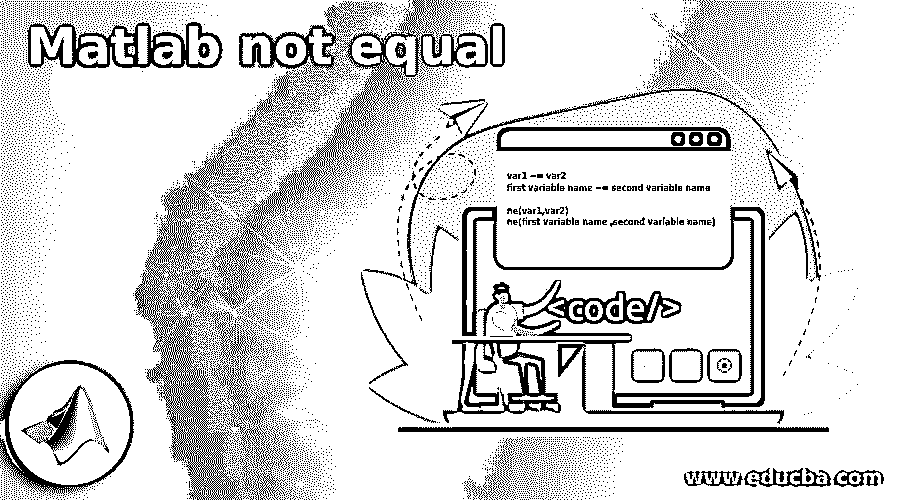
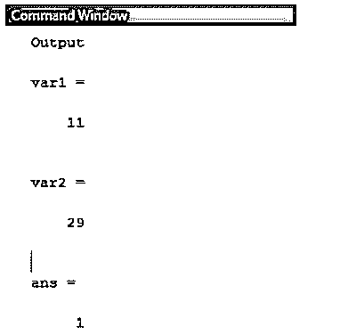
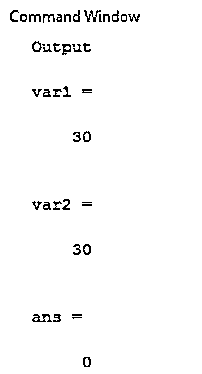
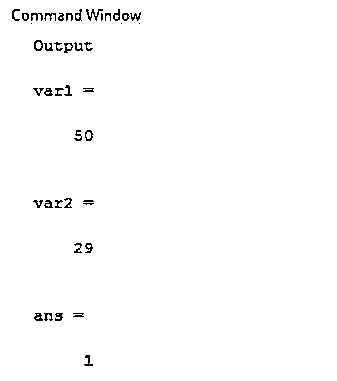
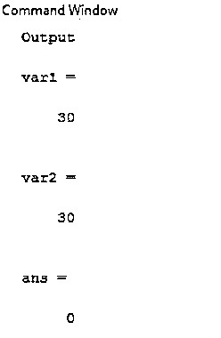
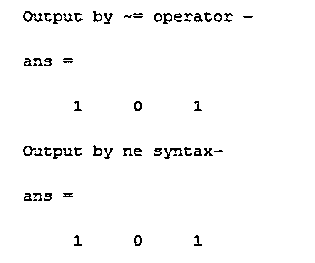
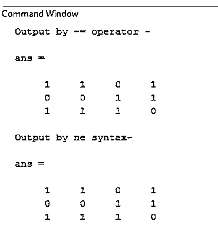
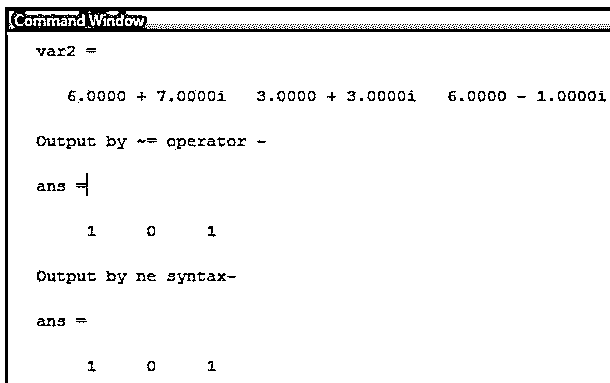
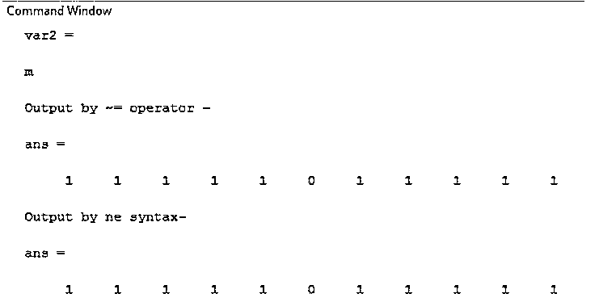
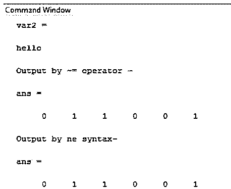

# Matlab 不等于

> 原文：<https://www.educba.com/matlab-not-equal/>

## Matlab 简介不等于

下面的文章提供了一个 Matlab 不等于大纲。Matlab 支持所有类型的运算符，如算术、逻辑、比较、关系等。在关系运算符组中，有各种决定两个量之间关系的运算。关系运算符有等于(= =)、不等于(~ =)、大于(>)、小于(

**语法:**

<small>Hadoop、数据科学、统计学&其他</small>

`var1 ~= var2
first variable name ~= second variable name`

`ne(var1,var2)
ne(first variable name ,second variable name)`

### 如何在 Matlab 中实现不等运算符？

*   不等于运算符一次比较两个量或元素，并以真或假的形式给出结果。
*   如果两个元素相同，则不等于运算失败，并且它给出的结果为假。同样，如果两个元素不相同，则不等于条件满足，则为真。
*   真和假以一和零的形式表示。
*   如果结果为真，则表示为‘1’，如果结果为假，则表示为‘0’。

### Matlab 不相等的例子

下面给出的是 Matlab 不相等的例子:

#### 示例#1

让我们考虑一个元素的简单例子。第一个元素“11”被声明为“var 1”，第二个元素“29”被声明为“var 2”。在示例 1(a)中，符号方法使用了不等运算符，而在示例 1(c)中，使用语法“ne”说明了相同的问题。在这两个例子中，元素是不同的；因此，我们将得到结果为 1。在实施例 1(b)和 1(d)中，元件是相同的；因此，我们将分别使用符号和语法方法得到结果 0。

**Matlab 代码示例 1(a):**

**代码:**

`clear all;
disp ('Output');
var 1 = 11
var 2 = 29
var1 ~ = var2`

**输出:**

**例 1(b)的 Matlab 代码:**

**代码:**

`clc;
clear all;
disp ('Output');
var 1 = 30
var 2 = 30
var1 ~ = var2`

**输出:**

**例 1(c)的 Matlab 代码:**

**代码:**

`clc;
clear all;
disp ('Output');
var 1 = 50
var 2 = 29
ne (var1, var2)`

**输出:**

**Matlab 代码示例 1(d):**

**代码:**

`clc;
clear all;
disp ('Output');
var 1 = 30
var 2 = 30
ne (var1, var2)`

**输出:**

#### 实施例 2

在前面的示例中，输入数据位于单个元素(一维)中，但是如果数据有多个元素，则“不等于”运算将比较数据库中的每个元素，并分别给出每个元素的输出，这在示例 2(a)中通过使用两种方法进行了说明。在例 2(b)中，我们可以看到数据是多维的(矩阵)；它有三行四列，所以不对矩阵的每个元素进行相等运算，它会给出三行四列的结果。

**Matlab 代码示例 2(a):**

**代码:**

`clc;
clear all;
var 1 = [34, 54, 65] var 2 = [35, 54, 45] disp ('Output by ~ = operator -');
var 1 ~ = var 2
disp ('Output by ne syntax- ');
ne (var 1, var 2)`

**输出:**

**例 2(b)的 Matlab 代码:**

**代码:**

`clc;
clear all;
var 1 = [5 6 3 2 ; 3 5 6 7 ; 2 7 8 4] var 2 =[4 5 3 1 ; 3 5 4 9 ; 6 5 3 4] disp('Output by ~ = operator -');
var 1 ~ = var 2
disp ('Output by ne syntax- ');
ne ( var 1, var 2)`

**输出:**

#### 实施例 3

在这个输入类型的例子中，参数是不同的。以前我们见过简单的整数。我们将把一个复变量看作元素。这里的输入是多维的，每个元素都是一个复杂的变量。在这种类型的数据集上，不等运算符比较每个元素的实部和虚部，并相应地给出结果，如示例 3 所示。

**代码:**

`clc;
clear all;
var 1 = [5 + 6i, 3 + 3i, 2 - i] var2 = [ 6 + 7i, 3 + 3i, 6 - i] disp('Output by ~ = operator -');
var 1 ~ = var 2
disp ('Output by ne syntax- ');
ne ( var 1,var 2)`

**输出:**

#### 实施例 4

在这个例子中，我们将考虑字符和字符串形式的输入。在示例 4(a)中，第一个输入是单词“hellomatlab”，第二个输入是单个字母“m”。不相等操作将把单词中的每个元素与单个字母“m”进行比较，并以数组的形式给出结果。在示例 4(b)中，第一个输入是与单个单词进行比较的单词数组，因此 not equal 运算符会将第一个输入中的所有单词与单词“hello”进行比较，并且它还会以数组的形式给出输出。

**Matlab 代码示例 4(a):**

**代码:**

`clc;
clear all;
var 1 = 'hellomatlab'
var 2 = 'm'
disp('Output by ~ = operator -');
var 1 ~ = var 2
disp('Output by ne syntax- ');
ne (var 1 ,var 2)`

**输出:**

**Matlab 代码示例 4(b):**

**代码:**

`clc;
clear all;
var 1 = categorical({'hello', 'hi', 'hi', 'hello', 'hello', 'hi'})
var 2 = 'hello'
disp ('Output by ~= operator -');
var 1 ~ = var 2
disp ('Output by ne syntax- ');
ne (var 1,var 2)`

**输出:**

### 结论

在本文中，我们看到了在 Matlab 中使用不等运算的各种方法。运算符对输入的每个元素执行操作，而不考虑输入数据的维度，如单元素、一维或多元素和多维。它可以处理所有数据类型，如整数、浮点数、复杂变量、字符和字符串。

### 推荐文章

这是一个 Matlab 的指南，不等于。这里我们分别讨论导论、不相等算子如何在 matlab 中工作以及例子。您也可以看看以下文章，了解更多信息–

1.  [Matlab gca](https://www.educba.com/matlab-gca/)
2.  [Matlab xcorr](https://www.educba.com/matlab-xcorr/)
3.  [Matlab 绘图标题](https://www.educba.com/matlab-plot-title/)
4.  [Matlab 排序](https://www.educba.com/matlab-sort/)

