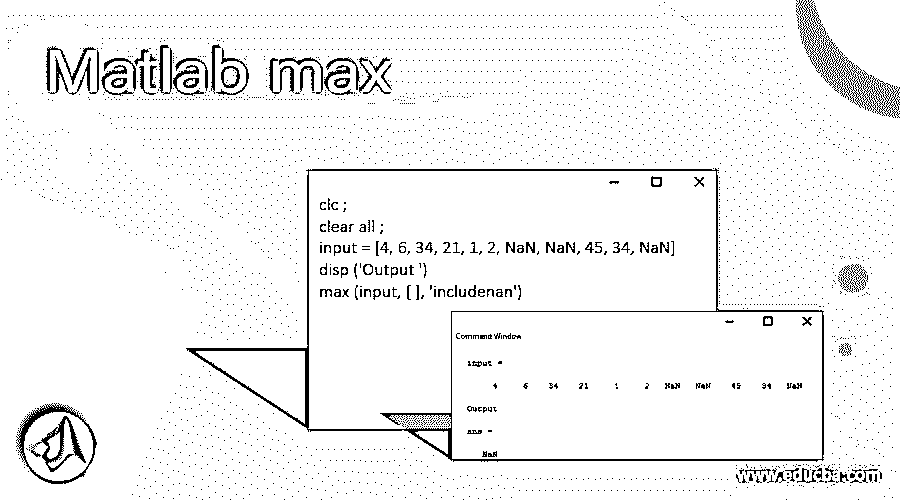
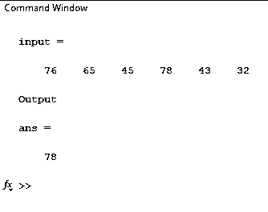
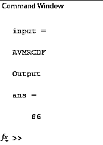
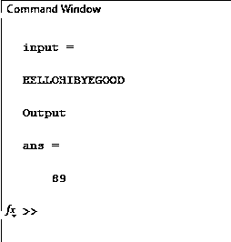
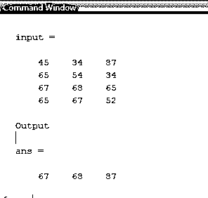
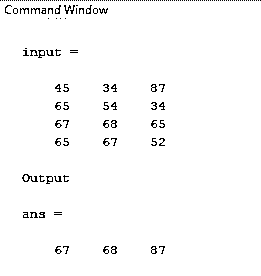
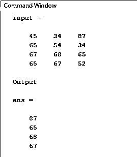
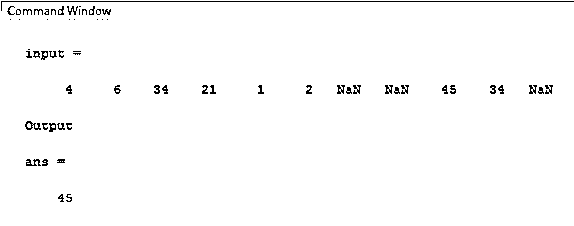
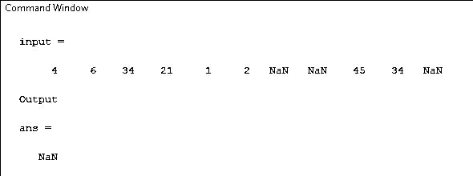

# Matlab max

> 原文：<https://www.educba.com/matlab-max/>

## Matlab max 简介

在 Matlab 中,' max '函数用于从给定的数据库中查找或计算最大元素。它比较整数中的所有值，并返回最大值。Max 函数支持一维数据集和多维数据集。它还可以处理所有数据类型，如整数、浮点数、字符、复数和字符串。如果数据集有空值，那么有不同的方法来考虑这些值。它有各种选项，如“omitnan”、“includenan”、“dim”、“nanflag”等。

**语法**

<small>Hadoop、数据科学、统计学&其他</small>

*   max(输入变量名)

最小(输入)

*   最大值(输入变量名，[ ]，维度)

max(输入，[ ]，1)，max(输入，[ ]，2)

*   max(输入变量名，[ ]，' includenan ')

max ( Input，[ ]，' includenan ')

*   max(输入变量名，[ ]，' omitnan ')

min(输入，[ ]，' omitnan ')

### Matlab 中 max 函数是如何工作的？

Max 函数对一系列元素执行，如果数据集是一维的，以向量或数组的形式，那么计算最大元素是简单的，但是如果数据集是多维的，并且数据集中存在大量元素，那么这是一个复杂的过程。该函数分别计算每行和每列的最大值。字符和字符串的最大值是根据所有元素的 ASCII 值计算的。

### 例子

下面举几个例子

#### 示例#1

让我们考虑一个整数元素 76，65，45，78，43，32 的数组，它被声明为输入。所有的元素都是整数；因此，max 函数将给出 78 作为输出，如示例 1(a)所示。在例 1(b)中，输入数据是字符形式，如‘A’，‘V’，‘M’，‘R’，‘C’，‘D’，‘F’。min 函数将首先找出 ascii 值，然后计算最大值。因此最小值最大值是 86。如果数据集是字符串数组，则字符串是字符数组；因此，在字符串中，max 函数也只能像字符一样执行。在示例 1(c)中，输入是“你好”、“嗨”、“再见”、“好”。这个函数将考虑每个字母的第一个字母，通过比较所有的第一个字母，我们将得到 89 作为输出，这是字符' Y '的 ascii 值。

**Matlab 代码示例 1(a):**

`clc ;
clear all;
input = [76, 65, 45, 78 , 43, 32] disp ('Output ')
max (input)`

**输出:**

**例 1(b)的 Matlab 代码:**

`clc ;
clear all ;
input = [ 'A', 'V', 'M', 'R', 'C', 'D', 'F' ] disp ('Output ')
max (input)`

**输出:**

**例 1(c)的 Matlab 代码:**

`clc ;
clear all ;
input = [ 'HELLO', 'HI', 'BYE', 'GOOD' ] disp ('Output ')
max (input)`

**输出:**

#### 实施例 2

让我们考虑一个多维数据库的例子。在示例 2(a)中，输入具有三列和四行；如果我们对输入应用 max 函数，我们将得到三个值作为输出。这三个值是每列的最大元素。我们也可以指示矩阵的维数。如果我们想要关于列的最大值，则使用“1”维度，如示例 2(b)中所示；如果我们想要关于行的最大值，则使用“2”维度，如示例 2(c)中所示。

**Matlab 代码示例 2 ( a ):**

`clc;
clear all;
input = [45 ,34, 87 ; 65, 54, 34 ; 67, 68, 65 ; 65, 67, 5 2 ] disp ('Output ')
max (input)`

**输出:**

**例 2 (b)的 Matlab 代码:**

`clc;
clear all;
input = [45 , 34, 87 ; 65, 54, 34 ; 67, 68, 65 ; 65, 67, 52 ] disp ('Output ')
max (input, [ ] , 1 )`

**输出:**

**例 2(c)的 Matlab 代码:**

`clc;
clear all;
input = [45 ,34, 87 ; 65, 54, 34 ; 67, 68, 65 ; 65, 67, 52 ] disp ('Output ')
max ( input, [ ] , 2)`

**输出:**

#### 实施例 3

如果数据库中缺少一些值或者一些值为空，那么有一种方法可以在这样的数据库上执行。Nan 表示空值。如果数据库中有 NaN 值，并且我们在没有任何指令的情况下应用 min 函数，那么它将自动忽略 NaN 值。max 函数有两种方式。一个是 omitnan，第二个是 includenan。“Omitnan”将忽略 nan 值，“Includenan”将考虑 NaN 值。在实施例 3(a)中，使用‘omit nan’；这将忽略所有 Nan 值并比较其他值。并且在示例 3(b)中，使用了 includenan 函数，该函数将包括 nan 值的存在，并且通过考虑 Nan 是最大元素，直接给出 Nan 的输出。

**Matlab 代码示例 3(a):**

`clc ;
clear all ;
input = [4, 6, 34, 21, 1, 2, NaN, NaN, 45, 3 4, NaN] disp ('Output ')
max (input, [ ], 'omitnan')`

**输出:**

**例 3(b)的 Matlab 代码:**

`clc ;
clear all ;
input = [4, 6, 34, 21, 1, 2, NaN, NaN, 45, 34, NaN] disp ('Output ')
max (input, [ ], 'includenan')`

**输出:**

### 结论

在本文中，我们已经看到了“最大”函数。该函数比较数据库中的所有元素，并找出数据库中的最大值。使用该操作对数据集的维度没有限制。除了所有类型的数据集，它还适用于所有数据类型，如整数、浮点数、复数、字符和字符串。

### 推荐文章

这是一个 Matlab max 的指南。这里我们讨论了 max 函数在 Matlab 中的工作原理和例子，以及代码和输出。您也可以阅读以下文章，了解更多信息——

1.  [Matlab gca](https://www.educba.com/matlab-gca/)
2.  [Matlab 二重积分](https://www.educba.com/matlab-double-integral/)
3.  [信号处理 Matlab](https://www.educba.com/signal-processing-matlab/)
4.  [Matlab fplot()](https://www.educba.com/matlab-fplot/)

