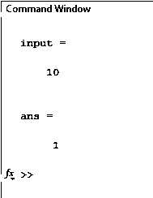
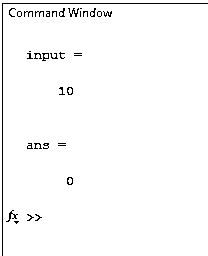
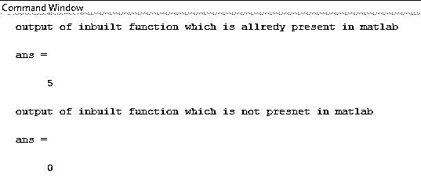
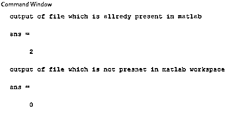
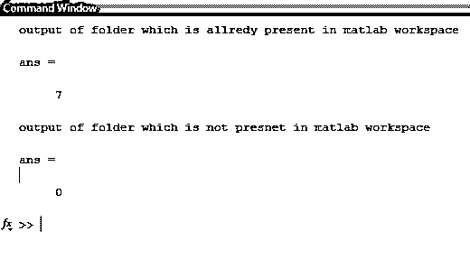

# Matlab 存在

> 原文：<https://www.educba.com/matlab-exist/>

## Matlab 简介存在

在 Matlab 中,“exist”代表存在。exist 函数检查变量、函数、类、文件夹等是否存在。这个函数帮助我们了解 Matlab 工作区中可用的清单。如果给定的文件或文件夹已经存在于 Matlab 中，它将在创建同名的新文件时出错，并使用相同的文件夹而不是新文件夹，以便优化空间。这个函数给出整数值作为输出；这个输出返回值从 0 到 8 不等。

**语法**

<small>Hadoop、数据科学、统计学&其他</small>

*   现有输入

现有变量名

*   存在(“最大”)

存在(“内置函数名”)

*   现有 gui 文件

现有 Matlab 文件名文件

*   存在直到 dir

现有文件夹名称目录

### Matlab 中的现有函数是如何工作的？

“Exist”函数以整数形式返回值。如果给定的量出现在 Matlab 中，那么它会根据量的类型给出从 1 到 8 的输出。如果给定的量在 Matlab 中不存在，那么它给出的输出为“0”。我们可以检查变量的存在，带有扩展名的文件。m '，'。mlx '，'。mlapp“，”。mat '，'。图'，'。txt’)、作为目录的文件夹、内置函数、类等。如果给定的变量存在于 Matlab 工作空间中，那么它返回数字“1”，对于文件，它返回“2”或“3”。如果是模拟模型，则返回 4。如果我们正在检查内置函数的存在，则它将通过“5”显示存在，对于文件夹，它将返回“7”。

### 例子

下面举几个例子

#### 示例#1(变量)

在这个例子中，首先，我们需要创建一个变量，然后我们可以检查变量的存在；这里创建了一个变量，即“输入”。在变量创建之后，我们已经在变量上使用了现有的函数；因此，输出为 1，这意味着“输入”变量出现在 Matlab 工作空间中，如示例 1(a)所示。在示例 1(b)中，没有创建任何变量，我们直接对“输出”变量应用函数，它返回结果为 0，这意味着“输出”变量不在 Matlab 工作区中。

**Matlab 代码示例 1(a)–**

`clc ;
clear all ;
input = 10
exist input`

**输出:**

**例 1( b)的 Matlab 代码:**

`clc ;
clear all ;
input = 10
exist output`

**输出:**

#### 实施例 2

在这个例子中，我们将检查 Matlab 内置函数的存在性。Matlab 中有各种函数可用，如最大值、平均值、最小值、平均值、导入、显示、使用等。这里我们使用了 max '函数来检查存在性，因为我们知道它存在于 Matlab 中，所以它将返回输出值为' 5 '。我们将使用一个随机名称“abc”，它将返回输出为“0”，这意味着 Matlab 中没有这样的函数，如示例 2 所示。

**Matlab 代码示例 2:**

`clc ;
clear all ;
disp ('output of inbuilt function which is already present in matlab ')
exist('max')
disp ('output of inbuilt function which is not present in matlab ')
exist('abc')`

**输出:**

#### 实施例 3

这个例子将检查 Matlab 中的文件是否存在。为了首先检查现在，我们需要创建一个文件，这里我们已经创建了一个名为“gui.m”的 Matlab 文件。检查文件是否存在的扩展名是有限制的；只有少数扩展名是允许的，如。m '，'。mlx '，'。mlapp“，”。mat '，'。图'，'。' txt '。因为我们已经创建了一个带扩展名的 Matlab 文件。m，那么我们将得到输出为‘2’。数字“2”表示文件的存在。另一方面，我们已经检查了文件 gui10 的存在；它返回值 0，这意味着工作区中没有名为 gui 10 的文件。

**Matlab 代码示例 3:**

`clc ;
clear all ;
% already created one matlab file 'gui.m'
disp ('output of file which is already present in matlab')
exist gui file
disp ('output of file which is not present in matlab workspace')
exist gui10 file`

**输出:**

#### 实施例 4

在本例中，我们将检查文件夹是否存在。要检查目录中是否存在，首先，我们需要创建一个文件夹，这里我们在目录“util”中创建了一个文件夹，在检查存在后，它返回值“7”。这意味着给定的文件夹存在于目录中，数字“7”表示该文件夹存在于 Matlab 工作区中。然后，我们检查另一个文件夹“util10”是否存在，该文件夹不在目录中，因此它将返回结果“0”。

**Matlab 代码示例 4:**

`clc ;
clear all ;
% already created one matlab folder ' util'
disp ('output of folder which is already present in matlab workspace')
exist util dir
disp ('output of folder which is not present in matlab workspace')
exist util10 dir`

**输出:**

### 结论

在本文中，我们看到了“exist”函数的各种用法。它检查任何模型的 stands 实现中所需的几乎每个因素的存在。有一些替代现有函数的方法，如“是文件”和“是文件夹”，但不要对每个术语(变量、文件、文件夹、函数、类)使用不同的语法，最好对所有术语使用相同的函数。

### 推荐文章

这是一个 Matlab 的存在指南。在这里，我们讨论如何在 Matlab 中存在函数工作和例子，以及代码和输出。您也可以阅读以下文章，了解更多信息——

1.  [Matlab gca](https://www.educba.com/matlab-gca/)
2.  [Matlab 表单](https://www.educba.com/matlab-forms/)
3.  [Matlab 变量](https://www.educba.com/matlab-variables/)
4.  [Matlab 积分](https://www.educba.com/matlab-integral/)

