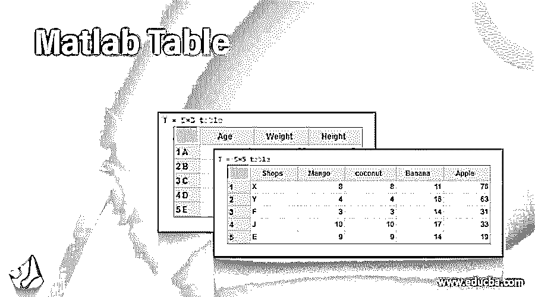
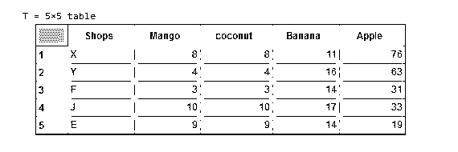
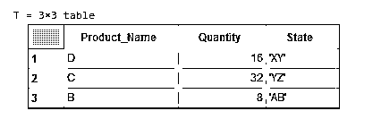
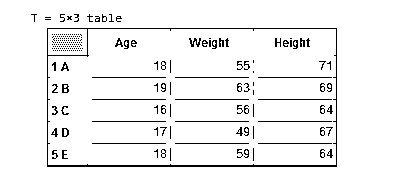

# Matlab 表格

> 原文：<https://www.educba.com/matlab-table/>

## Matlab 表格介绍

在 Matlab 的' Table，'函数是用来创建表格的。一个表可以包含不同类型的数据或信息，如变量、值、常数等。它也有不同的大小，只要所有的变量。table 函数按照我们的定义将数据排列成行和列。

**语法:**

<small>Hadoop、数据科学、统计学&其他</small>

*   T =表格(var1、…，警告)
*   T =表(___，' VariableNames '，varNames)
*   T =表(___，'行名'，行名)

### 如何在 Matlab 中创建表格？

表格功能用于创建表格。一个表可以包含不同类型的数据和大小。因此，我们需要获取所有数据，然后创建一个具有不同大小和不同数据类型的表。要创建一个表，使用以下步骤。

**第一步:**从文件中读取所有数据。

**第二步:**将所有数据赋给一个变量。

**步骤 3:** 然后使用“Matlab 表格”函数的适当语法创建一个表格。

**第四步:**然后执行代码。

### Matlab 表格示例

下面举几个例子

#### 示例#1

让我们考虑一个表格的例子。在这个例子中，我们可以看到如何使用 table 函数创建一个表。我们有五家商店水果销售的数据。我们可以使用 table 函数创建一个表。首先，我们按照水果名称获取所有销售条目，然后使用 table 函数创建一个表。一个可变的名字是芒果，椰子，香蕉和苹果。[8;4;3;10;9]该数据被分配给变量 Mango。一种可变椰子容器[8；4;3;10;9]数据。[11;16;14;17;14]数据被分配给变量 Banana。一个可变苹果包含[76；63;31;33;19]数据。所有这些数据都是 5 家商店出售的水果盒数量。所有适当的数据都被加载到表中，在 table 函数的帮助下，将创建一个表。table 函数按照我们的定义将所有数据排列成行和列。执行代码以创建数据

**代码:**

`clc;
clear all;
close all;
Mango = [8;4;3;10;9];
coconut = [8;4;3;10;9];
Banana = [11;16;14;17;14];
Apple = [76; 63; 31; 33; 19];
Shops  = [ 'X'; 'Y'  ; 'F'; 'J'; 'E'; ];
T = table(Shops, Mango, coconut, Banana, Apple)`

**输出:**

命令窗口:

**图 1**

执行代码后，我们看到在命令窗口中创建了一个表。

创建的表如图 1 所示。

#### 实施例 2

让我们再考虑一个桌子的例子。我们有某些公司产品及其运输地点的数据。正如我们所知，为了在 Matlab 中创建表格，我们使用了 table 函数。在这个例子中，我们可以看到创建表的另一种类型。在这个例子中，当我们使用“Matlab 表”函数时，我们可以分配所有的数据。我们使用带有适当语法的 table 函数来创建一个表。" T = table(categorial({ ' D；c’；B'})，[16；32;8]，…{ ' XY '；YZ’；AB' }，… VariableNames '，{'Product_Name '，' Quantity '，' State'})"这一行是使用提供的数据和变量创建的表。这里使用的变量名是“产品名称”、“数量”和“状态”。table 函数按照我们的定义将所有数据排列成行和列。执行后，将创建代码表。

**代码:**

`clc;
clear all;
close all;
T = table(categorical({'D';'C';'B'}),[16;32;8],...
{'XY';'YZ';'AB'},...
'VariableNames',{'Product_Name','Quantity','State'})`

**输出:**

命令窗口:

在第一个示例中，我们首先获取所有数据，然后使用 Table 函数。

**图 2**

#### 实施例 3

让我们再看一个表格的例子。在这个例子中，我们看到如何在 Matlab 中创建表格时指定行名。正如我们所知，Matlab 中的“table”函数用于创建表格。所以我们在 Matlab 中创建表格时使用 table 函数来指定行名。所以我们首先把所有的数据都变成变量。我们有一些关于人的数据，比如他们的年龄、身高、体重。所以首先我们把所有的数据转化为变量。年龄、体重、身高和名字这些变量包含了所有的数据。现在，我们使用带有适当语法的 table 函数来创建一个表。table 函数按照我们的定义将所有数据排列成行和列。执行后，将创建代码表。

**代码:**

`clc;
clear all;
close all;
Name = {'A';'B';'C';'D';'E'};
Age = [18;19;16;17;18];
Height = [71;69;64;67;64];
Weight = [55;63;56;49;59];
T = table(Age,Weight,Height,'RowNames',Name)`

**输出:**

命令窗口:

**图 3**

### 结论

基本上，表是用来创建表的。在本文中，我们已经看到了在 Matlab 中使用带有语法的“Matlab Table”函数创建表格的不同类型。表格是在 Matlab 中创建表格的重要而有效的方法之一。

### 推荐文章

这是一个 Matlab 表格指南。在这里，我们讨论如何在 Matlab 中创建一个表格，以及代码和输出的例子。您也可以看看以下文章，了解更多信息–

1.  [Matlab 导入数据](https://www.educba.com/matlab-import-data/)
2.  [MATLAB 独有的](https://www.educba.com/matlab-unique/)
3.  [MATLAB 归一化](https://www.educba.com/matlab-normalize/)
4.  [格式长 Matlab](https://www.educba.com/format-long-matlab/)

