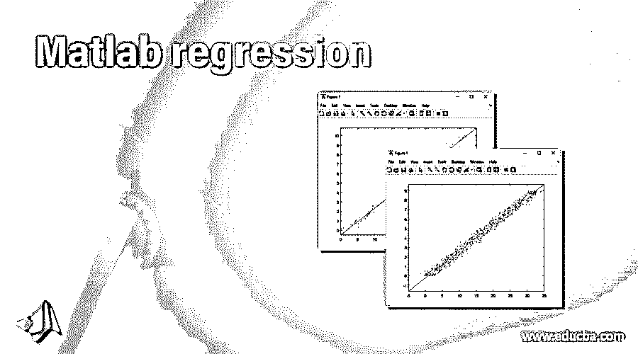
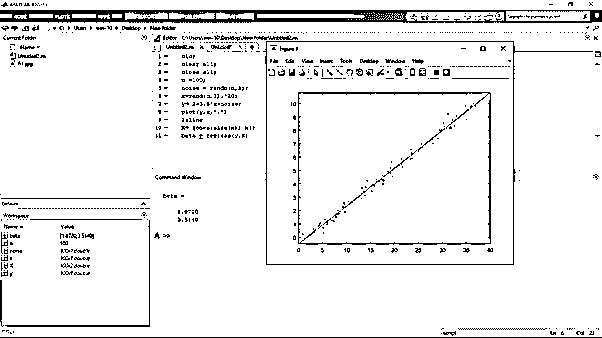
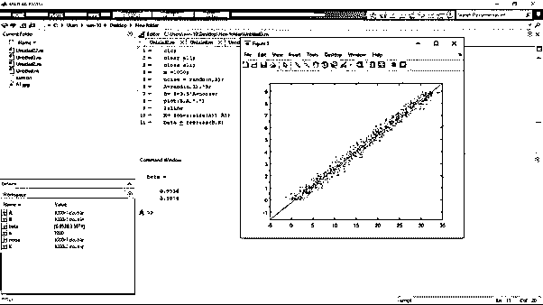

# Matlab 回归

> 原文：<https://www.educba.com/matlab-regression/>

## Matlab 回归简介

MATLAB 回归函数用于通过将线性方程代入观察数据来找出两个变量之间的关系。一个变量被视为解释变量，另一个变量被视为因变量。因变量本质上是连续的。因变量意味着变量值被关注或解释，另一方面解释变量或自变量被用于关注因变量。因变量表示为 Y，解释变量或自变量表示为 x。对于解释变量向量对自变量矩阵中预测值的响应的多元线性回归，使用 Matlab 回归函数。

**语法**

<small>Hadoop、数据科学、统计学&其他</small>

MATLAB 回归函数语法如下:-

`b = regress(y,X)`

### Matlab 中回归是如何工作的？

MATLAB 回归函数用于通过将线性方程代入观察数据来找出两个变量之间的关系。有两个变量，一个是解释变量或自变量，另一个是因变量。因变量本质上是连续的。了解回归函数在 Matlab 中如何工作有非常简单的步骤，步骤如下:–

**步骤 1:** 创建一个变量作为解释变量或自变量，并加载所有输入

数据。

**步骤 2:** 再创建一个变量作为因变量，加载所有数据。

**步骤 3:** 然后写出可以包含直线斜率的方程。

**第四步:**然后用适当的语法使用 MATLAB 回归函数

**步骤 5:** 执行 Matlab 代码，得到输出。

### Matlab 回归示例

下面举几个例子

#### 示例#1

让我们看看 Matlab 回归的例子，以及它是如何在 Matlab 中工作的。正如我们所知，对于 MATLAB 中的回归过程，我们使用了 Matlab 回归函数。所以让我们假设观察值是 100。然后，我们使用 rand 函数创建人工噪声。"噪声= randn(n，1)；"这条线是用来制造人造噪音的。之后我们创建独立变量 x，" x=rand(n，1)。*10;"这条线创建了自变量 x，它被人为地放大了，超过了噪声。之后，我们准备写方程。" y = 2+3.5 * x+噪声；"这条线给出了方程，这里 3.5 是自变量 x 的斜率，我们在这个方程中加入了人工噪声。然后，我们使用自变量 x 和因变量 y 之间的绘图函数来绘制图形。之后，我们使用“lsline”语法来创建直线或绘制直线。之后，我们通过附加 1 来创建第一个 beta 值。通过使用“X =[ones(size(X))X]；”在这一行中，我们创建了第一个 beta 值，然后使用 MATLAB 回归函数创建了最终的 beta 值。“beta = regressive(y，X)”该语法创建 beta。所以在执行 Matlab 代码后，我们得到 2 个 beta 值。

**代码:**

`clc;
clear all;
close all;
n =100;
noise = randn(n,1);
x=rand(n,1).*10;
y= 2+3.5*x+noise;
plot(y,x,'.')
lsline
X= [ones(size(x)) x];
beta = regress(y,X)`

**输出:**

命令窗口:

图 1

执行 Matlab 代码后，我们使用回归函数获得回归值。

#### 实施例 2

让我们再看一个回归的例子。正如我们所知，在 MATLAB 中寻找回归，我们使用 Matlab 回归函数。在这个例子中，我们看到了 Matlab 中回归函数的高效方式。这里假设了大量的观察值。因此，假设观察值等于 1000。然后，使用“randn”函数“noise = randn(n，1)；”创建人工噪声这一行用于在 Matlab 中创建人工噪声。然后我们创建一个自变量和一个因变量。为了创建独立变量 A

“A =兰特(n，1)。*9;"这条线是用过的。之后，我们准备写方程“B = 1+3.5 * A+噪声；，这条线给出了方程，这里 3.5 是自变量 a 的斜率，并且我们在这个方程中加入了人工噪声。然后，我们使用自变量 A 和因变量 b 之间的绘图函数来绘制图形。之后，我们使用“lsline”语法来创建直线或绘制直线。之后，我们通过附加 1 来创建第一个 beta 值。通过使用“X =[ones(size(A))A]；”这一行我们创建第一个 beta 值，最后我们使用 MATLAB 回归函数创建最终的 beta 值。“beta = regressive(B，X)”该语法创建 beta。所以在执行 Matlab 代码后，我们得到 2 个 beta 值。

**代码:**

`clc;
clear all;
close all;
n =1000;
noise = randn(n,1);
A=rand(n,1).*9;
B= 1+3.5*A+noise;
plot(B,A,'.')
lsline
X= [ones(size(A)) A];
beta = regress(B,X)`

**输出:**

命令窗口:

图 2

执行 Matlab 代码后，我们使用回归函数获得回归值。

### 结论

在本文中，我们看到了回归函数的概念。基本上，回归函数用于通过将线性方程放入观察数据来找出两个变量之间的关系。然后看到了与回归函数相关的语法以及如何在 Matlab 代码中使用它。同时，我们也看到了 MATLAB 回归函数在回归过程中的重要作用。

### 推荐文章

这是一个 Matlab 回归指南。在这里，我们讨论如何在 Matlab 中回归工作，以及代码和输出的例子。您也可以看看以下文章，了解更多信息–

1.  [雅可比 Matlab](https://www.educba.com/jacobian-matlab/)
2.  [点积 MATLAB](https://www.educba.com/dot-product-matlab/)
3.  [移动平均线 Matlab](https://www.educba.com/moving-average-matlab/)
4.  [震级 Matlab](https://www.educba.com/magnitude-matlab/)

