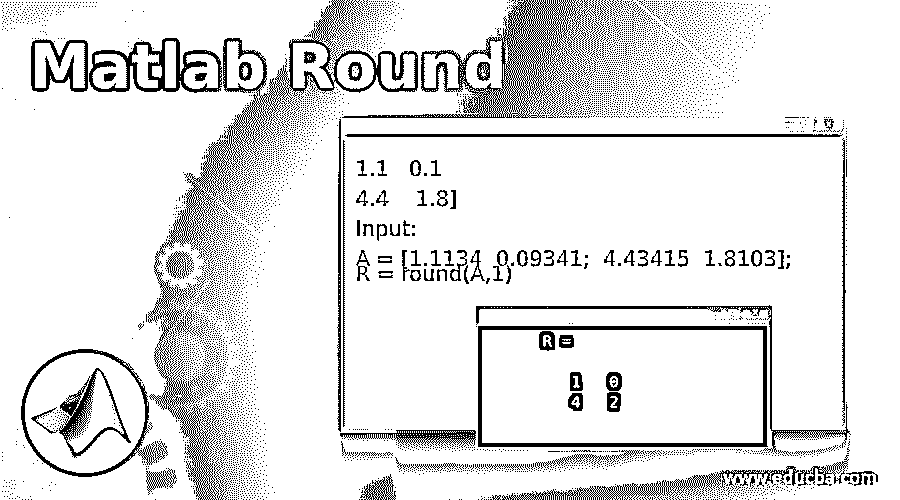
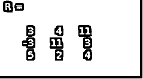
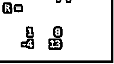
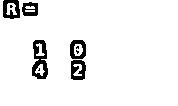

# Matlab 回合

> 原文：<https://www.educba.com/matlab-round/>

## Matlab Round 简介

“四舍五入”在数学中是用来限制有效位数的。例如,“pi”的值是 3.14159265358979323，在计算中每次都使用这个完整的值会变得很麻烦而且没有必要。为了避免这种情况，我们将数值四舍五入到所需的小数位数。这就是为什么我们大多把圆周率的值看成 3.14(四舍五入到小数点后两位)。

在 MATLAB 中，我们使用“round”函数来对数值进行四舍五入。

<small>Hadoop、数据科学、统计学&其他</small>

**语法:**

`R = round (A)`

`R = round (A, N)`

**描述:**

*   R = round (A)会将“A”四舍五入为最接近的整数。在数组的情况下,“A”的所有元素都四舍五入为最接近的整数
*   R = round (A，N)将把“A”四舍五入到“N”位。如果 N < 0，四舍五入到小数点左边

### Matlab 回合示例

现在让我们用不同的例子来理解 MATLAB 中的 round 函数代码:

#### 示例#1

在本例中，我们将采用一个 3 x 3 的矩阵。对于我们的第一个示例，我们将遵循以下步骤:

1.  初始化输入的 3 x 3 矩阵
2.  将矩阵作为输入传递给 round 函数

**代码:**

`A = [3.11  4.015  11.092;  -3.45  10.8  3.001;  4.981  2.012  4.1];`

[Declaring the 3 x 3 input matrix]

`R = round(A)`

[Passing the input matrix to the round function] [Mathematically, if we round off all the elements in the above matrix, we will get the following values:

3     4      11

-3    11     3

5     2      4]

**输入:**

`A = [3.11  4.015  11.092;  -3.45  10.8  3.001;  4.981  2.012  4.1];
R = round(A)`

**输出:**

正如我们在输出中看到的，我们已经获得了矩阵中所有元素的舍入值。

#### 实施例 2

在这个例子中，我们将采用一个 2 x 2 矩阵。对于此示例，我们将遵循以下步骤:

1.  初始化输入的 2 x 2 矩阵
2.  将矩阵作为输入传递给 round 函数

**代码:**

`A = [1.11  0.01;  -4.45  12.803];`

[Declaring the 2 x 2 input matrix]

`R = round(A)`

[Passing the input matrix to the round function] [Mathematically, if we round off all the elements in the above matrix, we will get the following values:

1     0

-4    13]

**输入:**

`A = [1.11  0.01;  -4.45  12.803];
R = round(A)`

**输出:**

正如我们在输出中看到的，我们已经获得了矩阵中所有元素的舍入值。在上面的两个例子中，我们看到所有的值都被四舍五入到最接近的整数。接下来，我们将学习如何将数值四舍五入到所需的小数位数。

#### 实施例 3

在本例中，我们将采用一个 2 x 2 矩阵，并将每个元素四舍五入到小数点后 1 位。即输出中小数点后有一位数字。对于此示例，我们将遵循以下步骤:

1.  初始化输入的 2 x 2 矩阵
2.  将矩阵作为第一个参数传递给 round 函数
3.  将“1”作为第二个参数传递给 round 函数

**代码:**

`A = [1.1134  0.09341;  4.43415  1.8103];`

[Declaring the 2 x 2 input matrix]

`R = round(A, 1)`

[Passing the input matrix to the round function. The second argument, ‘1’ is passed to specify the number of digits we need after the decimal point] [Mathematically, if we round off all the elements in the above matrix till 1st decimal place, we will get the following values:

1.1   0.1

4.4    1.8]

**输入:**

`A = [1.1134  0.09341;  4.43415  1.8103];
R = round(A,1)`

**输出:**

正如我们在输出中看到的，矩阵中的所有元素都四舍五入到第一个小数位]。接下来，我们将学习如何四舍五入小数点右边的数字

#### 实施例 4

在本例中，我们将取一个 2 x 2 的矩阵，并将其四舍五入到小数点后一位。即“十位数”右边的所有数字将变为零或被四舍五入。对于此示例，我们将遵循以下步骤:

1.  初始化输入的 2 x 2 矩阵
2.  将矩阵作为第一个参数传递给 round 函数
3.  将'-1 '作为第二个参数传递给 round 函数

**代码:**

`A = [321.1134  20.09341;  34.43415  14.8103];`

[Declaring the 2 x 2 input matrix]

`R = round(A, -1)`

[Passing the input matrix to the round function. The second argument, ‘-1’ will round off all the digits before tens place] [Mathematically, if we round off all the elements in the above matrix before tens place, we will get the following values:

320    20

30    10]

**输入:**

`A = [321.1134  20.09341;  34.43415  14.8103];
R = round(A, -1)`

**输出:**

正如我们在输出中看到的，矩阵中的所有元素都被四舍五入，十位之前的数字都变成了零]

### 结论

*   MATLAB 中的 round 函数用于对数值进行四舍五入。
*   默认情况下,“round”将值四舍五入为最接近的整数。如果我们需要将值四舍五入到某个位置，可以传递一个参数。

### 推荐文章

这是一个 Matlab 回合的指南。这里我们还讨论了 matlab round 的介绍和语法，以及不同的例子和代码实现。您也可以看看以下文章，了解更多信息–

1.  [单元格到字符串 MATLAB](https://www.educba.com/cell-to-string-matlab/)
2.  [Matlab 导入数据](https://www.educba.com/matlab-import-data/)
3.  [Matlab fopen](https://www.educba.com/matlab-fopen/)
4.  [Matlab fopen](https://www.educba.com/matlab-fopen/)

