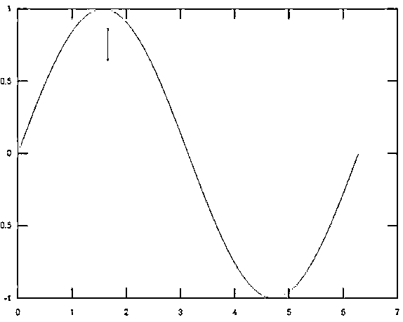
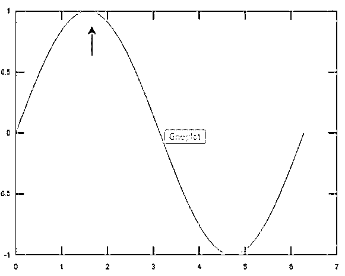
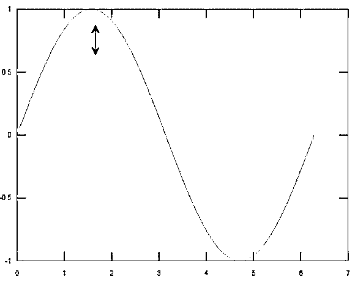
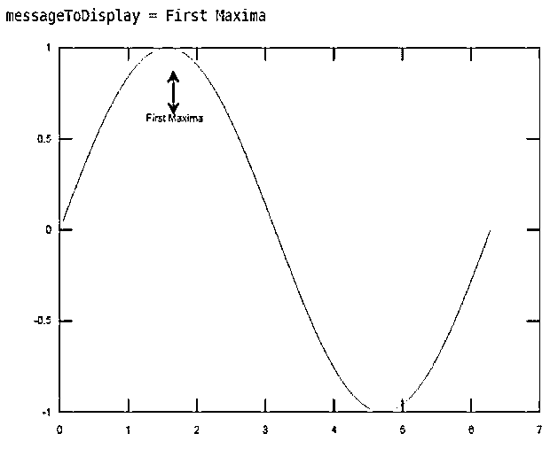
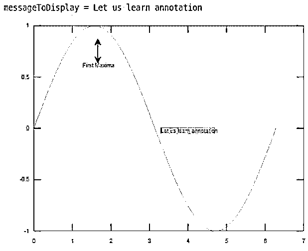

# Matlab 注释

> 原文：<https://www.educba.com/matlab-annotation/>

## Matlab 注释简介

对图表或任何文档进行注释是一种非常重要的方式，可以帮助读者更好地理解上下文&图表或文档所表达的论点，也可以帮助他们理解应该如何阅读图表(或文档)。使用注释，我们提供了与图表相关的任何额外信息，读者在解释图表时可能会发现这些信息很有用。在 Matlab 中，我们使用“注释”功能来创建各种类型的注释。

Matlab 中有两种类型的注释:

<small>Hadoop、数据科学、统计学&其他</small>

*   线型
*   形状类型

**语法:**

`annotation (lineType, A, B)`

`annotation (shapeType, dim)`

**描述:**

*   **标注(线型，a，b):** 用于创建箭头或线条标注。该注释在图中的两点之间延伸。
*   **标注(shapeType，dim):** 用于创建定义大小和位置的形状标注。

“lineType”参数可以采用以下 4 个值:

*   线条
*   箭
*   双箭头
*   文本箭头

“shapeType”参数可以采用以下值:

*   矩形
*   文本框

### Matlab 注释示例

下面是提到的例子:

#### 示例#1

在本例中，我们将绘制一个正弦波，然后使用线注释来显示正弦波达到最大值时的第一个事件。

我们将遵循以下步骤:

*   创建正弦图。
*   初始化注释线的点。
*   将这些点作为参数传递给注释函数。

**代码:**

fs = 0:pi/50:2 * pi；

[Defining the frequency for sinewave]

y =无(fs)；

[Initializing the sine wave]

plot(Fs,y)

[Creating the plot of sine wave]

a =[0.3 0.3]；

b =[0.8 0.9]；

[Defining the points for the annotation]

注释(“行”，A，B)

[Passing the above points to annotation function]

**输入:**

`Fs = 0:pi/50:2*pi;
y = sin(Fs);
plot(Fs,y)
A = [0.3 0.3];
B = [0.8 0.9];
annotation('line', A, B)`

**输出:**

**

** 

正如我们在输出中看到的，正弦波的第一个峰值是使用注释线指出的。

#### 实施例 2

在本例中，我们将使用箭头标注来显示正弦波达到最大值时的第一个事件。

**代码:**

fs = 0:pi/50:2 * pi；

[Defining the frequency for sinewave]

y =无(fs)；

[Initializing the sine wave]

plot(Fs,y)

[Creating the plot of sine wave]

a =[0.3 0.3]；

b =[0.8 0.9]；

[Defining the points for the annotation]

注释(“箭头”，A，B)

[Passing the above points to annotation function. Please note that first argument in this case is ‘arrow’]

**输入:**

`Fs = 0:pi/50:2*pi;
y = sin(Fs);
plot(Fs,y)
A = [0.3 0.3];
B = [0.8 0.9];
annotation('arrow', A, B)`

**输出:**

正如我们在输出中看到的，正弦波的第一个峰值是使用注释箭头指出的。

#### 实施例 3

在本例中，我们将使用双箭头注释来显示正弦波达到最大值时的第一个事件。

**代码:**

fs = 0:pi/50:2 * pi；

[Defining the frequency for sinewave]

y =无(fs)；

[Initializing the sine wave]

plot(Fs,y)

[Creating the plot of sine wave]

a =[0.3 0.3]；

b =[0.8 0.9]；

[Defining the points for the annotation]

批注(“双箭头”，A，B)

[Passing the above points to annotation function. Please note that the first argument in this case is ‘doublearrow’]

**输入:**

`Fs = 0:pi/50:2*pi;
y = sin(Fs);
plot(Fs,y)
A = [0.3 0.3];
B = [0.8 0.9];
annotation('doublearrow', A, B)`

**输出:**

**

** 

正如我们在输出中看到的，正弦波的第一个峰值是使用注释双箭头指出的。

以上所有注释类型都有助于我们放置一条线或一个箭头，但是如果我们除了注释行之外还需要文本呢？为此，我们使用“textarrow”注释。

#### 实施例 4

在本例中，我们将使用文本箭头注释来显示正弦波达到最大值时的第一个事件。

**代码:**

fs = 0:pi/50:2 * pi；

[Defining the frequency for sinewave]

y =无(fs)；

[Initializing the sine wave]

plot(Fs,y)

[Creating the plot of sine wave]

a =[0.3 0.3]；

b =[0.8 0.9]；

[Defining the points for the annotation]

messageToDisplay = '第一个最大值'

[Initializing the string with text message]

批注(' textarrow '，A，B，' String '，str)

[Passing the above points to annotation function. Please note that first argument in this case is ‘textarrow’.

我们还传递了包含要显示的消息的字符串]

**输入:**

`Fs = 0:pi/50:2*pi;
y = sin(Fs);
plot(Fs,y)
A = [0.3 0.3];
B = [0.8 0.9];
messageToDisplay = 'First Maxima'
annotation('textarrow', A, B, 'String', messageToDisplay)`

**输出:**

**

** 

正如我们在输出中看到的，正弦波的第一个峰值被指向，我们还显示了一条文本消息。

#### 实施例 5

在本例中，我们将使用 textbox 批注，这是一个 shapetype 批注。

**代码:**

fs = 0:pi/50:2 * pi；

[Defining the frequency for sinewave]

y =无(fs)；

[Initializing the sine wave]

plot(Fs,y)

[Creating the plot of sine wave]

box dimension =[0.5 0.5 0.3 0.3]；

[Defining the points for the annotation]

messageToDisplay = '让我们学习注释'

[Initializing the string with text message]

批注(“textbox”，boxDimension，“String”，messageToDisplay，“FitBoxToText”，“on”)；

[Passing the above points to annotation function. Please note that first argument in this case is ‘textbox’]

**输入:**

`Fs = 0:pi/50:2*pi;
y = sin(Fs);
plot(Fs,y)
boxDimension = [0.5 0.5 0.3 0.3];
messageToDisplay = 'Let us learn annotation'
annotation('textbox', boxDimension, 'String', messageToDisplay, 'FitBoxToText', 'on');`

**输出:**

**

** 

正如我们在输出中看到的，我们的图有一个文本框形式的注释，其中包含所需的消息。

要获得一个简单的矩形作为注释，只需将上述代码中的参数从“textbox”更改为“rectangle ”,并删除其他参数。

### 结论

添加注释是为了让我们的情节更加易读和直观。我们希望读者了解的关于我们的图表的任何附加信息都可以作为注释传递。Matlab 为我们提供了各种注释类型，如线条、箭头、文本框等。

### 推荐文章

这是一个 Matlab 注释指南。这里我们讨论 Matlab 注释的介绍以及编程示例。您也可以看看以下文章，了解更多信息–

1.  [Matlab sym()](https://www.educba.com/matlab-sym/)
2.  [xls 读取 Matlab](https://www.educba.com/xlsread-matlab/)
3.  [xlabel Matlab](https://www.educba.com/xlabel-matlab/)
4.  [MATLAB 索引](https://www.educba.com/matlab-indexing/)

