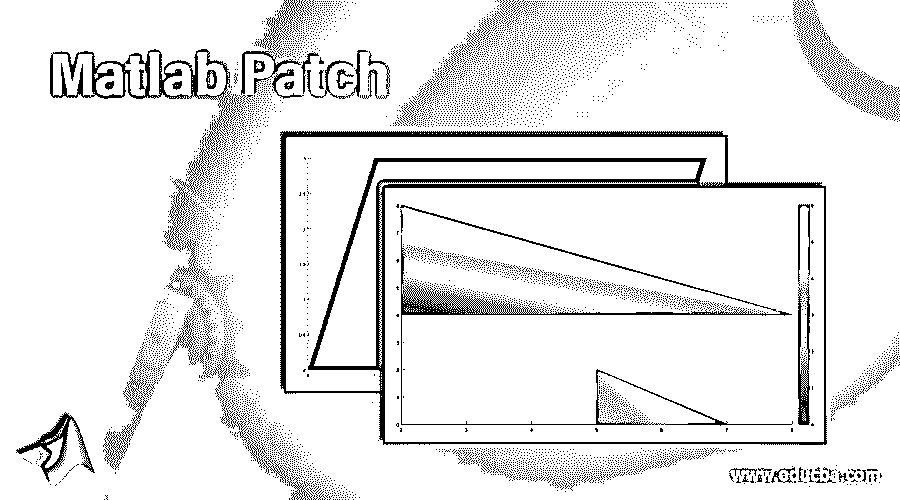
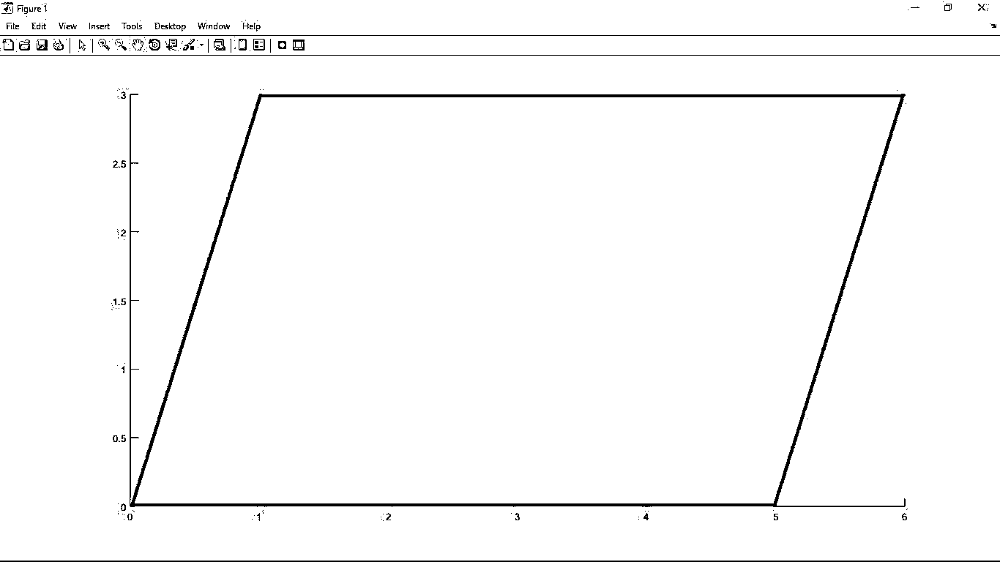
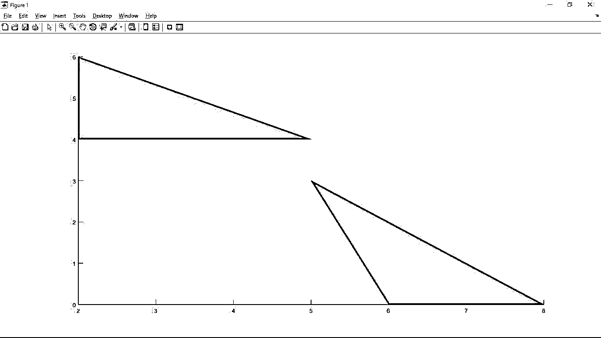

# Matlab 补丁

> 原文：<https://www.educba.com/matlab-patch/>

## Matlab 补丁简介

“帮助绘制一个或多个多边形区域的低级图形函数，称为 MATLAB 补丁函数”。Patch 函数根据顶点的输入坐标绘制一个或多个多边形对象。在一个补丁函数中，我们可以根据自己的需要给多边形上色。在这个主题中，我们将学习 Matlab 补丁。在这个主题中，我们将学习 Matlab 补丁。

**语法**

<small>Hadoop、数据科学、统计学&其他</small>

`patch( X, Y, C)`

### Matlab 中的拼接是如何实现的？

为了在 MATLAB 中绘制一个或多个场多边形区域，使用了 PATCH 函数。根据提供的顶点坐标，面片函数绘制多边形。修补函数自动将过去的(x，y)坐标与下一个(x，y)坐标连接起来。因此，很容易用面片函数绘制多边形。

这里有一些简单的步骤来绘制多边形使用补丁功能。

**第一步:**首先，我们取变量中所有的 x 轴坐标

**第二步:**然后，我们在另一个变量中取所有的 y 轴坐标。

**第三步:**之后我们就可以使用 patch 函数来绘制多边形了。

**第四步:**执行 Matlab 代码，得到输出。

### Matlab 补丁示例

下面给出的是 Matlab 补丁的例子:

#### 示例#1

让我们考虑贴片函数的例子，以绘制顶点在(0，0)、(5，0)、(6，3)和(1，3)的菱形。对于面片函数，我们必须提供其顶点的坐标。首先，我们得到菱形的坐标。我们在变量“x”和“y”中分别有菱形坐标。x 轴坐标取自“x”变量，Y 轴坐标取自“Y”变量。x =[0 1 1 0]；而 y =[0 0 0 1]；这条线用于获取顶点的坐标。在 Matlab 中获取坐标后，使用“patch”函数绘制菱形。patch(x，y，' blue ')这条线使用坐标绘制菱形。修补函数自动将过去的(x，y)坐标与下一个(x，y)坐标连接起来。这里的“蓝色”表示多边形的颜色。我们可以根据需要改变颜色。

**代码:**

`clc;
clear all ;
close all ;
x = [ 0 5 6 1] ;
y = [ 0 0 3 3];
patch(x,y,'blue')`

**输出:**

图 1

#### 实施例 2

让我们考虑 Matlab 补丁函数的另一个例子。在这个例子中，我们看到了如何在 Matlab 中使用 patch 函数绘制两个多边形。我们知道，对于面片函数，我们需要顶点的第一个坐标。在一个补丁函数中，我们可以根据自己的需要给多边形上色。因此我们分别在变量 A 和 B 中取所有坐标。获得所有坐标后，使用多边形面片函数进行绘制。a =[2 6；2 5;5 8];而 B =[4 0；6 3;4 0];分别用于获得 x 轴和 y 轴的坐标。补丁(A，B，'红色')线用于绘制多边形。在语法中，“红色”用于确定多边形的颜色。

**代码:**

`clc;
clear all ;
close all ;
A = [ 2 6 ; 2 5 ; 5 8 ] ;
B = [4 0 ; 6 3 ;  4 0 ] ;
patch( A, B , ' red ' )`

**输出:**

命令窗口:

图 2

#### 实施例 3

让我们再考虑一个 Matlab 补丁函数的例子。在这个例子中，我们讨论了 patch 函数如何给多边形赋予多种颜色。正如我们所知，补丁功能用于绘制一个或多个多边形。在这个例子中，我们可以在 Matlab 中使用 patch 函数绘制两个多边形。在一个补丁函数中，我们可以根据自己的需要给多边形上色。我们知道，对于面片函数，我们需要顶点的第一个坐标。因此我们分别在变量 A 和 B 中取所有坐标。获得所有坐标后，使用多边形面片函数进行绘制。a =[2 5；2 5;8 7];而 B =[4 0；8 2;4 0];分别用于获得 x 轴和 y 轴的坐标。d =[0 3；6 4;4 5];line 根据颜色条调整颜色值。颜色条由许多具有不同值的颜色组成。图语法创建图形输出窗口。执行代码后，我们可以看到不同颜色的多边形和颜色条。

**代码:**

`clc;
close all;
clear all;
A = [2 5; 2 5; 8 7] ;
B = [4 0; 8 2; 4 0] ;
D = [0 3; 6 4; 4 5] ;
figure
patch(A,B,D)
colorbar`

**输出:**

命令窗口:

图 3

### 结论

在本文中，我们看到了 Matlab 补丁函数的概念。基本上，面片用于绘制一个或多个多边形。然后看到了与 Matlab 补丁语句相关的语法，以及如何在 Matlab 代码中使用。此外，我们还看到了一些与 patch 语句相关的示例。

### 推荐文章

这是一个 Matlab 补丁指南。在这里，我们讨论如何在 Matlab 中拼凑和例子，以及代码和输出。您也可以看看以下文章，了解更多信息–

1.  [Matlab fopen](https://www.educba.com/matlab-fopen/)
2.  [Matlab 图片](https://www.educba.com/matlab-images/)
3.  [简化 Matlab](https://www.educba.com/simplify-matlab/)
4.  [MATLAB 独有的](https://www.educba.com/matlab-unique/)

