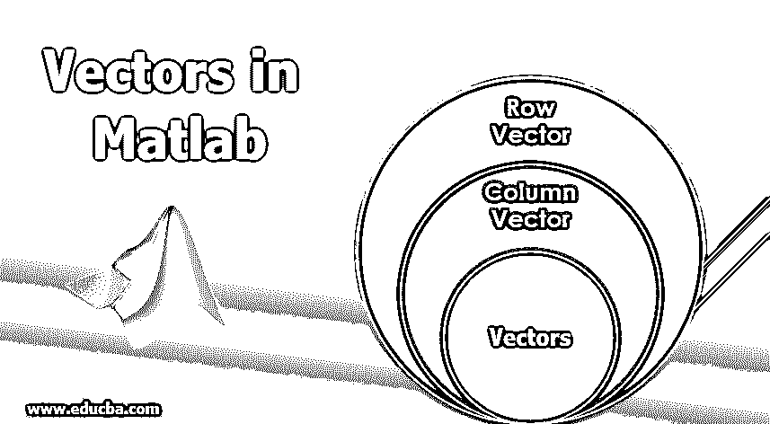
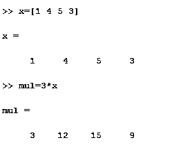
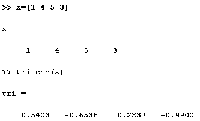
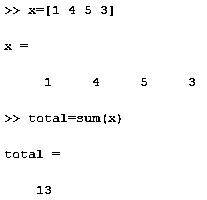
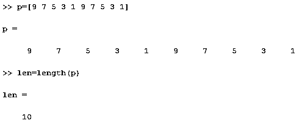
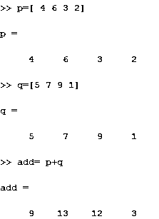
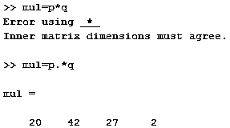
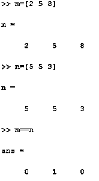

# Matlab 中的向量

> 原文：<https://www.educba.com/vectors-in-matlab/>

## Matlab 中的向量介绍

向量是一组封闭的元素。在 Matlab 中，我们可以用方括号来创建向量。向量是数组(一维数组)的一个例证。它可以用行向量和列向量两种方式表示。

**行向量**

<small>Hadoop、数据科学、统计学&其他</small>

它是元素的水平集合。它用方括号表示。每个元素由逗号或空格分隔。

X = [ 4 7 8 ]或 X =[4 7 8]

**列向量**

它是一组垂直的元素。它也用方括号表示。创建列向量有两种方法，首先是用分号分隔每个元素，另一种方法是在命令窗口的下一行写入每个元素。

x =[4；6 ;7 ]或者

X = [ 4

Six

7 ]

### 向量运算

向量算子大致分为两类。

#### 1.算术运算

让我们考虑两个向量 x 和 y，值 x = [ 1 4 5 3 ]和 y = [ 5 3 2 1 ]我们可以对这两个向量 x 和 y 执行各种操作。

**a .乘法:**该函数用于将任意一个算术值乘以整个向量。

**例如:**

mul = 3 * x

mul = 3* [ 1 4 5 3 ]

mul = [ 3 12 15 9 ]

**语法:** `variable name = arithmetic constant * vector name`

**b .三角函数:**我们可以对向量类的 sin、cos、tan、cosec、sec 等应用任何三角函数。

示例 tri = cos ( x)

答案是:0.54–0.65 0.28-0.99

**语法:** `variable name = trigonometric function name ( vector name )`

**Sum:** 显示一个向量中所有元素的总和(相加)。

**例子**

x = [ 1 4 5 3 ]

总计=总和(x)

输出总计= 13

**语法:** `variable name = = sum ( vector name )`

c. Length: 它表示特定向量的长度，我们假设一个向量 p = [ 9 7 5 3 1 9 7 5 3 1 ]

**例子**

p = [ 9 7 5 3 1 9 7 5 3 1 ]

长度(p)

输出为 Len = 10

**d .向量的相加:**两个或多个向量的相加是 Matlab 中的一个简单运算，我们来考虑两个向量 p 和 q。

P = [ 4 6 3 2 ]和 q = [ 5 7 9 1 ]

加法= p + q

输出是 Add = [ 9 13 12 3 ]

**语法:** `vector name operator ( + ) vector name`

同样，我们可以做减法运算，比如 sub = p–q

**e .向量乘法:**如果我们想做两个向量的乘法，那么简单的乘法运算符(*)是行不通的。因此，我们需要添加一个点运算符(' . '))和一个乘法运算符。

**举例:**

P = [ 4 6 3 2 ]和 q = [ 5 7 9 1 ]

mul = p . * q

输出是 mul = [ 20 42 27 2 ]

**语法:** `variable name = vector name dot operator multiplication operator vector name`

假设我想找出一个特定向量的平方，或者我想把这个向量只乘以那个向量。

那么语法将是 squr = x. ^ 2

#### 2.关系操作

**a .等于运算符**:该运算符比较两个向量中的每 n 个元素，并给出输出为 0 和 1 的形式。

**例子**

m = [ 2 5 8 ]

并且 n = [ 5 5 3 ]

我们知道向量 m 和向量 n 中有三个元素，

m == n

上述语句将输出为 0 1 0，这意味着第一个数字不相等，第二个数字相等，第三个数字不相等。o 代表假，1 代表真。

**b .小于运算符(< ):** 小于运算符用符号“<表示。我们可以将一个给定的矩阵与任何算术常数或任何其他向量进行比较。

**例子**

m = [ 3 2 4 ]

n = [ 1 1 1]

m < n

输出将是 0 0 0，这意味着所有的数字都大于向量 n。

并且如果 m < 10

那么输出将是 1 1 1，这意味着所有的数字都小于 10。

**c .大于运算符(> ):** 大于运算符用符号(>’)表示。我们可以将一个给定的矩阵与任何算术常数或任何其他向量进行比较。

**举例:**

M = [ 3 2 4 ]

N = [ 1 1 1 ]

男>女

输出将是 1 1 1，这意味着所有的值都大于向量 n 的值。

### 结论 Matlab 中的向量

在 Matlab 中，我们可以创建不同类型的向量，在其中我们可以执行各种操作，如加、减、乘、平方、平方根、幂、缩放、向量乘法、点积等。

### 推荐文章

这是 Matlab 中的矢量指南。这里我们讨论向量运算的类型，包括算术运算和关系运算以及一些例子。您也可以阅读以下文章，了解更多信息——

1.  [MATLAB 中的数据类型](https://www.educba.com/data-types-in-matlab/)
2.  [Matlab 的用途](https://www.educba.com/uses-of-matlab/)
3.  [Matlab 备选方案](https://www.educba.com/matlab-alternatives/)
4.  [Matlab 中的 While 循环](https://www.educba.com/while-loop-in-matlab/)
5.  [MATLAB 函数](https://www.educba.com/matlab-functions/)

