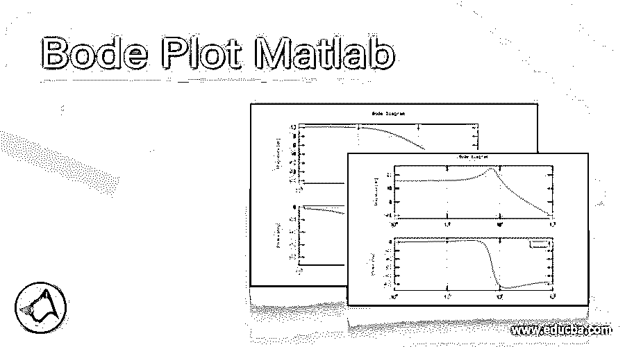
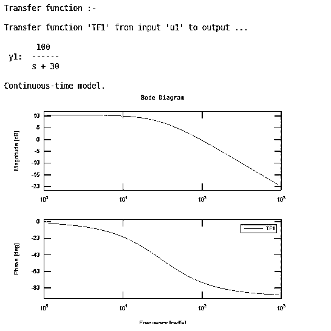
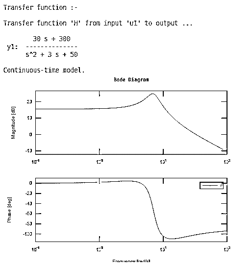
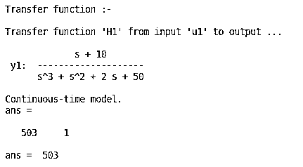

# 波特图 Matlab

> 原文：<https://www.educba.com/bode-plot-matlab/>

## 波特图 Matlab 简介

美国工程师亨德里克·伯德是伯德图的发明者，他于 20 世纪 30 年代在贝尔实验室工作。波特图描绘了线性时不变(LTI)系统的频率响应。两个 LTI 系统的振幅和相位都是相对于频率绘制的。对数标度用于频率和振幅，振幅以分贝(dB)为单位。波特图很受控制系统工程师的欢迎，因为它通过使用清晰易懂的规则以图形方式塑造开环频率响应，使他们能够实现更好的闭环系统性能。为了方便查看控制系统的增益裕量和相位裕量，工程师可以使用波特图。在本主题中，我们将学习 Matlab 中的波特图。

**语法**

<small>Hadoop、数据科学、统计学&其他</small>

波特图 Matlab 的语法如下所示

`bode (TF)`

### 波特图 Matlab 怎么做？

在波特图的 Matlab 中，波特内置函数是可用的。为了使用这些内置的波特函数，我们需要在 Matlab 上创建一个传递函数；为此，我们可以使用 Matlab 中的 tf 内置函数。

让我们看看如何使用这些函数来显示波特图。首先，波特图 Matlab 只不过是绘制一个频率范围内的幅度和相位图。为此，首先，我们需要创建一个传递函数。为了创建传递函数，我们需要知道传递函数的分子和分母系数；我们用两种方法创建传递函数。这些方法如下

1.  num 1 =[100]；

1 = [1 30]：

TF1 = tf(num1，den1)

首先，我们可以用两个变量来存储分子和分母系数，然后我们把这两个变量传递给 tf 函数，用逗号分隔两个变量。

2.  H = tf([30 300]，[1 3 50])

在 tf 函数中，我们取两个方括号；在第一个方括号中，我们写分子的系数(阶 s^4，s^3……，s，常数)，在第二个方括号中，我们写分母的系数(阶 s^4，s^3……，s，常数)。逗号分隔这两个方括号。然后使用括号中的 bode 函数，即分配给传递函数的变量。

### 例子

下面举几个例子

#### 示例#1

让我们考虑一个真实极点的例子；在本例中，我们采用一个传递函数，为此我们分别创建了两个变量“num1”和“den1”。变量“num1”包含传递函数分子的系数，变量“den1”存储传递函数分母的系数。tf 函数在 Matlab 上为“num1”和“den1”变量的给定系数生成传递函数。然后使用传递函数的两个变量“num1”和“den1”，我们可以显示传递函数并将其存储在变量“TF1”中。然后使用括号中的 bode 函数，即分配给传递函数“TF1”的变量。

**代码:**

`clc;
clear all;
close all;
num1= [ 100 ];
den1 = [ 1 30 ];
disp ('Transfer function :-  ');
TF1= tf (num1 , den1)
bode (TF1)`

**输出:**

正如我们已经看到的，结果 bode 内置函数在频域上绘制了以 dB 为单位的图形幅度和以度为单位的相位。

#### 实施例 2

让我们再看一个与复数共轭极点的波特图 Matlab 相关的例子。

在本例中，我们可以将上述传递函数用于波特图。我们使用 tf 内置函数在 Matlab 上创建上述传递函数。在 tf 函数中，我们分配上述传递函数的系数；在 tf 函数中，我们使用两个方括号，在第一个方括号中，我们写下上述传递函数(s^4,s^3……阶，s，常数)的分子系数，在第二个方括号中，我们写下上述传递函数(s^4,s^3……阶，s，常数)的分母系数。逗号分隔这两个方括号。然后我们用括号里的 bode 函数；我们指定用于生成传递函数的变量。

**代码:**

`clc;
clear all;
close all;
disp ('Transfer function :-  ');
H = tf([30 300],[1 3 50])
bode ( H )`

**输出:**

#### 实施例 3

让我们考虑另一个与波特图 Matlab 相关的例子；在本例中，我们使用波特图计算 SISO(单输入单输出)系统的幅度和相位响应。首先，我们生成传递函数，然后使用括号中的波德函数，这是为传递函数“H1”指定的变量。如果我们不能指定频率，bode 会根据系统动态来选择频率。

**代码:**

`clc;
clear all;
close all;
disp ('Transfer function :-  ');
H1 = tf([1 10],[1 1 2 50])
[mag1, phase1, wout1]=bode (H1);                                                                            size(mag1)
length(wout1)`

**输出:**

正如我们在结果中看到的，mag1 和 phase1 的前两个维度是 1，因为给定系统是 SISO 系统，而第三个维度(wout1)只不过是频率的数量。

### 结论

在本文中，我们看到了波特图 Matlab 的概念，首先我们了解了波特图的基本概念和定义，什么是波特图 Matlab，我们还看到了波特图在 Matlab 上的语法和使用方式，以及波特图在 Matlab 上的结果图，即幅度和相位图。

### 推荐文章

这是一个波特图 Matlab 指南。在这里，我们讨论如何做波特图 Matlab 和例子，以及代码和输出。您也可以看看以下文章，了解更多信息–

1.  [Matlab 排序](https://www.educba.com/matlab-sort/)
2.  [Matlab 编写](https://www.educba.com/matlab-fwrite/)
3.  [Matlab 符号](https://www.educba.com/matlab-syms/)
4.  [卷积 Matlab](https://www.educba.com/convolution-matlab/)

