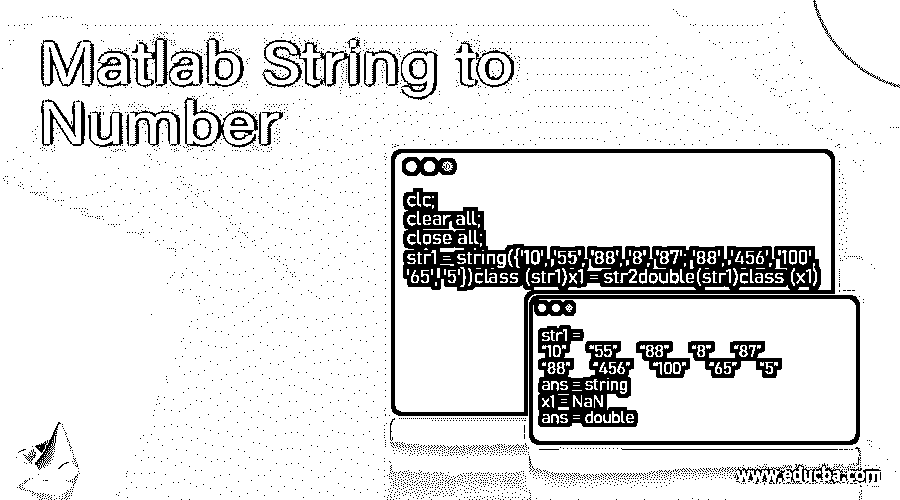
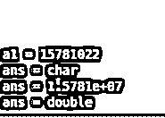
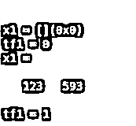
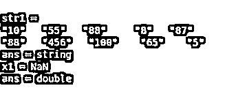

# Matlab 字符串到数字

> 原文：<https://www.educba.com/matlab-string-to-number/>

## Matlab 字符串到数字简介

在 Matlab 中，str2num 和 str2double 函数用于字符串到数字的转换。该函数用于将文本或字符串转换为数值，称为 str2num 函数。str2num 函数支持一个或多个由空格、小数点和逗号分隔的数字。输入字符串还可以包括像“+”号和“–”号这样的符号，10 的乘方因子前面的字母 e 或 d，以及表示复数或虚数的字母 I 或 j。如果输入字符串在矩阵中不包含有效数字，str2num(str)将返回空矩阵。

**语法**

<small>Hadoop、数据科学、统计学&其他</small>

Matlab 字符串到数字的语法如下所示:-

*   x1 = str2num(chr)
*   [ x1，tf] = str2num(chr)
*   x1 = str2double(str)

### 如何将字符串映射到数字？

基本上，现在我们可以看到如何将字符串转换为数字。为此，我们可以使用一个 [Matlab 命令](https://www.educba.com/matlab-commands/) str2num，它不将单元格数组、非标量字符串数组转换为数字数据类型。使用 str2num 函数，它对运算符周围的间距也很敏感。为了避免此错误，我们使用 str2double 命令。将字符串转换为数字的步骤如下

第一步:首先，我们将一个字符串放入一个变量中

**第二步:**使用命令将字符串转换成数字

**第三步:**检查对象的数据类型是可选步骤；这一步我们可以在转换字符串之前执行

### Matlab 字符串到数字的例子

下面提到了不同的例子:

#### 示例#1

在本例中，我们已经看到了如何将字符串数据转换为数字数据类型，因此，首先我们编写一个变量“a1”，在该变量中，我们编写任何内容或数字，在我们的情况下，我们编写数字，数字是 15 81022，以单反转，数字被分配给变量“a1”。然后我们找到它的类，我们写了一个带有变量名的类函数，class (a1)。它是一个字符，但实际上，它是一串字符。然后，我们将这个字符串转换成整数或数字数据类型；转换成 integer 的命令是 str2num，str2num 简单来说就是我们在把 string 转换成 numerical 的数据类型，所以我们简单来写 str2num(a1)。然后我们在数字中看到一个结果，所以为了验证，我们用命令类看到它的数据类型，因为我们看到类返回给定对象的类，然后我们可以验证它将字符串数据转换为数字数据类型或整数数据类型。所以我们写一个 ans 的类因为现在答案在 ans 里面，所以我们写一个类(和)，我们可以看到一个数据类型；它将是数字数据类型。

**代码:**

`clc;
clear all;
close all;
a1 = '15781022'
class (a1)
str2num (a1)
class (ans)`

**输出:**

正如我们在命令窗口中看到的结果，第一个数据类型是 char，它只不过是一个字符串，然后在应用 str2num 之后，您会看到一个 double 数据类型，它只不过是数字数据类型。所以我们证明字符串是转换成数字的。

#### 实施例 2

让我们看一个例子；在这个例子中，我们传递一个包含一些字母和特殊字符的字符串；然后在 1 st 的情况下，我们已经看到结果，因为 x1 是一个空矩阵，而 tf1 是一个 0，这表明转换状态失败。单元格数组，非标量字符串数组它不使用 str2num 函数转换成数值数据类型，而且它对运算符周围的间距也很敏感。所以在第二个和第二个语句中，我们删除了字符串中的字母和特殊字符，然后 str2num 函数返回 ax1 不是一个空矩阵，上面写有数字，并且 tf1 为‘1’，这表明转换成功。

**代码:**

`clc;
clear all;
close all;
[ x1,tf1 ] = str2num('123 m/s, 593 m/s')[ x1,tf1 ] = str2num('123, 593')`

**输出:**

正如我们看到的一个结果，str2num 函数有一个缺点，单元格数组，非标量字符串数组它不能使用 str2num 函数转换成数值数据类型，而且它对运算符周围的间距也很敏感，否则如果我们使用的话转换就失败了，否则它将返回空矩阵。因此，如果我们使用 str2double 函数进行转换，就可以避免这种情况。

#### 实施例 3

在本例中，我们使用 str2double 命令将字符串调用转换为双精度值。首先，我们将一个字符串单元格放入 str1 变量中，然后使用一个类函数检查 str1 的数据类型，然后使用 str2double 命令将该单元格转换为数字数据类型，为了进行验证，我们再次使用了一个类函数。

**代码:**

`clc;
clear all;
close all;
str1 = string({'10', '55', '88', '8', '87'; '88', '456', '100', '65', '5'})class (str1)x1 = str2double(str1)class (x1)`

**输出:**

### 结论

在本文中，我们看到了字符串到数字转换的概念，基本上将字符串转换为数字使用了 str2num 和 str2double 函数。然后看到了与字符串到数字转换语句相关的语法，以及如何在 Matlab 代码中使用它。此外，我们还看到了一些将字符串转换成数字的例子。

### 推荐文章

这是一个 Matlab 字符串到数字的指南。在这里，我们讨论如何将字符串映射到数字和示例，以及代码和输出。您也可以看看以下文章，了解更多信息–

1.  [Matlab 符号](https://www.educba.com/matlab-syms/)
2.  [Matlab 注释](https://www.educba.com/matlab-annotation/)
3.  [雅可比 Matlab](https://www.educba.com/jacobian-matlab/)
4.  [Matlab 堆积条形图](https://www.educba.com/matlab-stacked-bar/)

