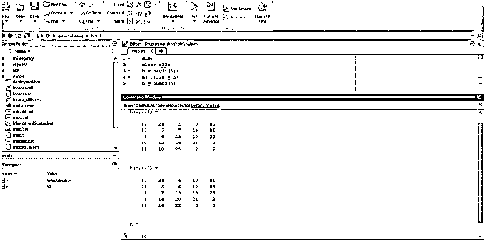
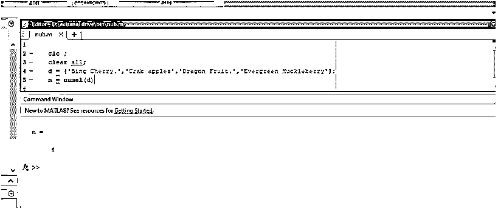
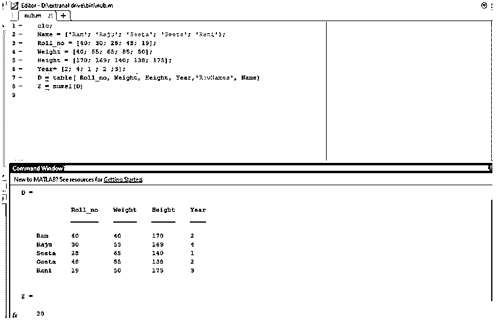

# NUMEL Matlab

> 原文：<https://www.educba.com/numel-matlab/>

## NUMEL Matlab 简介

NUMEL 函数用于计算数组元素的数量。它还用于计算数据库中元素的数量。在 MatLab 中执行的 numel 用于搜索数组中元素的数量，NUMEL 的结果与 prod(size(z))相同。我们可以从数据库中计算任意数量的元素，对数据库格式没有这样的标准或要求。任何类型的数据库都可以使用 numel 函数，比如数组、向量或多维矩阵。

**语法:**

<small>Hadoop、数据科学、统计学&其他</small>

numel 语法如下所示:-

`h = numel ( z )`

### NUMEL Matlab 怎么做？

h = numel ( z)返回数组 h 中元素的数量 z，相当于 prod ( size ( z))。在这种格式中，h 表示输出变量名，z 是输入变量名。通过使用 z，我们可以将任何随机的数据库值传递给函数。因此，它将以输入端存在的几个元素的形式产生结果。

### NUMEL Matlab 示例

以下是下面提到的例子。

#### 示例#1

让我们考虑一个例子，首先是矩阵，然后用 MatLab 计算。

在本例中，我们必须创建一个 6x 6x 2 的矩阵。创建矩阵有使用 numel 函数以及神奇的 Matlab 函数。

**代码:**

`clc;
clear all;
h = magic( 5 );
h(:,:,2)=h'
n = numel( h )`

**输出:**

e = magic ( n)返回一个 n 乘 n 的矩阵，该矩阵由行和列之和相等的整数 1 到 n^ 2 构成。在上面的例子中，魔法函数被用来创建一个 6 乘 6 乘 2 的矩阵。据此，创建矩阵 h(:，:，1)和矩阵 h(:，:，2)。然后为了计算矩阵中元素的数量，我们使用了 numel 函数。结果是 **t** 元素总数是 50。

#### 实施例 2

现在让我们考虑第二个例子，我们可以创建一个字符向量的单元格数组，然后我们可以计算它，看看在 Matlab 中的结果。这里我们使用数组 a，有 n 个字符

然后，为了找出数组中有多少个元素，我们使用了 numel Matlab 函数。

**代码:**

`clc;
clear all;
d = {'Bing Cherry.',' Crab apples','orange.','Evergreen_Huckleberry'};
n =  numel( d )`

**输出:**

在上面的例子中，给出了水果的特征向量的单元格数组。所有水果都保存在“d”组中。使用 Matlab 函数 numel 找出插图 d 中水果的总数。

插入的水果总数；是 4。

#### 实施例 3

让我们考虑另一个例子；在这个例子中，我们可以创建一个学生信息表。这些表格字段类似于学生姓名、学号、体重、身高和年份。我们可以存储学生信息的数量，也可以由用户获取这些学生信息，而不是直接在 Matlab 中给出。生成表格后，我们现在可以使用 numel Matlab 函数来查看表格中元素的数量。并且结果被存储在变量“z”中。

**代码:**

`clc;
Name = {'Ram'; 'Raju'; 'Seeta'; 'Geeta'; 'Rani'};
Roll_no = [ 40; 30; 28; 48; 19 ];
Weight  =  [ 40; 55; 65; 85; 50 ];
Height = [ 170; 169; 140; 138; 175 ];
Year =  [ 2; 4; 1; 2; 3 ];
D = table(  Roll_no , Weight , Height,  Year , ' RowNames ' ,  Name )
Z = numel( D )`

**输出:**

### 结论

在这篇文章中，我们看到了如何使用 Matlab 中的 numel 函数。它可以用来计算数组元素的个数，也可以用编程中的其他主要术语来计算数据库中元素的个数。通过使用 numel 函数，我们可以向代码传递多个参数和函数名。

### 推荐文章

这是一个 NUMEL Matlab 的指南。在这里，我们讨论如何做 NUMEL Matlab 和例子以及代码和输出。您也可以看看以下文章，了解更多信息–

1.  [MATLAB 指数](https://www.educba.com/matlab-exponential/)
2.  [Matlab sym()](https://www.educba.com/matlab-sym/)
3.  [Matlab loglog()](https://www.educba.com/matlab-loglog/)
4.  [Matlab 中的阶乘](https://www.educba.com/factorial-in-matlab/)

