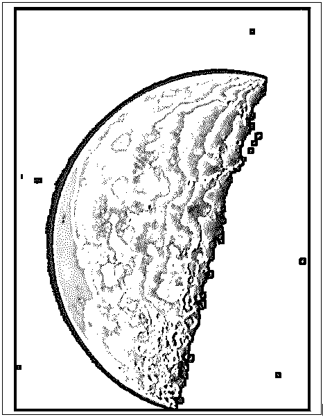

# Matlab 文件扩展名

> 原文：<https://www.educba.com/matlab-file-extension/>

## Matlab 文件扩展名介绍

文件扩展名或简称为文件扩展名作为后缀出现在文件名的末尾，跟在句点(。)并且长度通常为 2 到 4 个字符。在打开图片或文档时，通过检查文件名，我们可以很容易地注意到这些扩展名。操作系统使用文件扩展名来识别与文件类型相关联的应用程序，也就是说，当我们双击文件时，将识别哪个应用程序将被打开。

下表显示了 MATLAB 支持的一些文件扩展名:

<small>Hadoop、数据科学、统计学&其他</small>

| **文件内容** | **分机** | **详情** |
| MATLAB 格式化数据 | 

 | MATLAB 工作空间 |
| 文本 | 

*   TXT、CSV 等

 | 

*   Comma separated values
*   Separated values
*   And a combination of numbers and texts.

 |
| 试算表 | 

*   XLSM

 | 

*   Data stored in excel

 |
| 可扩展标记语言 | 

*   可扩展标记语言

 | 

*   Text in XML format

 |
| 图像文件 | 

*   标签图像文件格式。

 | 

*   Image formats, such as "tif", "jpeg", "gif", etc. Supported

 |

现在让我们了解在 MATLAB 中打开或加载这些文件扩展名的语法:

**语法:**

*   加载(文件)
*   Imread 文件
*   readmatrix 吗

**描述:**

1.  Load(file)用于加载输入文件中的变量。延伸到我们的工作空间
2.  Imread (file)将读取由参数“file”指定的图像。因为我们没有在这个语法中传递任何格式参数，所以它将从文件的内容中推断出格式
3.  Readmatrix 用于打开电子表格或扩展名为“XLSM”、“XLSX”、“XLS”的文件

### Matlab 文件扩展名示例

现在让我们来理解用来读取文件的代码。MATLAB 中使用“加载(文件)函数”的 MAT 扩展。

#### 示例#1

在本例中，我们将从 MATLAB 目录下的“gong.mat”文件中加载数据。以下是需要遵循的步骤:

1.  检查工作区的现有内容
2.  检查“gong.mat”文件的内容
3.  加载“gong.mat 文件”

**代码:**

`disp('Before our file is loaded:')
whos`

[Getting the existing contents of the workspace]

`disp('gong.mat file:')
whos('-file','gong.mat')`

[Getting the contents of the input file to be loaded]

`load('gong.mat')`

[Loading the file with .MAT extension]

`disp('After our file is loaded:')
whos`

[Checking the contents of the workspace after loading the file]

**输入:**

`disp('Before our file is loaded:')
whos
disp('gong.mat file:')
whos('-file','gong.mat')
load('gong.mat')
disp('After our file is loaded:')
whos`

**输出:**

**T2】**

 **正如我们在输出中看到的，文件的内容。MAT 扩展现在被加载到我们的工作空间中。

现在让我们来理解用来读取文件的代码。tif 扩展名。由于这是一个图像文件，我们将使用' imread '功能。

#### 实施例 2

在这个例子中，我们将从 MATLAB 目录下的“moon.tif”文件中读取一个月亮的图像。我们将遵循以下 2 个步骤:

1.  调用 imread 函数；这将读取图像
2.  调用 imshow 函数；这将在我们的工作区显示月亮的图像

**代码:**

`A = imread(‘moon.tif’)`

[Calling the imread function to read the file with ‘.tif’ extension]

`imshow(A)`

[Calling the imshow function; the image read in the first step is passed as an input to the imshow function. This will display the image into our workspace]

**输入:**

`A = imread(‘moon.tif’)
imshow(A)`

**输出:**

正如我们在输出中看到的，我们已经获得了月球的图像，这是我们用'从 MATLAB 的文件中读取的。' tif '扩展名。

现在让我们来理解用来读取文件的代码。txt 扩展名。为此，我们将使用“readmatrix”功能。

#### 实施例 3

在本例中，我们将读取 MATLAB 目录中的文件“basic_matrix.txt”的内容。

**代码:**

`A = readmatrix('basic_matrix.txt')`

[Calling the readmatrix function to read the file with ‘.txt’ extension] [‘basic_matrix.txt’ file contains a 5 x 4 matrix. The above line of code will display this matrix into our workspace]

**输入:**

`A = readmatrix('basic_matrix.txt')`

**输出:**

**T2】**

 **正如我们在输出中看到的，我们已经获得了一个 5 x 4 的矩阵，它是由我们从一个带有'的文件中读取的。' txt '扩展名。

接下来，我们将学习如何更改文件的扩展名。这可以通过以下步骤完成:

*   在目录中列出所有要更改扩展名的文件
*   请将扩展名设为。“出去”
*   复制该文件，然后将其扩展名更改为您想要的扩展名(为了便于理解，我们将使用)。' txt '扩展名)
*   用删除文件。外部扩展

下面是一次性更改多个文件扩展名的代码:

`directory = 'C:\Users\name\Documents\MATLAB';
listOfFiles = dir([directory, '*.out']);`

[Give the names of all the files whose extensions are to be changed]

`for i = 1 :numel (listOfFiles)
file1 = fullfile(directory, listOfFiles(1).name);
[temporaryDir, temporaryFile] = fileparts(file1);
status = copyfile(file1, fullfile(temporaryDir, [temporaryFile, '.txt']))`

[Loop to copy all .out files and give them ‘.txt’ extension]

`delete(file)`

[Deleting the file with ‘.out’ extension]

`end`

### 推荐文章

这是一个 Matlab 文件扩展指南。在这里，我们还讨论了 matlab 文件扩展的介绍和语法，以及不同的例子和代码实现。您也可以看看以下文章，了解更多信息–

1.  [MATLAB 独有的](https://www.educba.com/matlab-unique/)
2.  [Matlab 求根](https://www.educba.com/matlab-root-finding/)
3.  [MATLAB 归一化](https://www.educba.com/matlab-normalize/)
4.  [曲线拟合 Matlab](https://www.educba.com/curve-fitting-matlab/)

****