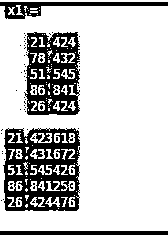
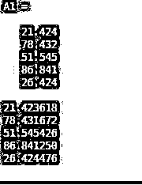

# matlab 填充

> 原文：<https://www.educba.com/matlab-file/>

## Matlab 文件介绍

在一些应用程序中，需要访问文本文件来进行数据读取、数据写入等操作。MATLAB 文件是用来做不同的选择，像写数据到一个文本文件或从文本文件读取数据等。为了在文本文件中写入数据，我们在 Matlab 中使用 fprint 语句。为了从文本文件中读取数据，我们在 Matlab 上使用 fscanf 语句。我们必须使用 fopen 语句来指定访问模式的类型，即读(r)或写(w)。

**语法:**

<small>Hadoop、数据科学、统计学&其他</small>

Matlab 文件处理操作的语法如下所示

**对于写操作:**

`fprintf(fileID1,formatSpec,A1,...,An)
fprintf(formatSpec,A1,...,An)`

**读取操作:**

`A = fscanf(fileID,formatSpec)
A = fscanf(fileID,formatSpec,sizeA)
[A,count] = fscanf(**___**)`

### Matlab 文件是如何工作的？

Matlab 文件是文件处理操作，比如读文件和写文件。我们在 Matlab 上看到这些操作是如何工作的。

对于有意识的操作，有一些我们上面提到过的语法。为了写，我们取一个变量，存储一些我们想写在那个文件上的数据，然后我们使用一个 fopen 语句，在这个语句中，我们指定访问类型和文本文件名，它存储在一个文件中，除了文件标识符什么都没有。然后我们使用 fprintf 的书面声明，其中提到了标识符名称、数据格式和存储数据的变量名。然后我们使用文件标识符中的 fclose 关闭该文件。

对于读取操作，我们首先通过使用存储在文件标识符 fileID1 中的 fopen 语句来指定访问类型和文件名。然后我们必须在 formatSpec 中指定数据格式，然后我们使用 fscanf 语句从文本文件中读取数据，在 fscanf 中我们使用文件标识符和格式说明符，从文本文件中读取的数据存储在一个变量中。然后，我们只需使用 fclose 语句关闭文件。

### 实现 Matlab 文件的例子

下面是 Matlab 文件的例子:

#### 示例#1

我们看到的第一个例子与对文件的写操作有关。为此，我们创建一个文本文件，即扩展名为. txt 的“textfile1”。为了在该文件上写入一些数字，我们可以使用一个“rand”函数，这基本上是 Matlab 中的一个内置函数。该函数用于生成一些随机数。我们使用 rand(5，1 ),这意味着 rand 函数可以返回五个随机数并乘以 100，这五个数字可以存储在 x1 变量中。然后我们使用一个 fopen 语句来指定文件名和我们想要执行的操作。为此，我们编写 fopen，在括号中输入文件名(textfile1.txt ),并指定对文件进行写操作的访问类型，用“w”表示。这两个参数由逗号分隔，并存储在变量 fileID1 中。最后，使用 fclose 语句关闭文件。然后为了验证我们使用了 type 函数，使用了一个 type 来显示文件的内容。

**代码:**

`x1 = 100*rand(5,1)
fileID1 = fopen('textfile1.txt','w');
fprintf(fileID1,'%f\n',x1);
fclose(fileID1);
type textfile1.txt`

**输出:**

**解释:**正如我们看到的结果，相同的随机数被写入那个文本文件。使用 type 函数显示文件内容。

#### 实施例 2

让我们看一下读操作的例子，读操作我们取一个早期的文本文件 textfile1.txt，对于读操作，首先我们指定访问类型，我们使用 fopen 语句，我们在括号中取 fopen，我们取我们要读的文本文件名(filetext1.txt)和读文件的访问类型，这两个参数用逗号分隔。然后使用我们定义为浮动的“格式规范”来指定格式。然后我们使用 fscanf 语句，它用于读取文本文件。我们将 fsacf 放在括号中，编写一个文件标识符 fileID1(文本文件由文件标识符 fileID1 表示)和我们之前定义的格式说明符 formatSpec，这两个参数由逗号分隔。该读取数据存储在变量 A1 内。我们使用 fclose 语句关闭文件。

**代码:**

`fileID1 = fopen('textfile1.txt','r');
formatSpec = '%f';A1 = fscanf(fileID1,formatSpec)fclose(fileID1);`

**输出:**

**解释:**正如我们看到的结果，显示的数据与之前的示例结果相似。这显示为成功处理了读取操作。因为读我们在前面例子中写的文件。

#### 实施例 3

让我们看一个与文件处理操作相关的例子，在这个例子中，我们从一个文件中读取数据，可以将该数据写入另一个文本文件。为此，我们首先使用 fcanf 语句从 textfile1 读取数据，然后使用 fprintf 语句将相同的数据写入 textfile2 文件，之后，我们使用 fclose 关闭这两个操作。为了验证，我们使用了一个类型函数，这个函数用于显示文件中的内容。

**代码:**

`fileID1 = fopen('textfile1.txt','r');formatSpec = '%f';A1 = fscanf(fileID1,formatSpec)
fileID2 = fopen ('textfile2.txt','w');
fprintf (fileID2,'%f\n',A1);
fclose (fileID1);
fclose (fileID2);
type textfile2.txt`

**输出:**

### 结论

在本文中，我们看到了对文件的不同操作，比如读和写。我们看到了从文本文件中读取或写入数据的不同类型的语法。我们还看到了一些读写操作的例子，也称为文件处理。

### 推荐文章

这是一个 Matlab 文件指南。在这里，我们讨论了 Matlab 文件的介绍，语法，它是如何工作的，代码和输出的例子。您也可以浏览我们的其他相关文章，了解更多信息——

1.  [Matlab 中的嵌套循环](https://www.educba.com/nested-loop-in-matlab/)
2.  [Matlab 结构](https://www.educba.com/matlab-struct/)
3.  [Matlab 中的循环](https://www.educba.com/loops-in-matlab/)
4.  [如何使用 Matlab？](https://www.educba.com/how-to-use-matlab/)

