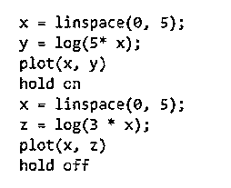
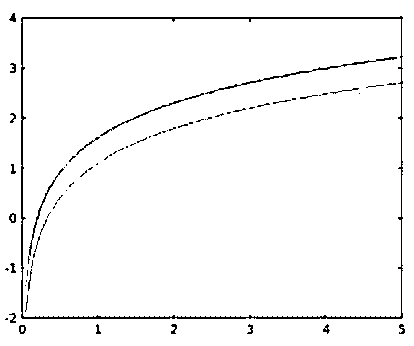
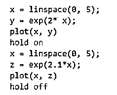
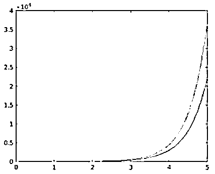
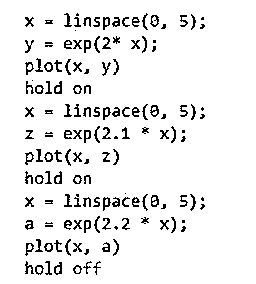
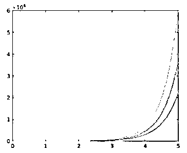

# Matlab 等等

> 原文：<https://www.educba.com/matlab-hold-on/>

## Matlab 简介等等

下面的文章提供了一个关于 Matlab 的概述。Matlab 的“hold”命令决定了新创建的图形对象是将被添加到现有图形中，还是将替换我们图形中的现有对象。命令“保持”用于保留我们当前的绘图及其轴属性，以便将后续图形命令添加到我们现有的图形中。

例如，我们可以使用 hold on 命令将正弦和余弦两个三角波添加到同一个图形中。

<small>Hadoop、数据科学、统计学&其他</small>

**语法:**

*   命令“保持”用于保持当前轴中的图形。通过这样做，新的图被添加到现有的轴，而不对现有的图进行任何更改。
*   命令“保持关闭”用于将保持状态改回关闭状态。

### Matlab 的例子等等

让我们看看如何在 Matlab 中使用“保持”命令向现有轴添加新的绘图。

#### 示例#1

在本例中，我们将使用“保持”命令将两个图添加到一个图形中。对于第一个到第一个的例子，我们将在一个图表中绘制两个不同的对数函数。

本例中要遵循的步骤是:

*   初始化要绘制的第一个第一个函数。
*   使用绘图方法显示第一个第一个函数。
*   使用“保持”命令，确保将下一个函数的图形添加到现有图形中。
*   初始化要绘制的第 2 个和第 1 个函数。
*   使用绘图方法显示 2 和功能。
*   使用“暂停”命令确保下一个图(如果有)作为新图形添加。

**代码:**

x = linspace (0, 5);

y = log(5 * x)；

[Initializing the 1st logarithmic function]

plot (x, y)

[Using the plot method to display the figure]

继续

x = linspace (0, 5);

z = log(3 * x)；

[Initializing the 2nd logarithmic function]

plot(x, z)

[Using the plot method to display the figure]

拖延

[Using the ‘hold off’ command to ensure that the next plot, if any, is added as a new graph]

这是我们的输入和输出在 Matlab 命令窗口中的样子。

**输入:**

**输出:**

正如我们在输出中看到的，我们在同一个图形中获得了 2 个对数函数，正如我们所预期的那样。

#### 实施例 2

在本例中，我们将使用“保持”命令在一个图形中添加两个不同的指数函数。

本例中要遵循的步骤是:

*   初始化要绘制的第一个第一个函数。
*   使用绘图方法显示第一个第一个函数。
*   使用“保持”命令，确保将下一个函数的图形添加到现有图形中。
*   初始化要绘制的第 2 个和第 1 个函数。
*   使用绘图方法显示 2 和功能。
*   使用“暂停”命令确保下一个图(如果有)作为新图形添加。

**代码:**

x = linspace(0, 5);

y = exp(2 * x)；

[Initializing 1st exponential function]

plot(x, y)

[Using the plot method to display the figure]

继续

x = linspace(0, 5);

z = exp(2.1 * x)；

[Initializing 2nd exponential function]

plot(x, z)

[Using the plot method to display the figure]

拖延

[Using the ‘hold off’ command to ensure that the next plot, if any, is added as a new graph]

这是我们的输入和输出在 Matlab 命令窗口中的样子。

**输入:**

**输出:**

正如我们在输出中看到的，我们在同一个图中获得了两个指数函数，正如我们所预期的那样。

在上面的两个例子中，我们看到了如何将两个函数添加到一个图中。我们也可以使用相同的“保持”命令来添加两个以上的功能。接下来，我们将看到如何将 3 个函数添加到同一个图中。

#### 实施例 3

在本例中，我们将使用“保持”命令将 3 个图添加到一个图形中。对于这个例子，我们将在一个图表中绘制 3 个不同的指数函数。

本例中要遵循的步骤是:

*   初始化要绘制的第一个第一个函数。
*   使用绘图方法显示第一个第一个函数。
*   使用“保持”命令，确保将下一个图形添加到现有图形中。
*   初始化要绘制的第 2 个和第 1 个函数。
*   使用绘图方法显示 2 和功能。
*   使用“保持”命令，确保将下一个图形添加到现有图形中。
*   初始化要绘制的第三个和第四个函数。
*   使用绘图方法显示第三个和第四个函数。
*   使用“暂停”命令确保下一个图(如果有)作为新图形添加。

**代码:**

x = linspace(0, 5);

y = exp(2 * x)；

[Initializing 1st exponential function]

plot(x, y)

[Using the plot method to display the figure]

继续

x = linspace(0, 5);

z = exp(2.1 * x)；

[Initializing 2nd exponential function]

plot(x, z)

[Using the plot method to display the figure]

继续

x = linspace(0, 5);

a = exp(2.2 * x)；

[Initializing 3rd exponential function]

绘图(x，a)

[Using the plot method to display the figure]

拖延

[Using the ‘hold off’ command to ensure that the next plot, if any, is added as a new graph]

这是我们的输入和输出在 Matlab 命令窗口中的样子:

**输入:**

**输出:**

正如我们在输出中看到的，我们在同一个图中获得了 3 个指数函数，正如我们所预期的那样。

### 结论

Matlab 的“保持”命令用于向同一个图形添加多个图形对象。该命令用于保留当前绘图及其轴属性，以便将后续图形命令添加到现有图形中。

### 推荐文章

这是一个 Matlab 的指南。在这里，我们讨论了 Matlab 的介绍，为了更好地理解，我们举了一些例子。您也可以看看以下文章，了解更多信息–

1.  [拉普拉斯变换 MATLAB](https://www.educba.com/laplace-transform-matlab/)
2.  [Matlab 全局变量](https://www.educba.com/matlab-global-variables/)
3.  [Matlab 绘图标题](https://www.educba.com/matlab-plot-title/)
4.  [Matlab 索引超过矩阵维数](https://www.educba.com/matlab-index-exceeds-matrix-dimensions/)

