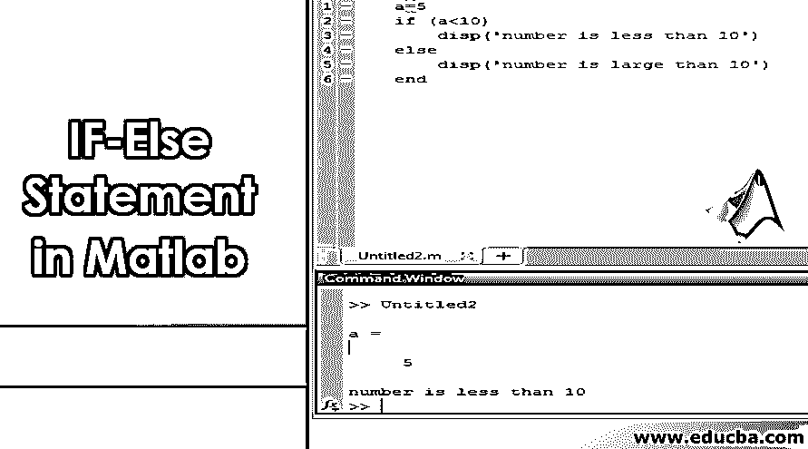
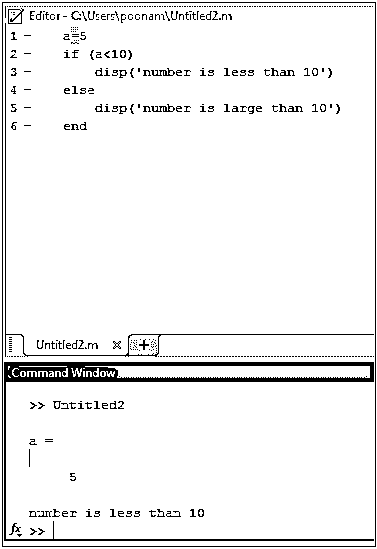
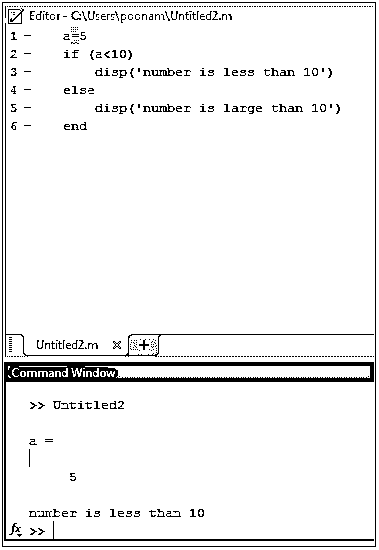
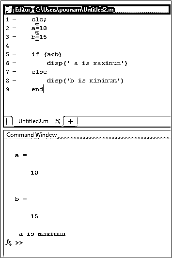
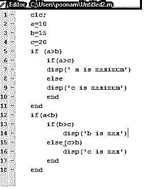
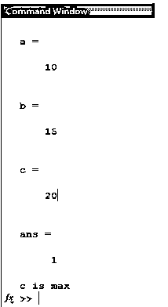

# Matlab 中的 IF-Else 语句

> 原文：<https://www.educba.com/if-else-statement-in-matlab/>

## Matlab 中 If-Else 语句介绍

*   If 语句仅在条件为真时执行代码或语句块。它是一个条件编程关键字，用于给 Matlab 上的程序赋予条件。
*   它在 Matlab 中有 if 语句、else 语句和 else if 语句 if-else 语句三部分。
*   如果第一个表达式或条件为真，则执行“If”语句。如果表达式为假，则执行 else 语句。如果代码中有多个条件，那么如果语句在 Matlab 中使用。

**语法:**

`If (condition)
Statement
Else
Statement
end`

<small>Hadoop、数据科学、统计学&其他</small>

### Matlab 中 If-Else 语句的例子

以下是 Matlab 中 if-else 语句的一些示例:

#### 示例 1–简单的 If-Else 语句

让我们考虑一个例子，找出一个大的或小于一个特定的数字。

如果 a = 5，那么我们会发现数字 a 是否小于 10。

**代码:**

`a = 5
if ( a < 10 ) - - - - - condition 1
disp ( ' number is less than 10 ' ) - - - - - condition 1 is true
else
disp ( ' number is large than 10 ' ) - - - - - condition 1 is false
end`

**输出:**

a = 5

这个数字不到 10

屏幕 1 显示了示例 1 的 Matlab 实现。

屏幕 1:示例 1 的 Matlab 实现

#### 示例 2–两个数字的比较

考虑第二个例子，找出两个数的最大值。让我们取两个数“a”和“b”。

**代码:**

`a = 10 and b = 15
clc ;
a = 10
b = 15
if ( a > b ) - - - - - condition 1
disp ( ' a is maximum ' ) - - - - - condition 1 is true
else
disp (' b is minimum ' ) - - - - - -condition 1 is false
end`

**输出:**

a =10

b =15

b 是最大值

屏幕 2 显示了示例 2 的 Matlab 实现。

屏幕 2:示例 2 的 Matlab 实现

#### 示例 3–嵌套 if 语句的使用

在这个例子中，我们将看到最多三个数字，让我们考虑三个数字 a、b 和 c。a = 10，b = 15，c = 20。

**代码:**

`clc ;
a = 10
b = 15
c = 20
if ( a > b ) - - - -condition 1
if ( a > c ) - - - nested if condition 2
disp ( ' a is maximum ' ) . . . .if condition 2 is true
else
disp ( ' c is maximum ' ) - - - -if condition 2 is false
end
end
if ( a < b ) - - - - - -condition 3
if ( b > c ) - - - - nested if condition 4
disp ( ' b is max ' ) if condition 4 is true
else
disp('c is max') if condition 4 is false
end
end`

**输出:**

a =10

b =15

c =20

Ans =1

c 是最大值

屏幕 3 A 显示了示例 3 的 Matlab 代码，屏幕 3 B 显示了示例 3 的输出。

屏幕 3a:3a 的 Matlab 实现

屏幕 3 B:示例 3 的输出

#### 示例 4–逻辑运算符的使用

现在让我们考虑一个例子来检查给定的数字是否在范围内。

在这个例子中，我们将看到 if-else 语句中逻辑表达式的使用。

**代码:**

**1。如果 a = 10**

`Clc ;
a = 10
min = 2
max = 20
if ( a > = min ) & & ( a < = max )
disp ( ' a is within range ' )
elseif ( a < = min )
disp ( ' a is less than minimum ' )
else
disp ( ' a is more than maximum value ' )
end`

**输出:**

a =10

最小值=2

最大值=20

a 在范围内

**2。如果 a = 50 的值**

**代码:**

`clc ;
a = 50
min = 2
max = 20
if ( a >= min ) & & ( a < = max )
disp ( ' a is within range ' )
elseif ( a < = min )
disp ( ' a is less than minimum ' )
else
disp ( ' a is more than maximum value ' )
end`

**输出:**

a =50

最小值=2

最大值=20

a 大于最大值

**3。如果 a 的值= 1**

**代码:**

`clc ;
a = 1
min = 2
max = 20
if ( a > = min ) & & ( a < = max )
disp ( 'a is within range ' )
elseif ( a < = min )
disp ( ' a is less than minimum ' )
else
disp ( ' a is more than maximum value ' )
end`

**输出:**

a =1

最小值=2

最大值=20

a 小于最小值

### 结论

*   if-else 语句的使用使复杂的条件问题变得简单易行，而且我们可以创建嵌套的 if 操作来在一个条件中给出条件。
*   其中，表达式包括逻辑运算符，如' > ' (大于)、'< ’ ( less than ) ,  ‘ = = ’ (equal to)  , ‘  > = '(大于等于 l)、' < = '(小于等于)、' && '(逻辑 and)、' =！'(不等于)、' || '(逻辑或)等。

### 推荐文章

这是一个 Matlab 中 IF-Else 语句的指南。这里我们讨论 Matlab 中 if-else 语句的各种例子，以及不同的条件和代码实现。您也可以阅读以下文章，了解更多信息——

1.  [Matlab 中的 Switch 语句](https://www.educba.com/switch-statement-in-matlab/)
2.  [MATLAB 版本](https://www.educba.com/matlab-version/)
3.  [Matlab 运算符](https://www.educba.com/matlab-operators/)
4.  [Matlab 中的向量](https://www.educba.com/vectors-in-matlab/)
5.  [Python 中的 If 语句](https://www.educba.com/if-statement-in-python/)
6.  [Matlab 编译器| Matlab 编译器的应用](https://www.educba.com/matlab-compiler/)
7.  [c#中的 Switch 语句](https://www.educba.com/switch-statement-in-c-sharp/)

