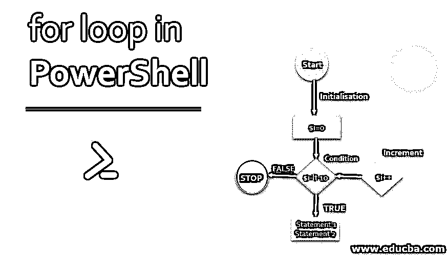
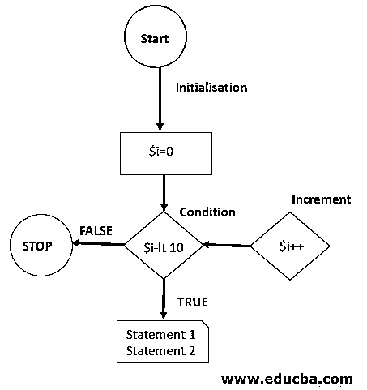
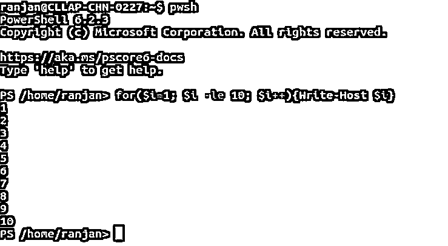
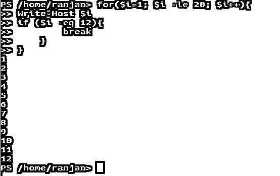
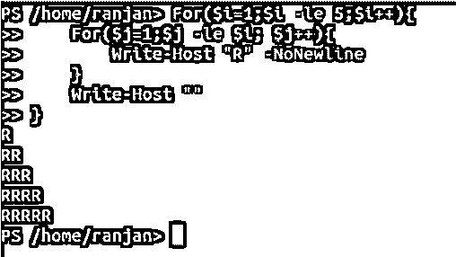
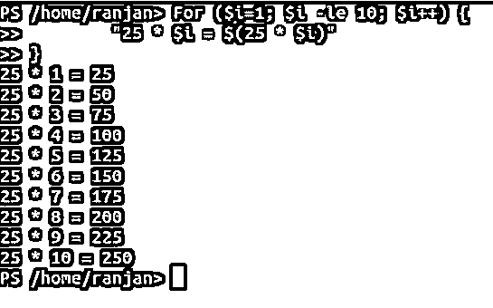
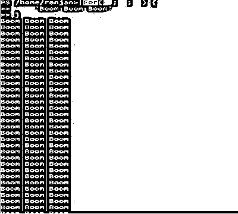

# PowerShell 中的 for 循环

> 原文：<https://www.educba.com/for-loop-in-powershell/>

## PowerShell 中 for 循环的介绍

一旦你进入迪普编码，你将面临各种各样的情况，有些情况下，你可能需要重复执行某些表达式或语句。它可能是读取一个数组的每个元素，也可能是读取一个文件的每一行，在所有这些情况下我们都需要反复读取。PowerShell 中的“for”循环也有同样的作用，它提供了一个非常强大的机制，可以根据需要反复执行某些代码块。例如，一个包含用户的数组，我们希望检查名为“Ajay”的用户，所以我们需要检查每个元素，为此，我们需要一个“For”循环，一旦用户“Rajya”找到循环，循环将退出。在使用“for”循环之前，请记住循环是非常消耗资源的，所以我们应该尝试以这样的方式编写代码，一旦我们达到了目标，循环就应该停止。

**语法:**

<small>Hadoop、数据科学、统计学&其他</small>

`for (<Initial value>; <Condition expression>; <Incremental>)
{
<Statement 1>
<Statement 1>
...
}`

### PowerShell 中 for 循环的 4 个主要部分

对于由 4 个主要部分组成的回路，解释如下:

#### 1.基础资料

初始值是一个从 0 到任意数字的整数值，这个部分第一次执行一次。在本节中，我们用初始值初始化变量，例如($i = 0)，($i = 0)，($j = 0)。

#### 2.条件表达式

在这一部分中，在每次重复时，它检查条件是真还是假，因此如果条件为真，那么它将进入 for 循环并执行语句 1 和语句 2。例如$i -lt 10，这里如果$i 小于 10，那么语句 1 和语句 2 将执行。

#### 3.增加的

在每次迭代中，$i 的值将根据操作符增加、减少或改变，例如$i++在每次迭代中值将增加 1，$i–在这种情况下，值将在每次迭代中减少 1，$i+2 在这种情况下，$ I 的值将在每次迭代中增加 2。

#### 4.声明

在这个部分中，可以编写一段代码或一些组语句。在本节中，我们还可以根据我们的要求编写制动或暂停循环的条件。

### 流程图

上图清楚地显示了初始化、条件和增量三个部分。如果$i 的值小于 10，则表示为真。因此，语句块将执行语句 1 和语句 2，之后，它将进入增量块，将$i 的值增加 1。一旦$i 的值达到 10，条件将为假，for 循环将停止。

### Powershell 中的 for loop 是如何工作的？

一旦 for 循环开始，它首先将变量的初始值分配到内存中，这种情况在 for 循环开始时发生一次。在每次迭代中，$i 的值将随着检查条件(如果条件为真或假)而改变。下面是一个例子。

for($ I = 0；$ I-lt 10；$i++) {写主机$i }。这里它将继续打印 0，1，2，3，4，5…..99 .这里$i 的初始值是 0，经过每次迭代，它的值变成 1，2，3，4，5，6…100。一旦$i 的值达到 100，它将停止进一步执行，并且不会打印 100，因为条件“$i -lt 100”失败。

### 例子

下面是提到的例子:

#### 1.简单 For 循环示例

`for($i=1; $i -le 10; $i++){Write-Host $i}`

**解释**:

它将迭代$i 的每个值，直到 10，因为我们的条件是$i -le 10，它< =(小于等于)。因此，直到 10 次迭代将继续。程序的输出是 1，2，3，4，5，6，7，8，9，10。

下面是它的代码执行屏幕。

#### 2.带有中断的 For 循环

在某些情况下，我们可能需要在特定条件下打破循环。在下面的例子中，一旦达到 12，我们就中断循环。因此，下面代码的输出将是 1，2，3，4，5，6，7，8，9，10，11，12。

`for($i=1; $i -le 20; $i++){
Write-Host $i
if ($i -eq 12){
break
}
}`

下面是它的代码执行屏幕。

#### 3.嵌套 For 循环

**说明:**

我们应该总是试图找到一种替代的方法，而不是嵌套 for 循环，因为它的时间复杂度非常高(时间复杂度是任何程序执行时间的度量)。对于任何嵌套的 For 循环，时间复杂度都是 O(n^2).嵌套循环是“for 循环”中的“for 循环”,或者内循环是外循环的语句。我们可以在任何内循环或外循环中放置一个断点来中止循环。

`For($i=1;$i -le 5;$i++){
For($j=1;$j -le $i; $j++){
Write-Host "R" -NoNewline
}
Write-Host ""
}`

下面是它的代码执行屏幕。

#### 4.25 乘法表的 For 循环

这是一个 25 的表，在每次迭代中，它用增加的数字乘以 25，直到$i 值达到 10。

`For ($i=1; $i -le 10; $i++) {
"25 * $i = $(25 * $i)"
}`

#### 5.字符串上的 For 循环

在 PowerShell 中，length 是知道任何字符串长度的关键字，所以这里我们检查一个字符串的长度是否小于等于 5(< = 5)。一旦字符串长度达到 6，循环就退出。所以输出 id 为 R，RR，RRR，RRRR，RRRRR。这里 RRRRRR<=5，这意味着它达到了大于 5 的 6 个字母。

`For($string='' ;$string.length -le 5;$string=$string+'R'){
$string
}`

#### 6.数组上的 For 循环

`$number = “ranjan”,”vijay”,”raj”,”suraj”
for ($i = 0; $i -le ($number.length - 1); $i += 1) {
$number[$i] }`

这里它打印了从 0-3 的所有数组内存值。因此，在第一次迭代中，$i 的值为 0，所以它在 0 位置打印属性“Ranjan”，在第二次迭代中，它以相同的方式在内存位置 1 打印属性，最后它将在内存位置 3 打印最后一个属性。

#### 7.无限循环

这里我们没有给任何初始值，没有给任何条件，甚至没有任何增量，所以它会一直打印，直到无穷大。

`For(  ;  ;  ) {
"Boom Boom Boom"
}`

### 结论

总之，for 循环语句允许我们根据某些条件多次执行一条语句或一组语句。

### 推荐文章

这是 PowerShell 中 For 循环的指南。在这里，我们讨论了简介、PowerShell 中循环的 4 个主要部分以及流程图、示例代码及其输出。您也可以阅读以下文章，了解更多信息——

1.  [PowerShell 中的开关盒](https://www.educba.com/switch-case-in-powershell/)
2.  [PowerShell 日期](https://www.educba.com/powershell-date/)
3.  [PowerShell 中的比较运算符工作](https://www.educba.com/comparison-operators-in-powershell/)
4.  [PowerShell 工具](https://www.educba.com/powershell-tools/)

