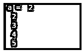
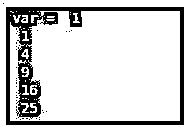
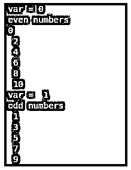
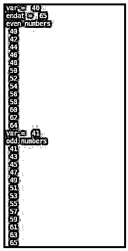
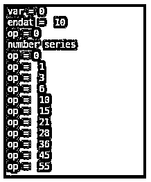

# Matlab 中的 do while 循环

> 原文：<https://www.educba.com/do-while-loop-in-matlab/>

## Matlab 中 do while 循环的介绍

Matlab 中基本上没有像 c 编程、cpp 编程和其他编程语言那样的 do while 循环。但在 Matlab 中，代替 do while 循环的功能非常强大。在 Matlab 中，通常使用两个循环来进行运算。如果我们能确定一个特定任务需要执行多少次，那么就使用 for 循环。如果我们不确定一个特定任务要执行多少次，那么就使用 while 循环。在循环内部，我们可以编写特定程序的条件和重复语句，以及变量的递增/递减。

在程序中用于编写 while 循环的语法是‘while’命令，在结束时，我们需要编写‘end’命令来停止循环。

<small>Hadoop、数据科学、统计学&其他</small>

### Matlab 中 while 循环是如何工作的？

为了在 Matlab 中编写 while 循环，我们需要考虑三个参数。

*   第一个条件在执行时限制循环。
*   第二个参数语句表示实际预期的输出。
*   第三个参数是增量循环变量。如果我们错过了增量行，那么循环将执行无限次。

**语法:**
`while(condition)
Statement1
Statement2
.
.
Statement n
Increment loop variable syntax`

### Matlab 中 do while 循环的例子

以下是 Matlab 中 do while 循环的示例:

#### 示例#1

在这个例子中，让我们考虑一个变量 a。赋给 a 的初始值是 2。在应用条件(a < = 5)和 while 循环后，循环将针对值 2、3、4、5 执行。这里的语句只显示 a 的值，因此它将输出显示为 2，3，4，5。

**代码:**

`a = 2
while(a <= 5)
disp(a)
a = a + 1;
end`

**输出:**

#### 实施例 2

第二个例子是平方函数。在这个例子中，我们要找出值的平方，直到 5。这里 var 是变量名。赋给 var 的值是 1，因此 var 将在 1 到 5 之间变化。

**代码:**

`var = 1
while(var <=5)
op=var*var;
disp(op)
var = var + 1;
end`

**输出:**

#### 实施例 3

在这个例子中有两个不同的操作，一个是偶数，第二个是奇数。为了找出偶数和奇数，我们使用了两种不同的 while 循环。

**代码:**

`var = 0
disp('even numbers')
while(var <= 10)
disp(var)
var = var + 2;
end
var = 1
disp('odd numbers')
while(var <= 10)
disp( var )
var = var + 2 ;
end`

**输出:**

#### 实施例 4

在前面的例子中，我们从原点开始解决问题，但是通过使用 while 循环，我们可以改变问题的范围。在这个例子中，我们考虑从 41 到 65 的数字。这里我们使用了两个变量。Var 用于范围的开始，end at 用于范围的结束。

**代码:**

`% even numbers between 41 to 65
var = 40
endat = 65
disp('even numbers')
while(var <= 65)
disp( var )
var = var + 2;
end
var = 41
disp('odd numbers')
while(var <= endat)
disp( var )
var = var + 2 ;
end`

**输出:**

#### 实施例 5

通过使用 while 循环，我们可以创建各种数列和应用程序。在这个例子中，我们通过考虑先前迭代输出创建了一系列数字。

**代码:**

`% addition of previous numbers
var = 0
endat= 10
op = 0
disp('number series ')
while(var <= endat)
%disp(var);
op = op + var
var = var + 1 ;
end`

**输出:**

### 结论

任何编程语言中使用的两个主要循环是“for”循环和“while”循环。如果重复语句的范围未知，则使用“while”循环。在上面的例子中，我们看到了 while loop 可以通过不同的参数以不同的方式使用。它提高了程序的效率，也降低了问题的复杂性。

### 推荐文章

这是一个在 Matlab 中做 while 循环的指南。这里我们讨论一下入门，在 Matlab 中 while loop 是如何工作的？以及不同的示例和代码实现。您也可以看看以下文章，了解更多信息–

1.  [测井曲线 Matlab](https://www.educba.com/log-plot-matlab/)
2.  [c#中的随机数生成器](https://www.educba.com/random-number-generator-in-sharp/)
3.  [Matlab 中的向量](https://www.educba.com/vectors-in-matlab/)
4.  [JavaScript 中的按位运算符](https://www.educba.com/bitwise-operators-in-javascript/)

