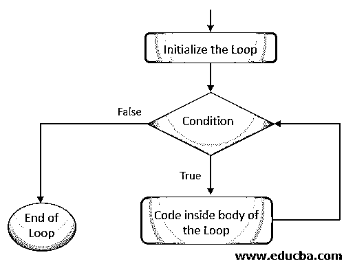
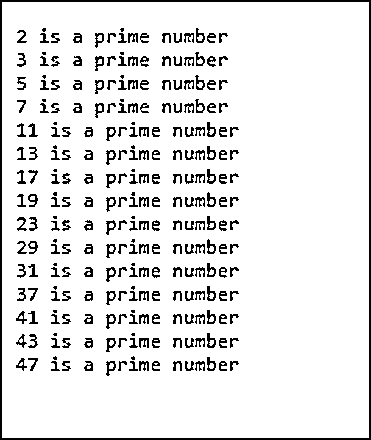
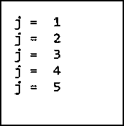

# Matlab 中的嵌套循环

> 原文：<https://www.educba.com/nested-loop-in-matlab/>

## Matlab 中嵌套循环的定义

嵌套循环是 Matlab 中的一个复合语句，我们可以将一个循环放在另一个嵌套了条件语句的循环体内。众所周知，Matlab 允许你在其他复合循环中组合一些复合语句，比如 IF，FOR & WHILE。这种嵌套循环在 Matlab 中称为嵌套循环。你应该注意到你可以把一种类型的循环放在另一种类型的循环中。

一般来说，循环是一个重复的代码部分，它有效地允许您根据需要执行特定次数的条件语句。因此，嵌套循环定义了一个概念，即在代码语句的外循环体内使用内循环。执行时，循环被触发，传递到外部循环，然后再传递到内部循环。这个过程一直持续到外部循环满足条件，并且被 break 语句中断，该语句进一步继续提供所需的结果。

<small>Hadoop、数据科学、统计学&其他</small>

**语法:**

以下是 Matlab 中带有“For”循环语句的嵌套循环的语法:

`for m = 1:i
for n = 1:i
[statements] end
end`

这里的“I”表示您希望在嵌套循环中运行的循环数，语句定义代码的条件或数值表达式。还有，Matlab 中 WHILE 循环语句的嵌套循环:

`while [expressions1] while [expressions] statements
end
end`

### 流程图

下图定义了 Matlab 中嵌套循环的流程图:

### Matlab 中嵌套循环是如何工作的？

按照上面的语法，下面是 Matlab 中嵌套循环的一个例子。

`a = 0;
for m = 1:5
for n = 1:5
a = a+m+n;
end
end`

但是当我们用数学术语来看上面的循环结构时，我们似乎是在计算总和为m = 1∑5n = 1∑5(m+n)。这可以通过计算得出以下结果:

因为我们已经取了 i=5，那么

`i2(i + 1 ) = 52 * 6 = 150`

这是你在 MATLAB 中得到的:

`a = 0;
for m = 1:5
for n = 1:5
a = a + m + n;     >>>>>150
end
end`

### 如何退出嵌套的 FOR 循环？

不恰当的是，据我所知，没有什么聪明的方法可以退出每个嵌套循环并运行剩余的代码部分。通常，我们每次都需要回显条件来退出 FOR 循环。您可以查看以下语法:

`for m = 1:i
for n = 1:i
[conditional statements] if conditionforbreak
break
end
end
if conditionforbreak
break
end
end`

假设如果我们拿前面的例子来实现 break 来退出循环，那么我们会得到:

`a = 0;
for m = 1:5
for n = 1:5
a = a+m+n;
conditionforbreak = a>100;
if conditionforbreak
break
end
end
if conditionforbreak
end
end`

这在 Matlab 中提供了以下结果:

如果 a = 109 或大于 100，那么它将中断并退出循环。请注意,“a”不会在单次增加中重复，因此它确保“a”的下一次重复不是 101。

### Matlab 中嵌套循环的例子

例如，要使用嵌套循环，我们可以编写以下代码来显示从 1 到 50 的所有质数。我们需要创建一个脚本文件，并编写以下嵌套循环语句。

`for m=2:50
for n=2:50
if (~mod(m,n))
break;
end
end
if(m>(m/n))
fprintf(‘%d is prime \n’, m);
end
end`

当您执行上面的文件时，您将得到下面的结果:

**输出:**

这里，在 Matlab 中，我们可以执行迭代语句中的代码。在这段代码中，我们在语句体中嵌套了 IF 循环。我们可以根据需要多次重复。同样，我们可以将 FOR 循环嵌套在其他 FOR 循环中，WHILE 循环也可以以嵌套循环的形式执行，以编写语句。

%创建乘法表，结果保存为 x。

`rows 1:10
cols 1:10
for a = rows
for b = cols
A(a,c) = a*b;
end
end`

我们需要记住，除了放入内部 FOR 循环的任何语句之外，嵌套的 FOR 循环还会为周围循环的每个值运行一次。谈到上面的代码脚本，外部循环，即“a = rows”的循环，对于 a 的每个值每次执行 10 次。另一方面，每次内部循环，即“b = cols”的循环修改 10 个不同的条目，每个条目与 X 矩阵中“b”的每个值相关。最后，我们将得到更新后的表 X 中总共 100 个条目或值的输出，即' =10*10 '。

#### 刻痕

缩进的可靠使用允许创建一个可读的代码，尤其是在同时使用嵌套的 IF 和 FOR 循环时。我们可以使用 MATLAB 编辑器提供的智能缩进特性，这样我们就可以确认添加的代码对于嵌套循环语句是有效的，比如使用(TEXT ->SMART INDENT)。如果缩进不合适，它可能会隐藏任何错误或问题。

#### 用 Break 语句避免或停止嵌套循环

BREAK 语句只在循环内部提供逻辑输出。我们还应该知道，BREAK 语句只与包含 BREAK 语句的最内层循环一起使用。在 Matlab 中，有几种创建 FOR 循环的方法。让我们讨论一个简单的语法和一个编写循环的例子:

`for j = 1:k  % k is the number of loops that we want
conditions;  % the condition to be fulfilled for loop to execute it
end`

现在让我们创建循环:

`for j = 1:5
j
end`

**输出:**

### 结论

因此，嵌套循环是一种控制结构，有助于迭代循环语句的给定部分，直到满足满意的条件，然后终止。您需要将循环编写为脚本，而不是像在新脚本选项中找到左上角的按钮那样直接写入命令窗口。在这篇文章中，我希望你能学到一些关于 MATLAB 中嵌套循环的新概念。

### 推荐文章

这是 Matlab 中嵌套循环的指南。这里我们讨论 Matlab 中嵌套循环的定义和工作原理，以及流程图和例子。您也可以阅读以下文章，了解更多信息——

1.  [MATLAB 中各种类型的循环](https://www.educba.com/loops-in-matlab/)
2.  [Matlab 中 Meshgrid 的例子](https://www.educba.com/meshgrid-in-matlab/)
3.  [Matlab 中色彩映射表的介绍](https://www.educba.com/colormap-in-matlab/)
4.  [是 MATLAB 中的成员函数](https://www.educba.com/ismember-matlab/)
5.  [c++中的嵌套循环指南](https://www.educba.com/nested-loop-in-c-plus-plus/)

