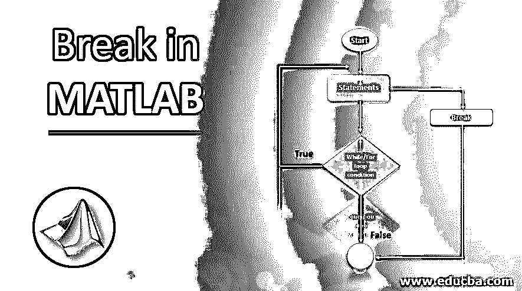
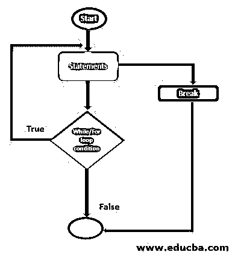
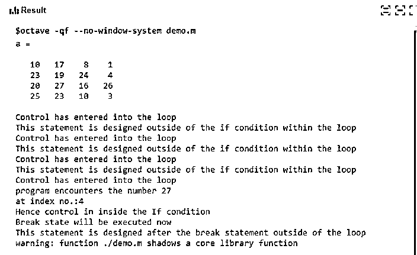
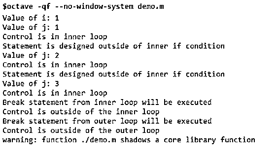
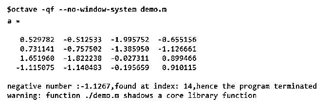
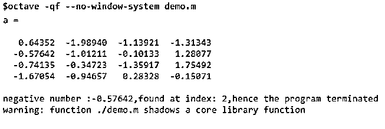

# MATLAB 中断

> 原文：<https://www.educba.com/break-in-matlab/>

## MATLAB 中 Break 的介绍

MATLAB 中的 Break-in 命令用于在循环条件到期之前终止任何 FOR 或 WHILE 循环的执行。直接关联的循环中的 Post break 语句不会被执行。break 语句的执行范围在其直接的“For”或“While”循环内。

实时地，让我们考虑一个基于其环境/周围的温度运行的系统。基于环境温度的变化来调节系统的工作。但是如果温度达到对系统危险的水平，程序的执行应该立即停止。在程序设计的这种情况下，必须使用 break 语句。

<small>Hadoop、数据科学、统计学&其他</small>

关键字“break”用于定义 Break 语句。

**语法:**

`break`

### 流程图

### MATLAB 中如何使用 Break？

以下是 MATLAB 的一些用法:

#### 1.在单个循环中使用 Break

Break 命令用于将控制从循环中取出，而不在循环范围内执行 break 语句后设计的指令。

##### 示例:

下面的代码片段是为了用一个循环演示 break 语句的应用而编写的。代码被编写为运行 while 循环来遍历矩阵‘a’的每个值。当矩阵‘a’中的任何数字等于 25 时，将调用 break 指令。当值等于 25 时，将执行 break 语句，并且不会执行 break 之后的 disp()命令。

**代码:**

`% Program to break the flow of Execution
% randi() is used to generate numbers between 0 to 30 positioned in 4X4 matrix
a = randi(30,4,4)
k = 1;
while k
disp('Control has entered into the loop')
if a(k) ==25
disp('program encounters the number 25')
disp(['at index no.:',num2str(k)])
disp('Hence control in inside the If condition')
disp('Break state will be executed now')
% terminate the loop using break statement
break
disp('This statement is designed immediate after the break statement')
end
disp('This statement is designed outside of the if condition within the loop')
k = k+1;
end
disp('This statement is designed after the break statement outside of the loop')`

**输出:**

4X4 大小的矩阵“a”由 randi()函数生成。如果第 4 个位置满足条件，且控制已脱离循环。

#### 2.在嵌套循环中使用 Break

当从嵌套循环中调用 break 语句时，控件从包含 break 语句的直接内部循环中出来。

##### 示例#1

下面的代码片段用来说明用于内循环和外循环的 break 语句的行为。

来自矩阵‘I’的值创建了外部循环，而来自矩阵‘j’的值创建了内部循环。

**代码:**

`% Program to break the flow of Execution
flag=0;
%Beginning of outer loop
for i=1:10
disp(['Value of i: ',num2str(i)])
%Beginning of inner loop
for j=1:5
disp(['Value of j: ',num2str(j)])
disp('Control is in inner loop')
if(j==3)
disp('Break statement from inner loop will be executed')
% Break statement to come out of the inner loop
break
end
disp('Statement is designed outside of inner if condition')
flag=1;
end
disp('Control is outside of the inner loop')
% Break statement to come out of the outer loop
if(flag==1)
disp('Break statement from outer loop will be executed')
break
end
disp('Statement is designed outside of outer if condition')
end
disp('Control is outside of the outer loop')`

**输出:**

当内部 if 条件产生真值时，执行内部循环中的 Break 语句。控制来自内部循环，但外部循环继续不受影响。继续外环中的控制，直到外环中存在的 if 条件不为真。

Break 的应用也有助于提高编码质量。它优化了编码执行时间，从而提高了应用程序的性能。

##### 实施例 2

下面的代码片段是用来读取矩阵“a”中出现的第一个负数的。案例 1 是在没有使用 break 语句的情况下编写的，而案例 2 的代码片段是使用 break 语句开发的。

**案例 1:**

`% program to terminate the execution on finding negative input
a = randn(4)
k = 1;
flag=0;
negnum=0.0;
pos=0;
%Beginning of while loop
while k < numel(a)
if a(k) < 0
flag=1;
negnum=a(k);
pos=k;
end
k = k + 1;
end
if flag ==1
disp(['negative number :', num2str(negnum), ',found at index: ', num2str(pos),',hence the program terminated'])
else
disp('There is no negative number present in the matrix')
end`

**输出:**

在这种情况下，循环将一直执行，直到循环条件生效。即使找到负数，控件仍会在循环中循环。一旦循环结束，它就显示结果。这个代码片段包括了一些变量，更多的代码行。在大量数据的情况下，执行将花费很长时间，因此程序的性能将显著降低。

**案例二:**

`% program to terminate the execution on finding negative input
a = randn(4)
k = 1;
%Beginning of the while loop
while k < numel(a)
%Use of break statement to fetch the result fast
if a(k) < 0
break
end
k = k + 1;
end
if a(k) < 0
disp(['negative number :', num2str(a(k)), ',found at index: ', num2str(k),',hence the program terminated'])
else
disp('There is no negative number present in the matrix')
end`

**输出**

在这种情况下，一旦取出第一个负数，控制就退出循环。一旦达到期望的结果，额外的执行就不会发生。因此，执行速度更快，性能得到提高。它包含更少的变量或代码行，从而降低了程序的复杂性。

中断和返回，两者都用于重定向执行流。不同之处在于 return 语句将控制返回给父调用函数，而 break 语句将控制从其直接循环中取出，并继续执行相同的函数。

### 推荐文章

这是一个在 MATLAB 中破解的指南。这里我们讨论如何在 MATLAB 中使用 Break，以及流程图、适当的语法和相应的例子。您也可以浏览我们推荐的其他文章，了解更多信息——

1.  [在 Matlab 中整形](https://www.educba.com/reshape-in-matlab/)
2.  [Matlab 中的颜色图](https://www.educba.com/colormap-in-matlab/)
3.  [Matlab 的 do-while 循环](https://www.educba.com/do-while-loop-in-matlab/)
4.  [Matlab 中的单位矩阵](https://www.educba.com/identity-matrix-in-matlab/)
5.  [线性拟合 Matlab |示例](https://www.educba.com/linear-fit-matlab/)

