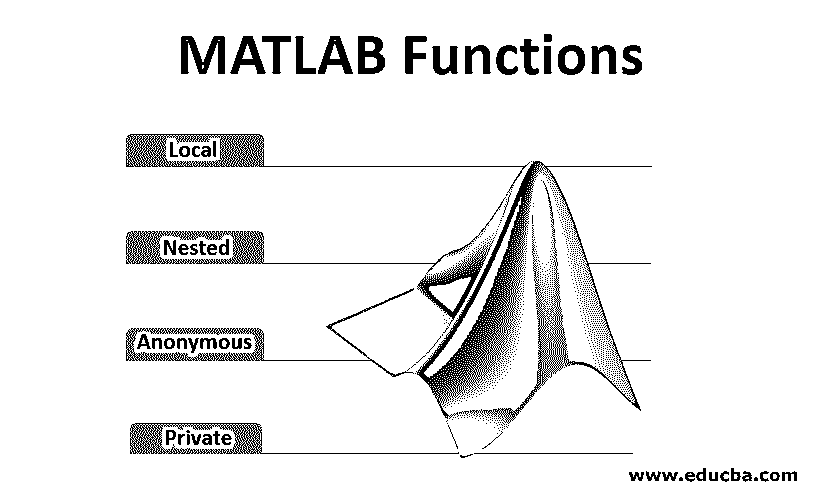

# MATLAB 函数

> 原文：<https://www.educba.com/matlab-functions/>

## MATLAB 函数介绍

MATLAB 函数是用各种代码行编写的，这些代码行将一个变量与另一个变量相关联，并且每个输出都与一个特定的输入完全相关，这是任何编程语言的重要组成部分。在 MATLAB 环境中，它们像脚本文件一样存储在某个文件中。它们可以接受多个输入参数，也可以返回多个输出参数。它们在预定义的工作空间(称为本地工作空间)中对定义的变量进行操作。

### MATLAB 中的函数类型

在 Matlab 中，可以使用以下语法创建或定义函数:

<small>Hadoop、数据科学、统计学&其他</small>

`function [o1,o2, ..., oN] = myfun(i1,i2,i3, ..., iN)`

这里我的乐趣是接受输入参数 i1，i2 的函数名..并返回输出 o1，o2…on。在声明函数时，上面的语句应该在第一行。对于有效的函数名和保存函数，需要遵循一些规则:

*   以字母开头并可以包含数字、字符或下划线的函数名被认为是有效的。
*   我们可以将函数保存在包含函数定义的函数文件中，文件名必须与文件中的第一个函数名相匹配。
*   我们还可以保存包含函数定义和命令的函数。函数应该出现在文件的末尾，并且脚本文件名不能与文件中的函数同名。

end 关键字应该用来表示函数的结束。当文件中的任何函数包含嵌套函数或在脚本和函数文件中用作局部函数的函数时，它是必需的。函数在 R2016b 或更高版本的脚本中工作。MATLAB 中使用了几种类型的函数。它们如下:

#### 1.匿名函数

它是不存储在程序文件中的函数，但它与数据类型为 function_handle 的变量相关联。它在一条语句中定义，并有任意数量的输入或输出参数。语法可以写成:

Fun=@(argumentlist)表达式

**举例:**

`mul=@(x,y) x*y;
res1=mul(2,3)
res2=mul(4,3)
res3=mul(4,5)`

当我们运行输出时，我们得到以下结果:

res1=6

res2=12

res3=20

我们可以编写没有输入或者有多个输入和输出的匿名函数。如果函数没有输入，那么我们可以使用一个空括号来调用匿名函数。一些例子是

1.`curr= @() datestr(now);
d = curr()
Output: d= 22-Oct-2019 11:02:47`

2.`myfun=@(x,y)(x+y);
x=4
y=7
z=myfun(x,y)
Output: z=11`

#### 2.本地功能

任何函数文件都包含出现在代码第一行的主函数。它们对其他文件中的函数可见，并且可以在命令行中调用。文件中的其他函数称为局部函数。它们不能从命令行调用，只能被父函数或主函数以及写在同一文件中的函数看到。它们也被称为子功能。它们相当于在另一种编程语言中使用的子程序。它们也可以写在脚本文件中，只要它们出现在脚本代码的最后一行之后。

`function [avg, med] = mystats(y)
a= length(y);
avg = mymean(y,a);
med = mymedian(y,a);
end`

`function a = mymean(v,n) ---- Example of a local function
a = sum(v)/n;
end`

 `#### 3.嵌套函数

在另一个函数或父函数中定义的函数称为嵌套函数。他们可以使用或修改父函数中定义的变量。它们是在函数范围内定义的，并且可以访问定义它们的工作区。每个嵌套函数都应该遵循某些要求:

*   所有函数都不需要 end 语句。但是，要嵌套任何函数，应该为每个函数编写 end 语句。
*   我们不能在任何控制语句中定义嵌套函数，比如 if-else、switch case 等。
*   嵌套函数可以通过名字或使用任何函数句柄直接调用。

`function current
nestfun1
nestfun2
function nestfun1
x = 7;
end
function nestfun2
x = 4;
end`

#### 4.私人功能

它们是仅对有限的一组功能可见的功能。它们位于子函数中，用关键字“private”表示。它们仅对父文件夹中的函数或私有子文件夹上一级文件夹中的函数可见。当我们想要限制函数的范围时，它们是有用的。我们不能从命令行或父文件夹之外的函数调用私有函数。

**代码**:

`function priv
disp(“Hello “)`

更改包含私有文件夹的文件夹，并将文件名更改为 present
function present
priv

将文件夹更改到任意位置，并调用 present 函数
present

**输出:**“你好”

### 结论–MATLAB 函数

MATLAB 函数可以用于多种任务和场景。它们是任何编程语言不可或缺的一部分。如果我们希望某些信息或内容是私有的，可以通过使用全局变量或私有函数对它们进行全局访问。每个组织都使用它们来满足业务需求。

### 推荐文章

这是一个 MATLAB 函数的指南。这里我们讨论一下 MATLAB 函数的介绍和函数的类型。您也可以浏览我们推荐的其他文章，了解更多信息——

1.  [MATLAB 中的贝塞尔函数](https://www.educba.com/bessel-functions-in-matlab/)
2.  [Matlab 中的匿名函数](https://www.educba.com/anonymous-functions-in-matlab/)
3.  [c#中的数学函数](https://www.educba.com/math-functions-in-c-sharp/)
4.  [Matlab 中的传递函数](https://www.educba.com/transfer-functions-in-matlab/)

`