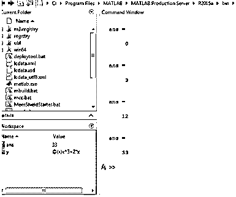
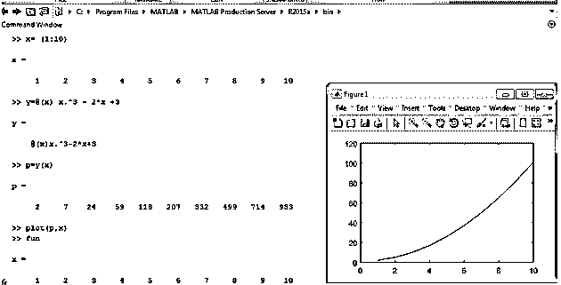
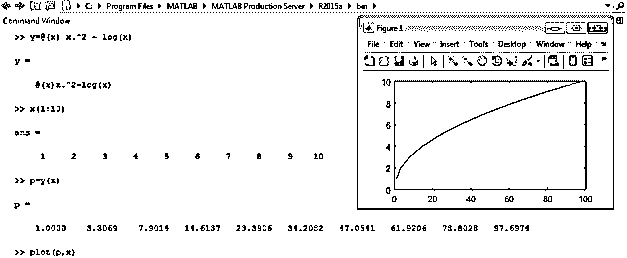

# Matlab 中的匿名函数

> 原文：<https://www.educba.com/anonymous-functions-in-matlab/>

## Matlab 中的匿名函数介绍

在 Matlab 中，有各种内置函数(Matlab 中有各种库)。这些内置函数使 Matlab 变得简单而强大。但是如果我们想创建自己的函数，Matlab 中有一个选项，就是函数句柄。通过使用函数处理程序，我们可以创建任何数学函数，这些函数被称为匿名函数。

让我们考虑一个例子 y =–2，这里有两个变量 x 和 y，x 是输入，y 是输出。y 的值取决于 x 的值。

<small>Hadoop、数据科学、统计学&其他</small>

所以匿名函数表示将是 y = @(x)^ 3–2

在上面的等式中，y 是函数处理程序，x 是输入变量，而“@”是用于匿名函数的符号。

写出这个方程后，我们可以给出 x 的任意值，例如 y ( 0)，y ( 1)，y ( 2)，y ( 3)，等等

如果 x 的值是 0，那么 y = x ^ 3–2

y = 0–2

y =–2

类似地，如果 x 的值是 1，那么 y = 1 ^ 3–2

y = 1–2

Y = -1

### 在 Matlab 中编写匿名函数的步骤

这里我们讨论了在 Matlab 中编写函数的步骤。

**第一步:**首先用' @ '符号和输入变量定义 Matlab 句柄函数，y = @ ( x)

**第二步:**将整个方程写在函数处理程序变量旁边。

**第三步:**接受输出变量 y ( 0)里面的输入值。

**语法:**

函数定义；

功能体；

让我们考虑一个等式 p = q ^ 2–3

| **Matlab 代码** | **语法** |
| P = @ ( q) | 函数句柄变量= @输入变量 |
| 问:^ 2-3 | 方程 |
| 问(1) | 函数句柄变量(输入变量值) |

### Matlab 中匿名函数的例子

下面是 matlab 中匿名函数的不同例子:

#### 示例#1

Y = x 3 + 2x

在这个例子中，我们将看到一个简单的匿名函数方法。

这里，Y 是输出，x 是变量输入，

如果我们设 x = 0

Y = 0 + 2 ( 0)

Y = 0

如果我们设 x = 1

Y = x 3 + 2x

Y = 1 + 2

Y = 3

如果我们把 x = 2

Y = x 3 + 2x

Y = 8 + 4

Y = 12

如果我们把 x = 3

Y = x 3 + 2x

Y = 27 + 6

Y = 33

**Matlab 代码:**

clc

y = @(x)x . ^ 3+(2 * x)；

y ( 0)

y ( 1)

y ( 2)

y ( 3)

在上面的代码中，y 在编译时接受 x 的值。屏幕 1 显示了示例 1 在 Matlab 中的实现

#### 实施例 2

y = x3–2 * x+3

如果 x = 1

y = 1–2+3

y = 2

如果 x = 2

y = 8–4+3

y = 7

如果 x = 3

y = x3–2 * x+3

y = 27–6+3

y = 24

**Matlab 代码:**

X = ( 1 : 10)

y = @(x)x .*^*3–2 * x+3

p = y ( x)

plot (y, x )

在上面的代码中，x 的范围是从 0 到 10，因此在编译时不需要分配“x”的值，如果 x 和 y 的离散值已知，那么我们可以绘制变量 x 和 y 的响应。屏幕 2 显示了示例 2 的实现以及 x 和 y 的响应。

#### 实施例 3

y = x2–log(x)

在这个例子中，很难找到 x 的每个值的对数，如果我们使用直接的 [Matlab 命令](https://www.educba.com/matlab-commands/)，我们将得到所有 y 值的输出以及 x 对 y 的响应(通过使用 plot 命令)。

**Matlab 代码:**

clc

y = @(x)x.^2–对数(x)

y = @(x)x.^2-log(x)

x (1: 10)

p = y ( x)

在上面的代码中，x 的范围是从 0 到 10，因此在编译时不需要分配“x”的值，如果 x 和 y 的离散值已知，那么我们可以绘制变量 x 和 y 的响应。屏幕 2 显示了示例 2 的实现以及 x 和 y 的响应。

### Matlab 中匿名函数的优势

*   在匿名函数中，我们可以创建任何未预定义的函数。
*   它可以存储在变量中。
*   匿名函数可以在函数中返回。
*   它可以在函数内部传递。
*   这些函数不能存储在程序文件中，因此，我们可以节省内存。
*   我们可以存储一个匿名函数句柄，这样我们就可以在需要的时候反复使用它。
*   它很容易表示和实现。

### 结论

在 Matlab 中，通过使用匿名函数，我们可以很容易地将复杂的数学二次方程转化为简单的形式。这些函数没有这样定义的名字，我们可以在函数定义的时候给它们起一个名字。匿名函数既节省了内存，又支持可重用性，因此无需反复编写庞大而复杂的表达式。

### 推荐文章

这是一个 Matlab 中匿名函数的指南。在这里，我们讨论了 Matlab 中匿名函数的步骤、优点以及一些例子。您也可以阅读以下文章，了解更多信息——

1.  [如何安装 MATLAB](https://www.educba.com/install-matlab/)
2.  [Matlab 的用途](https://www.educba.com/uses-of-matlab/)
3.  [Matlab 内联函数概述](https://www.educba.com/inline-functions-in-matlab/)
4.  [MATLAB 函数](https://www.educba.com/matlab-functions/)

